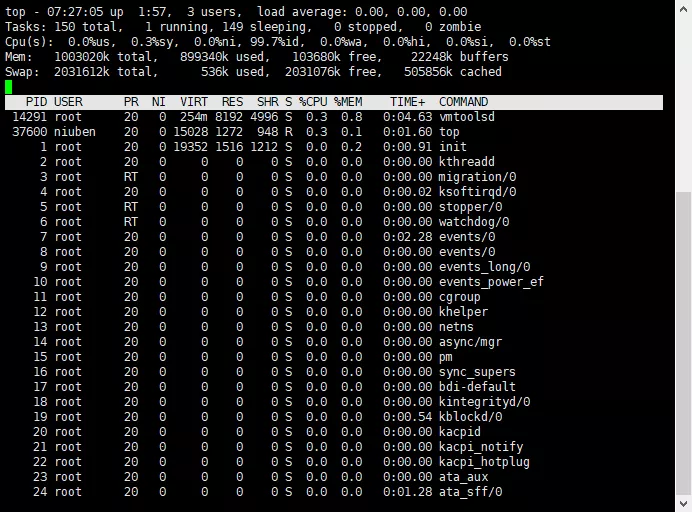
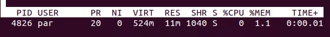

# Linux

- [Linux](#linux)
  - [性能查看](#性能查看)
    - [top命令详解](#top命令详解)
      - [单个进程维度信息](#单个进程维度信息)
      - [界面交互操作](#界面交互操作)
      - [cpu](#cpu)
      - [内存 free和pidstat](#内存-free和pidstat)
      - [硬盘查看df -h(转化为单位制) 查看磁盘剩余空间数](#硬盘查看df--h转化为单位制-查看磁盘剩余空间数)
      - [磁盘IO查看iostat -xdk 2 3(2秒/共3次) 和 pidstat](#磁盘io查看iostat--xdk-2-32秒共3次-和-pidstat)
      - [网络IO查看 ifstat l](#网络io查看-ifstat-l)
    - [CPU占用过高的定位分析思路(遇到的印象深刻的问题)](#cpu占用过高的定位分析思路遇到的印象深刻的问题)
  - [常用命令](#常用命令)
  - [linux 配置](#linux-配置)
    - [配置基本信息](#配置基本信息)
    - [经验错误汇总](#经验错误汇总)
    - [虚拟机软件设置网关，ip，nat模式](#虚拟机软件设置网关ipnat模式)

## 性能查看

### top命令详解


top [-] [d] [p] [q] [c] [C] [S] [s] [n]

- d：top -d 5 指定每两次屏幕信息刷新之间的时间间隔。回车后进入top页面，这时候按下s键就可以看到刷新频率信息已经被改成了5s。
- p: top - p 549 通过指定监控进程ID来仅仅监控某个进程的状态。
- n: top -n 3 指定循环数量,执行这个命令后，top刷新三次就自动退出了。其实这个命令的最主要价值是将结果输出到文件。
  - top -b -n 1 > test.txt 执行上面使用批处理模式循环一次后输出到test.txt文件。less这个文件可以看到top的快照。
- q:该选项将使top没有任何延迟的进行刷新。如果调用程序有超级用户权限，那么top将以尽可能高的优先级运行。
- S：指定累计模式。
- s：使top命令在安全模式中运行。这将去除交互命令所带来的潜在危险。
- i：使top不显示任何闲置或者僵死进程。
- c:显示整个命令行而不只是显示命令名。

在top命令显示的页面还可以输入以下按键执行相应的功能(注意大小写区分的)

- ?：显示在top当中可以输入的命令
- P：以CPU的使用资源排序显示
- M：以内存的使用资源排序显示
- N：以pid排序显示
- T：由进程使用的时间累计排序显示
- k：给某一个pid一个信号。可以用来杀死进程
- r：给某个pid重新定制一个nice值（即优先级）
- q：退出top（用ctrl+c也可以退出top）。



第一行
| 内容                           | 含义                                                                                   |
| ------------------------------ | -------------------------------------------------------------------------------------- |
| up 1min                        | 系统运行时间 格式为时：分                                                              |
| 1 users                        | 当前登录用户数                                                                         |
| load average: 0.00, 0.01, 0.05 | 系统负载，即任务队列的平均长度。 三个数值分别为 1分钟、5分钟、15分钟前到现在的平均值。 |

load average: 如果这个数除以逻辑CPU的数量，结果高于5的时候就表明系统在超负荷运转了,一个经常运行的linux机器，一般15分钟的数据，每次刷新时数据最稳定。因为数据周期长，受瞬时波动更小。

load average数据是每隔5秒钟检查一次活跃的进程数，然后按特定算法计算出的数值。关于负载的含义，网上最广泛的示例，是通过桥梁的通过率来解释的。以下以单核cpu为例说明(单核cpu,1.0表示满负载)，如果是多核，要乘以核数。

> 系统负荷为0，意味着大桥上一辆车也没有  
> 系统负荷为0.5，意味着大桥一半的路段有车  
> 系统负荷为1.0，意味着大桥的所有路段都有车，但仍然可以顺次通行  
> 系统负荷为1.7，除了桥满之外，在桥的入口处还有70%的车辆在等待  

第二行为进程信息

| 内容         | 含义             |
| ------------ | ---------------- |
| 132 total    | 进程总数         |
| 12 running   | 正在运行的进程数 |
| 131 sleeping | 睡眠的进程数     |
| 0 stopped    | 停止的进程数     |
| 0 zombie     | 僵尸进程数       |

僵尸进程。有些进程实际已经结束了，但是需要等待其父进程来将其收回。但是父进程可能忘记了进行收回，使得此僵尸进程一直处于占用系统资源的状态。也有可能是父进程先于此僵尸进程结束了，这样父进程就无法收回讲师进程的资源。当然，linux系统不会容忍僵尸进程一直存在，系统本身会定期检查并收回僵尸进程的资源。

第三行为CPU的信息,当有多个CPU时，这些内容可能会超过两行,按键盘数字“1”可以监控每个逻辑CPU的状况
| 内容    | 含义                                               |
| ------- | -------------------------------------------------- |
| 0.2 us  | 用户空间占用CPU百分比                              |
| 0.7 sy  | 内核空间占用CPU百分比                              |
| 0.0 ni  | 用户进程空间内改变过优先级的进程占用CPU百分比      |
| 99.2 id | 空闲CPU百分比                                      |
| 0.0 wa  | 等待输入输出的CPU时间百分比(IO等待占用CPU的百分比) |
| 0.0 hi  | 硬中断（Hardware IRQ）占用CPU的百分比              |
| 0.0 si  | 软中断（Software Interrupts）占用CPU的百分比       |
| 0.0 st  | 用于有虚拟cpu的情况，用来指示被虚拟机偷掉的cpu时间 |

第四五行 物理内存状态和swap交换分区状态

1003020k total,   234464k used,   777824k free,    24084k buffers【缓冲的内存量】  
2031612k total,      536k used,  2031076k free,   505864k cached【缓冲的交换区总量】

内存速度是远远高于磁盘速度的，要想磁盘和内存同步运行，就要用到缓冲和缓存。  
写操作，用缓冲。当内存中的数据要写入磁盘，可以先写入缓冲，数据由缓冲同步到磁盘。这样，内存可以被节约出来做一些其他的事情。  
读操作，用缓存。当需要从磁盘上读取数据时，会先读到缓存中。再由缓存和程序进行交互。  

监控上看到的内存指标avail mem，用 total、used、free、buffers、cached加减乘除都不对。原因是used是实际使用的内存，buffers和cached虽然被占用但是可以很快被释放，而且在某一瞬间并不是所有的buffers/cached空间都被占满了，这一瞬间虽名义上被buffers/cached占用着，但是实际上没有用的+free就是avail mem。

**shift+e**切换磁盘的单位KiB、MiB、GiB、TiB、EiB的顺序  
m键切换还可以进行这一部分的图形化展示，竖线条模式

top命令经常用来监控linux的系统状况，是常用的性能分析工具，能够实时显示系统中各个进程的资源占用情况。

- 主要看load average, CPU, MEN三部分
- load average表示系统负载，即任务队列的平均长度。 三个数值分别为 1分钟、5分钟、15分钟前到现在的平均值。三个值相加/3 * 100 > 60% 系统压力较大; 如果这个数除以逻辑CPU的数量，结果高于5的时候就表明系统在超负荷运转了。
- 按键盘上面的1 查看cpu

uptime(top的精简版)

#### 单个进程维度信息

[重要的信息 热点和秒杀来临前要做的5件事](https://mp.weixin.qq.com/s?__biz=MzUzNjAxODg4MQ==&mid=2247486431&idx=1&sn=c6bb35981521d01846c7a02517f5d281&chksm=fafde171cd8a68677f5ead2228b27d009ff60746adf77861ec63e951fed3e0ba7cbb665a64f9&scene=21#wechat_redirect)




nice表示用户空间进程的CPU的调度优先级，范围为[-20,19]。nice值越高，表示越谦让，优先级越低。

VIRT(虚拟内存)

1. 进程“需要的”虚拟内存大小，包括进程使用的库、代码、数据，以及malloc、new分配的堆空间和分配的栈空间等；
2. 假如进程新申请10MB的内存，但实际只使用了1MB，那么它会增长10MB，而不是实际的1MB使用量。
3. VIRT = SWAP + RES

RES(常驻内存)

1. 进程当前使用的内存大小，包括使用中的malloc、new分配的堆空间和分配的栈空间，但不包括swap out量；
2. 包含其他进程的共享；
3. 如果申请10MB的内存，实际使用1MB，它只增长1MB，与VIRT相反；
4. 关于库占用内存的情况，它只统计加载的库文件所占内存大小。
5. RES = CODE + DATA

SHR(共享内存)

1. 除了自身进程的共享内存，也包括其他进程的共享内存；
2. 虽然进程只使用了几个共享库的函数，但它包含了整个共享库的大小；
3. 计算某个进程所占的物理内存大小公式：RES – SHR；
4. swap out后，它将会降下来。


- 在top信息界面,按``f``进入字段选择界面
- ``上下键``选择要排序的字段,界面会高亮显示``左右键``选中的字段,再``上下``排序
- 确认选中操作后,按下``s``键,激活这个选择
- 最后按``q``推出选择排序界面

注意: 排序界面有``*``可以用``空格``或``d``来切换,表示该字段是否显示在top界面

#### 界面交互操作

top中显示的数据是定时刷新的，按s;为方便大家记忆，界面交互操作总结如下：

- shift+e 切换内存显示模式(可重复按键切换)
- z 切换是否彩色显示（可重复按键切换）
- m 切换内存显示模式（可重复按键切换）
- e 切换底部进程中单位的显示模式（可重复按键切换）
- b 切换高亮选中（可重复按键切换）,上下键可以切换选中。再按b键可退出选中
- W 把当前配置保存到文件中，下次启动top会使用当前的配置
- h 进入帮助菜单（进入菜单后，可安ESC或q退出帮助菜单）
- q 退出 top 命令
- N 按PID大小顺序排列
- x 高亮显示序的列
- s 改变画面刷新频率
- n 设置在金恒列表所显示的进程的数量
- L 搜索指定内容

#### cpu

- vmstat -n 2 3 采样cpu等信息,每2秒一次,一共3次

procs

- r：运行和等待的CPU时间片的进程数，原则上1核的CPU的运行队列不要超过2，整个系统的运行队列不超过总核数的2倍，否则代表系统压力过大，我们看蘑菇博客测试服务器，能发现都超过了2，说明现在压力过大
- b：等待资源的进程数，比如正在等待磁盘I/O、网络I/O等

cpu

- us：用户进程消耗CPU时间百分比，us值高，用户进程消耗CPU时间多，如果长期大于50%，优化程序
- sy：内核进程消耗的CPU时间百分比
- us + sy 参考值为80%，如果us + sy 大于80%，说明可能存在CPU不足，从上面的图片可以看出，us + sy还没有超过百分80，因此说明蘑菇博客的CPU消耗不是很高
- id：处于空闲的CPU百分比
- wa：系统等待IO的CPU时间百分比
- st：来自于一个虚拟机偷取的CPU时间比

- mpstat -P ALL 2  查看看所有cpu核信息,2秒刷新

- pidstat -u 1 -p 进程编号,每个进程使用cpu的用量分解信息,1秒刷新

#### 内存 free和pidstat

应用程序可用内存数

经验值

- 应用程序可用内存l系统物理内存>70%内存充足
- 应用程序可用内存/系统物理内存<20%内存不足，需要增加内存
- 20%<应用程序可用内存/系统物理内存<70%内存基本够用

free -m/-g/-h: 单位 M / G / M|g混合使用

- pidstat -p 5101(进程号) -r 2 (采样间隔秒数,查看额外)

#### 硬盘查看df -h(转化为单位制) 查看磁盘剩余空间数

#### 磁盘IO查看iostat -xdk 2 3(2秒/共3次) 和 pidstat

iostat -xdk 2 3(2秒/共3次)

磁盘块设备分布

- rkB/s每秒读取数据量kB;wkB/s每秒写入数据量kB;
- svctm lO请求的平均服务时间，单位毫秒;
- await l/O请求的平均等待时间，单位毫秒;值越小，性能越好;
- util一秒中有百分几的时间用于I/O操作。接近100%时，表示磁盘带宽跑满，需要优化程序或者增加磁盘;**这个比较关键**
- rkB/s、wkB/s根据系统应用不同会有不同的值，但有规律遵循:长期、超大数据读写，肯定不正常，需要优化程序读取。
- svctm的值与await的值很接近，表示几乎没有IO等待，磁盘性能好。
- 如果await的值远高于svctm的值，则表示IO队列等待太长，需要优化程序或更换更快磁盘。

pidstat -d 2 -p 5101

#### 网络IO查看 ifstat l

```log
wget http://gael.roualland.free.fr/lifstat/ifstat-1.1.tar.gz
tar -xzvf ifstat-1.1.tar.gz
cd ifstat-1.1
./configure
make
make install
```

查看网络IO

各个网卡的in、out

观察网络负载情况程序

网络读写是否正常

- 程序网络I/O优化
- 增加网络I/O带宽

### CPU占用过高的定位分析思路(遇到的印象深刻的问题)

结合Linux和JDK命令一块分析

案例步骤

- 先用top命令找出CPU占比最高的
- ps -ef或者jps进一步定位，得知是一个怎么样的一个后台**进程**作搞屎棍
  - ps -ef|grep java|grep -v grep
  - jps -l |grep atguigu
- 定位到具体**线程**或者代码
  - ps -mp 进程编号 -o THREAD,tid,time
    - -m 显示所有的线程
    - -p pid进程使用cpu的时间
    - -o 该参数后是用户自定义格式
- 将需要的线程ID转换为16进制格式（英文小写格式），命令  printf "%x\n" 172 将172转换为十六进制(英文要小写)
- jstack **进程ID** | grep tid（16进制**线程ID**小写英文）-A60

将会打印是那个类多少行代码导致的问题

```log
ps - process status
-A Display information about other users’ processes, including those without controlling terminals.

-e Identical to -A.

-f Display the uid, pid, parent pid, recent CPU usage, process start time, controlling tty, elapsed CPU usage, and the associated command. If the -u option is also used, display the user name rather then the numeric uid. When -o or -O is used to add to the display following -f, the command field is not truncated as severely as it is in other formats.
```

[对于JDK自带的JVM监控和性能分析工具用过哪些?一般你是怎么用的?](https://blog.csdn.net/u011863024/article/details/106651068)

下表是Sun JDK监控和故障处理工具

| 名称   | 主要作用                                                                                                 |
| ------ | -------------------------------------------------------------------------------------------------------- |
| jps    | JVM Process Status Tool，显示指定系统内所有的HotSpot虚拟机进程                                           |
| jstat  | JVM Statistics Monitoring Tool，用于收集HotSpot虚拟机各方面的运行数据                                    |
| jinfo  | Configuration Info for Java，显示虚拟机配置信息                                                          |
| jmap   | Memory Map for Java，生成虚拟机的内存转储快照（Heapdump文件）                                            |
| jhat   | JVM Heap Dump Browser，用于分析heapdump文件，它会建立一个HTTP/HTML服务器，让用户可以在浏览器上查看分析结 | 果 |
| jstack | Stack Trace for Java，显示虚拟机的线程快照                                                               |

## 常用命令

- Man  or  --help
- Date
- Cal
- Pwd 查看当前完整路径
- Ls  -a -l ll
- netstat -nltp 看系统占用的端口号
- netstat -tunlp|grep 端口号    查看端口号，或查看全部
- source /etc/profiles  (虚拟机重新加载配置)
- lsof -i:xxx
- Ps -ef | grep xxx
- Mkdir -p
- Rmdir
- Crontab
- Tail -n5
- Tail -f 文件名  看日志,-f 实时滚动
- History
- Echo
- Rm  -rvf   -rf
- Touch
- Top   top / free  查看整机信息
- df -l
- Cp -r -v \cp
- Mv old n new n
- Mv /old dir /new dir
- More space / enter / q / ctrl f
- Cat *  ,  ** , * > *  ,  * > >*  , tac
- Less pageDown/Up  /  /?  N   n
- systemctl list-unit-files 查看开机启动项
- service mysqld stop
- kill -s 9 pid
- Free -m 查看内存和占用
- Chmod -R 777 更改权限
- Yum makecache
- find / -name "*maven*" / 下搜索所有匹配maven的
- ulimit -u 查看当前用户的可用线程数,普通是1024

## linux 配置

### 配置基本信息

虚拟机内部配置ip,网关等 vim  /etc/sysconfig/network-scripts/ifcfg-ens33

```conf
TYPE="Ethernet"
PROXY_METHOD="none"
BROWSER_ONLY="no"
BOOTPROTO="static"
DEFROUTE="yes"
IPV4_FAILURE_FATAL="no"
#IP和子网掩码
IPADDR=192.168.134.11
NETMASK=255.255.255.0
#网关和DNS服务器 要与虚拟机nat一致
GATEWAY=192.168.134.2
DNS1=8.8.8.8
DNS2=114.114.114.114
#IP地址的前24为代表网络地址，后面是主机地址
PREFIX=24
IPV6INIT="yes"
IPV6_AUTOCONF="yes"
IPV6_DEFROUTE="yes"
IPV6_FAILURE_FATAL="no"
IPV6_ADDR_GEN_MODE="stable-privacy"
NAME="ens33"
UUID="9b0a1ad0-dbac-4636-ad5e-098be246d2fa"
DEVICE="ens33"
ONBOOT="yes"
ZONE=public

# 配置一些别的信息 ,我暂时还没搞清楚是什么

JAVA_HOME=/opt/jdk1.8.0_221
PATH=$JAVA_HOME/bin:$PATH
export JAVA_HOME PATH
export 
CATALINA_HOME=/opt/apache-tomcat-7.0.70
export PATH=$CATALINA_HOME/bin:$PATH

无网络时修改
Cd /etc/sysconfig/network-scripts/ 里面有eth0 eth1 两个网卡,看ip 修改那个 在里面加上网关地址,两个dns,wq保存后service network restart 重启
```

- systemctl status firewalld
- systemctl stop firewalld
- systemctl disable firewalld
- systemctl enable firewalld

### 经验错误汇总

安装完成后ifconfig无反应，cd /sbin,在sbin目录下输入ls，可见下图所示，并没有ifconfig。
安装  sudo yum install net-tools 即可

安装yum
直接yum update？
rpm -aq|grep yum|xargs rpm -e --nodeps 删除所有yum

### 虚拟机软件设置网关，ip，nat模式

1. 去虚拟软件右键网络配置选择nat模式
2. 选择还原默认设置
3. 查看左下角子网ip，再查看nat设置里网关ip，他两应该是在同一个网段，但是后面不一样192.168.zzz.0，192.168.zzz.2
4. 去vm8虚拟网卡，设置ip地址为192.168.zzz.1，介于软件子网ip和网关之间，子网掩码255，默认网关就是软件的网关192.168.zzz.2
5. 最后虚拟系统网络无论选nat还是自定义都可以ping通(需关闭防火墙)ping 宿主机或者网关都可以ping通
6. 但是系统里面要把网关设置的跟外面软件一样，ip最后一位可以变，但是需要重启192.168.zzz.11
