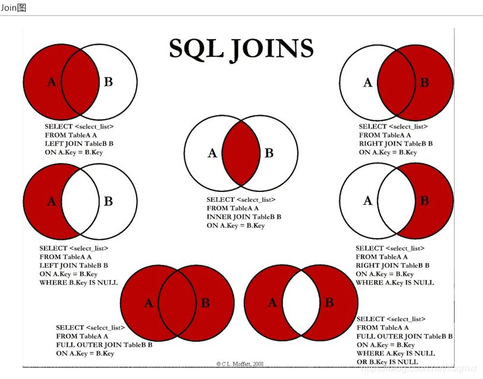
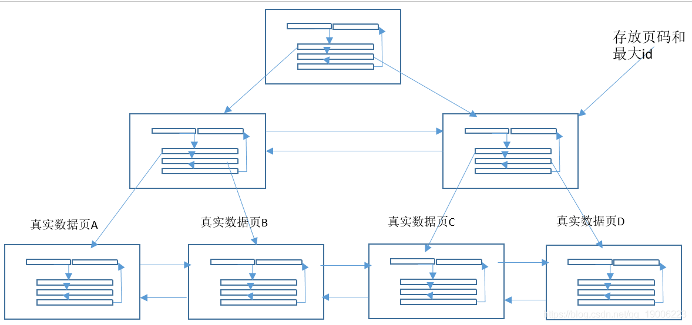

# mysql 基础

- [mysql 基础](#mysql-基础)
  - [基础](#基础)
    - [未学习通透的](#未学习通透的)
    - [引擎](#引擎)
      - [MyISAM](#myisam)
      - [InnoDB](#innodb)
      - [约束分类](#约束分类)
    - [事务&MVCC](#事务mvcc)
      - [ACID,隔离级别和数据一致性问题](#acid隔离级别和数据一致性问题)
      - [MVCC 多版本并发控制](#mvcc-多版本并发控制)
        - [简述MySQL的MVCC多版本并发控制](#简述mysql的mvcc多版本并发控制)
      - [select加锁分析](#select加锁分析)
    - [DDL](#ddl)
    - [DCL](#dcl)
    - [DML / DQL](#dml--dql)
      - [行转列](#行转列)
      - [列转行](#列转行)
      - [Like 搭配通配符](#like-搭配通配符)
      - [比较运算符](#比较运算符)
        - [非符号运算符](#非符号运算符)
        - [逻辑运算符](#逻辑运算符)
      - [多表7种连接方式](#多表7种连接方式)
        - [UNION和UNION ALL的区别](#union和union-all的区别)
    - [单表比多表查的好处](#单表比多表查的好处)
  - [JDBC](#jdbc)
    - [JDBC连接方式最终版](#jdbc连接方式最终版)
    - [JDBC步骤](#jdbc步骤)
  - [B+树存放多少行数据](#b树存放多少行数据)
  - [mysql索引](#mysql索引)
    - [索引树](#索引树)
    - [数据库索引(储存在磁盘里)](#数据库索引储存在磁盘里)
      - [哪些情况需要创建索引](#哪些情况需要创建索引)
      - [哪些情况不要创建索引](#哪些情况不要创建索引)
      - [索引优化](#索引优化)
        - [一般性优化建议](#一般性优化建议)
        - [order by优化](#order-by优化)
        - [GROUP BY关键字优化](#group-by关键字优化)
        - [关联查询优化](#关联查询优化)
        - [小表驱动大表](#小表驱动大表)
        - [临时表优化](#临时表优化)
    - [索引失效七字口诀](#索引失效七字口诀)
    - [索引测试题](#索引测试题)
    - [覆盖索引](#覆盖索引)
    - [索引条件下推](#索引条件下推)
    - [EXPLAIN字段说明](#explain字段说明)
  - [主从复制](#主从复制)
    - [一主一从环境搭建](#一主一从环境搭建)
    - [主从验证](#主从验证)
  - [mysql军规](#mysql军规)

## 基础

### 未学习通透的

changebuffer 只是针对二级索引的页的优化

表中如果有一个字段内容是{xx:yyy,aa:bb},它是不能直接通过select 查询赋值给pojo的map(集合)类型，解决方法: 通过级联查询 多表嵌套  
将该字段转存入pojo中一个string字段，将该字段用JSON.parseObject(str,Map.class)转为一个map，再存入pojo的map属性字段

### 引擎

mysql数据库由后台线程和一个共享内存区组成

MyISAM和InnoDB的区别，什么时候选择MyISAM ( 储存引擎是基于表的，而不是基于数据库 )

#### MyISAM

myISAM:B+ 主索引key唯一，辅助索引key可重复，data域是数据的地址。只缓存索引，默认是非聚集索引，索引文件和数据文件是分离的，索引文件仅保存数据记录的地址。MyISAM只支持表级锁、数据排列是按照插入顺序，没有做规则排序。使用非聚集索引，适合应用以查询和插入为主，只有很少量的更新和删除操作，对事务的完整性和并发性要求不是很高的场景。(如快递的途径历史记录)

#### InnoDB

InnoDb:B+ data就是索引文件，辅助索引data域是相应记录主键的列值。缓存索引与数据，默认是聚集索引，一个文件数据文件就是索引文件。在InnoDB中，表数据文件本身就是按B+Tree组织的一个索引结构，叶节点data域保存了完整的数据记录。这个索引的key是数据表的主键，因此InnoDB表数据文件本身就是主索引。MySQL主流版本默认存储引擎，支持事务、外键、行锁，对于并发条件下要求数据的一致性，适用于对数据准确性要求高的场景。准确性要求不高的场景可以用nosql(分类:文档型、图形、列式，键值)，使用聚集索引

  1. 关键特性
     - 插入缓冲 Insert Buffer
     - 两次写 Double Write
     - 自适应哈希索引 Adaptive Hash Index
     - 异步IO Async IO
     - 刷新邻接页 Flush Neighbor Page

#### 约束分类

- NOT NULL。支持列级约束。
- DEFAULT，支持列级约束。
- PRIMARY KEY 支持列级约束以及表级约束。
- UNIQUE，支持列级约束以及表级约束。
- FORGIEN KEY，用于限制两个表间的关系。支持表级约束。

### 事务&MVCC

Mysql 锁

- 表级锁：开销小，加锁快。不会出现死锁，锁定粒度大，发生锁冲突的概率高，并发度低。
- 页面锁：开销时间、加锁时间、锁定粒度在 表级锁 与 行级锁 之间，会出现死锁，并发度中等。
- 行级锁：开销大，加锁慢。会出现死锁，锁定粒度小，发生锁冲突的概率低，并发度高。

char varchar

- CHAR 长度不可变，范围 1~255。若存储长度未达到定义的长度，则以 空格 填充。存取速度快，但容易浪费空间。
- VARCHAR 长度可变，范围 1~65535。若存储长度未达到定义的长度，则存实际长度数据。存取速度稍慢，但节约空间。

#### ACID,隔离级别和数据一致性问题

1. 原子性（Atomicity）: 原子性是指事务是一个不可分割的工作单位，事务中的操作要么都发生，要么都不发生。用**undo.log**实现
2. 一致性（Consistency）: 可以理解为数据是满足完整性约束的，也就是不会存在中间状态的数据，比如你账上有400，我账上有100，你给我打200块，此时你账上的钱应该是200，我账上的钱应该是300，不会存在我账上钱加了，你账上钱没扣的中间状态。
3. 隔离性（Isolation）: 事务的隔离性是多个用户并发访问数据库时，数据库为每一个用户开启的事务，不能被其他事务的操作数据所干扰，多个并发事务之间要相互隔离。
4. 持久性（Durability）:持久性是指一个事务一旦被提交，它对数据库中数据的改变就是永久性的，接下来即使数据库发生故障也不应该对其有任何影响 **redo.log**来实现(WAL预写日志),没有写入成功也会根据日志进行恢复

- 脏读: 一个事务访问并修改了数据，暂未提交，另一个事务却读到了该未提交数据的值
- 不可重复读(重点是修改): 一个事务在读取某些数据已经发生了改变、或某些记录已经被删除了！这种现象叫做“不可重复读”。
- 幻读(重点是新增或删除): 两个事务T1、T2，T1从表中读取数据，然后T2进行了INSERT操作并提交，当T1再次读取的时候，结果不一致的情况发生。一个事务按相同的查询条件重新读取以前检索过的数据，却发现其他事务插入了满足其查询条件的新数据，这种现象就称为 “幻读”。
  1. 由于 UPDATE 本身也是一种 read-write，如果执行 UPDATE 也会有 write skew 问题, 那对实际应用来说就太糟糕了。
  2. MySQL（innodb）为了解决这个问题，强行把 read 分成了 snapshot read（快照读）和 locking read （当前读）。在 UPDATE 或者 SELECT ... FOR UPDATE 的时候，innodb 引擎实际执行的是当前读，在扫描过程中加上行锁和区间锁（gap locks，next-key locks），相当于变相提升到了 serializable 隔离级别，从而消除了 write skew 。
  3. 从实用角度看，这个解法还是很赞的。既解决了 UPDATE write-skew 问题，又保证了绝大多数场景 SELECT 的性能，特殊情况还可以用 SELECT ... FOR UPDATE，完美。
  4. 但是,MySQL（innodb）当前读的机制本身和 snapshot 是矛盾的。加锁保护的一定是数据最新版本。例如，如果在快照读之后再执行一次当前读，则读到的数据内容不一定能保证一致，因此会有这样的现象

- READ UNCOMMITTED
- READ COMMITTED
- REPEATABLE READ
- SERIALIZABLE

#### MVCC 多版本并发控制

[InnoDB MVCC 机制，看这篇就够了](https://cloud.tencent.com/developer/article/1454636)

不同的事务在并发过程中，SELECT 操作可以不加锁而是通过 MVCC 机制(解决读-写冲突的无锁并发控制,只会在RC.RR中使用)读取指定的版本历史记录，并通过一些手段保证保证读取的记录值符合事务所处的隔离级别，从而解决并发场景下的读写冲突

Mvcc + 乐观锁、 mvcc + 悲观锁 最大程度提高并发性能，解决读写冲突，写写冲突造成的问题

原理：记录中的隐式字段行的创建时间，过期时间、undo日志， Read view来实现

- 当前读  共享锁，排他锁就是当前读，会读取记录的最新版本，对要读取记录加锁
- 快照读  不加锁的非阻塞读，前提隔离级别不是串行，否则会退还为当前读，实现基于mvcc

1. 隐式字段
   1. DB_TRX_ID 6byte，最近修改(修改/插入)事务ID：记录创建这条记录/最后一次修改该记录的事务ID
   2. DB_ROLL_PTR 7byte，回滚指针，指向这条记录的上一个版本（存储于rollback segment里）
   3. DB_ROW_ID 6byte，隐含的自增ID（隐藏主键），如果数据表没有主键，InnoDB会自动以DB_ROW_ID产生一个聚簇索引
   4. 实际还有一个删除flag隐藏字段, 既记录被更新或删除并不代表真的删除，而是删除flag变了
2. undo日志
   1. insert undo log  事务在insert新记录时产生的undo log, 只在事务回滚时需要，并且在事务提交后可以被立即丢弃
   2. update undo log  事务在进行update或delete时产生的undo log; 不仅在事务回滚时需要，在快照读时也需要；所以不能随便删除，只有在快速读或事务回滚不涉及该日志时，对应的日志才会被purge线程统一清除
   3. 不同事务或者相同事务的对同一记录的修改，会导致该记录的undo log成为一条记录版本线性表，既链表，undo log的链首就是最新的旧记录，链尾就是最早的旧记录

3. Read View
   1. 是事务进行快照读操作的时候生产的读视图 会生成数据库系统当前的一个快照，记录并维护系统当前活跃事务的ID
   2. 在RC隔离级别下，是每个快照读都会生成并获取最新Read View；而在RR隔离级别下，则是同一个事务中的第一个快照读才会创建Read View, 之后的快照读获取的都是同一个Read View。

4. Purge(清除)
   - 从前面的分析可以看出，为了实现InnoDB的MVCC机制，更新或者删除操作都只是设置一下老记录的deleted_bit，并不真正将过时的记录删除。
   - 为了节省磁盘空间，InnoDB有专门的purge线程来清理deleted_bit为true的记录。为了不影响MVCC的正常工作，purge线程自己也维护了一个read view（这个read view相当于系统中最老活跃事务的read view）;如果某个记录的deleted_bit为true，并且DB_TRX_ID相对于purge线程的read view可见，那么这条记录一定是可以被安全清除的。

##### 简述MySQL的MVCC多版本并发控制

答：对RC，RR，基于乐观锁的实现。在LBCC(基于锁的并发控制)RC、RR和串行化分别是通过加行锁、间隙锁和表锁来基于悲观锁实现。而乐观锁的原理就是在特定的时间点(RC是每次读时，RR是事务开始时)生成一个当前快照，读数据读取快照，只在提交时判断是否有冲突，类似于git的branch和commit。

MVCC会在新开启一个事务时，给事务里包含的每行记录添加一个当前事务ID和回滚指针。并包含一个Read View，Read View里保存了当前活跃的事务列表，小于这些列表的最近的事务ID(自增)才是可见的。这样保证了读到的都是已提交的事务。

应用：mvcc很常见的并发控制手段，如当前状态是订单未提交，则更新时update XXX set status='订单已提交' where status='订单未提交'，如果执行这条语句时，status已经发生了改变，这条语句就执行失败了

#### select加锁分析

```sql
select * from table where id = ?
select * from table where id < ?
select * from table where id = ? lock in share mode
select * from table where id < ? lock in share mode
select * from table where id = ? for update
select * from table where id < ? for update
```

如果你能清楚的说出，这六句sql在不同的事务隔离级别下，是否加锁，加的是共享锁还是排他锁，是否存在间隙锁，那这篇文章就没有看的意义了。

- innodb一定存在聚簇索引，默认以主键作为聚簇索引
- 有几个索引，就有几棵B+树(不考虑hash索引的情形)
- 聚簇索引的叶子节点为磁盘上的真实数据。非聚簇索引的叶子节点还是索引，指向聚簇索引B+树。

### DDL

Data Definition Language

``create`` ``alter``  ``drop``  ``rename``  ``truncate`` 都自动提交 `commit` 且不受 ``set autocommit = false`` 影响, ``rollback`` 对DDL操作都失效

``create database if not exists xxx``

``drop database|table if exists xxx``

``DELETE TABLE IF EXISTS xxx;``// 删表内容

``TRUNCATE TABLE xxx;``// 清空表数据 不可 ``rollback``

``RENAME TABLE XXX TO YYY``

``ALTER TABLE`` 表名 ``ADD | MODIFY | CHANGE | DROP COLUMN`` 字段名 字段类型【字段约束】

``CREATE TABLE xxx LIKE xxx;``//复制结构

``CREATE TABLE xxx SELECT * FROM xxx;``//复制结构 + 数据

``CREATE TABLE emp2 AS SELECT employee_id,last_name,salary FROM employees;``//选择复制结构 如果起别名就会作为新表的表名

如果只想要某些字段 不想要数据 就给出一个where不成立的结果 就不会存在数据

复制数据到另一张表,表结构相同的表，且在同一数据库（如，table1,table2)（不同表结构也是如此）

- Sql ：insert into table1 select * from table2 (完全复制)
- insert into table1 select distinct * from table2(不复制重复纪录）
- insert into table1 select top 5 * from table2 (前五条纪录)

不在同一数据库中（如，db1 table1,db2 table2)

- sql: insert into db1..table1 select * from db2..table2 (完全复制)
- insert into db1..table1 select distinct * from db2table2(不复制重复纪录）
- insert into tdb1..able1 select top 5 * from db2table2 (前五条纪录)

位置 ：列级 vs 表级// 约束的分类

数量 ：单列 vs 多列

功能 ：not null | unique | primary key | auto increment | foreign | check| default

``ALTER TABLE emp4 DROP INDEX emp4_email_uk``

``ALTER TABLE emp4 ADD CONSTRAINT emp4_email_uk UNIQUE(id)``

### DCL

Data Control Language

``commit`` ``rollback`` ``grant`` ``revoke`` ``savepoint``

### DML / DQL

Data Manipulation Language

Data QueryLanguage

``insert``  ``delete``  ``update`` 逻辑删除,自增继续,会返回受影响的行数,支持回滚

``truncate table``真删除 自增不会 不会返回受影响的行数，不支持回滚

``if(条件，表达式1，表达式2)``

```sql
case [表达式] // if / case 
when 值1 then 结果1 [else 结果2]
when 值2 then 结果2
...else 默认结果
end
```

```sql
select a.name,
case when b.id is null then '否' else '是' end '是否为掌门' 
from ...
```

```sql
SELECT last_name Last_name, job_id Job_id, 
CASE job_id 
WHEN 'AD_PRES' THEN 'A'
WHEN 'ST_MAN' THEN 'B'
WHEN 'IT_PROG' THEN 'C'
WHEN 'SA_REP' THEN 'D'
WHEN 'ST_CLERK' THEN 'E'
ELSE 'F'
END "gradeyx"
FROM employees;
```

IF(expr1,expr2,expr3) , IFNULL(expr1,expr2) , isnull(expr)

ifnull(字段,表达式)version() ,user(),database(),in(),not in(),between,not between()

#### 行转列

```sql
DROP TABLE IF EXISTS tb_score;
CREATE TABLE tb_score(
    id INT(11) NOT NULL auto_increment,
    userid VARCHAR(20) NOT NULL COMMENT '用户id',
    subject VARCHAR(20) COMMENT '科目',
    score DOUBLE COMMENT '成绩',
    PRIMARY KEY(id)
)ENGINE = INNODB DEFAULT CHARSET = utf8;

INSERT INTO tb_score(userid,subject,score) VALUES ('001','语文',90);
INSERT INTO tb_score(userid,subject,score) VALUES ('001','数学',92);
INSERT INTO tb_score(userid,subject,score) VALUES ('001','英语',80);
INSERT INTO tb_score(userid,subject,score) VALUES ('002','语文',88);
INSERT INTO tb_score(userid,subject,score) VALUES ('002','数学',90);
INSERT INTO tb_score(userid,subject,score) VALUES ('002','英语',75.5);
INSERT INTO tb_score(userid,subject,score) VALUES ('003','语文',70);
INSERT INTO tb_score(userid,subject,score) VALUES ('003','数学',85);
INSERT INTO tb_score(userid,subject,score) VALUES ('003','英语',90);
INSERT INTO tb_score(userid,subject,score) VALUES ('003','政治',82);

# 行转列字段

SELECT userid,
SUM(CASE `subject` WHEN '语文' THEN score ELSE 0 END) as '语文',SUM(CASE `subject` WHEN '数学' THEN score ELSE 0 END) as '数学',
SUM(CASE `subject` WHEN '英语' THEN score ELSE 0 END) as '英语',SUM(CASE `subject` WHEN '政治' THEN score ELSE 0 END) as '政治' FROM tb_score 
GROUP BY userid

SELECT userid,
SUM(IF(`subject`='语文',score,0)) as '语文',SUM(IF(`subject`='数学',score,0)) as '数学',
SUM(IF(`subject`='英语',score,0)) as '英语',SUM(IF(`subject`='政治',score,0)) as '政治' FROM tb_score 
GROUP BY userid

# 将所有人的subject总成绩求和，用函数新增一些行或列

SELECT IFNULL(userid,'total') AS userid,
SUM(IF(`subject`='语文',score,0)) AS 语文,SUM(IF(`subject`='数学',score,0)) AS 数学,
SUM(IF(`subject`='英语',score,0)) AS 英语,SUM(IF(`subject`='政治',score,0)) AS 政治,SUM(IF(`subject`='total',score,0)) AS total
FROM(
    SELECT userid,IFNULL(`subject`,'total') AS `subject`,SUM(score) AS score
    FROM tb_score
    GROUP BY userid,`subject`
    WITH ROLLUP
    HAVING userid IS NOT NULL
)AS A 
GROUP BY userid
WITH ROLLUP;# 对组函数求和

SELECT userid,
SUM(IF(`subject`='语文',score,0)) AS '语文',SUM(IF(`subject`='数学',score,0)) AS 数学,
SUM(IF(`subject`='英语',score,0)) AS 英语,SUM(IF(`subject`='政治',score,0)) AS 政治,SUM(score) AS TOTAL FROM tb_score
GROUP BY userid

UNION
SELECT 'TOTAL',SUM(IF(`subject`='语文',score,0)) AS '语文',SUM(IF(`subject`='数学',score,0)) AS 数学,
SUM(IF(`subject`='英语',score,0)) AS 英语,SUM(IF(`subject`='政治',score,0)) AS 政治,SUM(score) FROM tb_score

# 上面的简化版本，不用子查询,不回表

SELECT IFNULL(userid,'TOTAL') AS userid,#id为空，total上
SUM(IF(`subject`='语文',score,0)) AS 语文,SUM(IF(`subject`='数学',score,0)) AS 数学,
SUM(IF(`subject`='英语',score,0)) AS 英语,SUM(IF(`subject`='政治',score,0)) AS 政治,SUM(score) AS TOTAL 
FROM tb_score
GROUP BY userid WITH ROLLUP;

# 动态获取，适用于不确定的情况

SET @EE='';
select @EE :=CONCAT(@EE,'sum(if(subject= \'',subject,'\',score,0)) as ',subject, ',') AS aa FROM (SELECT DISTINCT subject FROM tb_score) A ;

SET @QQ = CONCAT('select ifnull(userid,\'TOTAL\')as userid,',@EE,' sum(score) as TOTAL from tb_score group by userid WITH ROLLUP');
-- SELECT @QQ;

PREPARE stmt FROM @QQ;
EXECUTE stmt;
DEALLOCATE PREPARE stmt;
```

#### 列转行

```sql
CREATE TABLE tb_score1(
    id INT(11) NOT NULL auto_increment,
    userid VARCHAR(20) NOT NULL COMMENT '用户id',
    cn_score DOUBLE COMMENT '语文成绩',
    math_score DOUBLE COMMENT '数学成绩',
    en_score DOUBLE COMMENT '英语成绩',
    po_score DOUBLE COMMENT '政治成绩',
    PRIMARY KEY(id)
)ENGINE = INNODB DEFAULT CHARSET = utf8;

INSERT INTO tb_score1(userid,cn_score,math_score,en_score,po_score) VALUES ('001',90,92,80,0);
INSERT INTO tb_score1(userid,cn_score,math_score,en_score,po_score) VALUES ('002',88,90,75.5,0);
INSERT INTO tb_score1(userid,cn_score,math_score,en_score,po_score) VALUES ('003',70,85,90,82);

SELECT userid,'语文' AS course,cn_score AS score FROM tb_score1
UNION ALL
SELECT userid,'数学' AS course,math_score AS score FROM tb_score1
UNION ALL
SELECT userid,'英语' AS course,en_score AS score FROM tb_score1
UNION ALL
SELECT userid,'政治' AS course,po_score AS score FROM tb_score1
ORDER BY userid
```

#### Like 搭配通配符

``_`` 任意单个字符 ``__a``, ``a_``

``%`` 任意多个字符  ``%a%``    ``%a``    ``a%``

```where last_name like '_\_a%';``` 转义或#  ```'_#_a%' escape '#'；``` #开始的一个字符被省略,转义

```Select * from employee where last_name like 'a%';'____e%';'_$_%' escape '$';``` $开始的一个字符被省略,转义

#### 比较运算符

``<>`` 判断两个值,字符串,表达式是否不相等

``<=>`` 安全的判断两个值,字符串,表达式是否相等

<, <=, > , >= , <> , !=

- SELECT xxx FROM aaa WHERE xxx BETWEEN x AND y
- SELECT xxx FROM aaa WHERE xxx IS NULL
- SELECT xxx FROM aaa WHERE (xxx OR yyy) AND zzz (and优先级高先执行，需要括号)
- SELECT xxx FROM aaa WHERE xxx IN (yyy,zzz)(or也可以做到，但是子查询in更方便)
- SELECT xxx FROM aaa WHERE NOT xxx = zzz(not 配合in 在子查询很方便)
- SELECT xxx FROM aaa WHERE xxx LIKE '%yyy___zzz%'(_ 只匹配单个字符,通配符一般在最后使用,因为通配符速度慢)
- SELECT CONCAT(name,' + ',phoneNumber,' = ',regTime) FROM t_member (字段拼接为一列)
- SELECT CONCAT(name,' + ',if(ISNULL(sex),1,0)) FROM t_member

set session transaction isolation level read uncommitted  当前会话会显示事务未提交的数据

##### 非符号运算符

| 运算符      | 作用                           | 示例                                   |
| ----------- | ------------------------------ | -------------------------------------- |
| is null     | 值,字符串,表达式是否为空       | select b from table where a is null    |
| is notnull  | 不为空                         | where a is not null                    |
| least       | 多个值中的最小值               | select d from table where c least(a,b) |
| greatest    | 多个值中的最大值               | where c greatest(a,b)                  |
| between and | 一个值是否在两个值之间         | where c between a and b                |
| isnull      | 值,字符串,表达式是否为空       | where a isnull                         |
| in          | 一个值是否为列表中的任意一个值 | where c in (a,b)                       |
| not in      | 不是列表中的任意一个值         | where c not in (a,b)                   |
| like        | 模糊匹配                       | where a like b                         |
| regexp      | 值是否符合正则表达式的规则     | where a regexp b                       |
| rlike       | 值是否符合正则表达式的规则     | where a rlike b                        |

##### 逻辑运算符

| 运算符     | 作用     | 示例           |
| ---------- | -------- | -------------- |
| not 或 !   | 逻辑非   | select not a   |
| and 或 &&  | 逻辑与   | select a and b |
| or 或 \|\| | 逻辑或   | select a or b  |
| xor        | 逻辑异或 | select a xor b |

一起用 ``and`` 优先级高于 ``or``



#### 多表7种连接方式

JOIN / inner / outer  / union set / difference set

```sql
//INNER JOIN
select * from a inner join b on a.key=b.key

//LEFT OUTER JOIN
select * from a left join b on a.key=b.key

//RIGHT OUTER JOIN
select * from a right join b on a.key=b.key

// LEFT OUTER OUTER JOIN
select * from a left join b on a.key=b.key where b.key is null

// RIGHT OUTER OUTER JOIN
select * from a right join b on a.key=b.key where a.key is null

// 并集union SET,union会去重,速度慢,UNION All不会去重,速度快
// LEFT OUTER JOIN + RIGHT OUTER OUTER JOIN 也可以

select * from a full outer join b on a.key=b.key
mysql不支持上面的

select * from a left join b on a.key=b.key(找出A的所有)
union(去重)
select * from a right join b on a.key=b.key(找出B的所有)

// 差集difference SET  union会去重,速度慢,UNION All不会去重,速度快
select * from a full outer join b on a.key=b.key where a.key is null or b.key is null
mysql不支持上面的

select * from Table A left join Table B on A.Key = B.Key where B.Key is null(找出A的独有)
union(去重,排序)
select * from Table A right join Table B on A.Key = B.Key where A.Key is null(找出B的独有)
```

多条待联合的查询语句的查询列数必须一致，查询类型，字段意义最好一致;

union 需要两条或以上的select语句组成

每个查询必须包含相同的列，表达式或聚集函数(不需要以相同的次序列出)

列数据类型必须兼容:类型不需完全相同，但必须是DBMS可以隐式转换的类型

##### UNION和UNION ALL的区别

对重复结果的处理：UNION会去掉重复id记录，以第一个id为准，UNION ALL不会；

对排序的处理：UNION会排序，UNION ALL只是简单地将两个结果集合并；

效率方面的区别：因为UNION 会做去重和排序处理，因此效率比UNION ALL慢很多；

| 执行顺序 |
| -------- |
7 Select 查询列表
1 From 表名1 别名
2 join 表名2 别名
3 on 连接条件
4 Where 【and】筛选条件
5 Group by 分组 + WITH ROLLUP,对分组之后的组函数进行求和
6 Having 分组后筛选
8 Order by 排序列表
9 limit (page - 1)*size,size

过滤条件1有组函数，过滤条件1声明在having中 Having 先遍历再过滤

过滤条件2无组函数，推荐过滤条件2声明在where中 Where 遍历时就在过滤

select count(distinct 字段) from 表

Max/min/count/avg/sum 只适用数字,全都忽视null


### 单表比多表查的好处

1. 让缓存的效率更高
2. 许多应用程序可以方便地缓存单表查询对应的结果对象。另外对于MySQL的查询缓存来说，如果关联中的某+个表发生了变化，那么就无法使用查询缓存了，而拆分后，如果某个表很少改变，那么基于该表的查询就可以重复利用查询缓存结果了
3. 将查询分解后，执行单个查询可以减少锁的竞争
4. 在应用层做关联，可以更容易对数据库进行拆分，更容易做到高性能和可扩展
5. 查询本身效率也可能会有所提升
6. 可以减少冗余记录的查询
7. 更进一步，这样做相当于在应用中实现了哈希关联，而不是使用MySQL的嵌套环关联，某些场景哈希关联的效率更高很多

## JDBC

### JDBC连接方式最终版

```java
public void getConnection5() throws Exception {
    InputStream is = connectionTest.class.getClassLoader()
    .getResourceAsStream("jdbc.properties");
    Properties properties = new Properties();
    properties.load(is);
    String user = properties.getProperty("user");
    String password = properties.getProperty("password");
    String url = properties.getProperty("url");
    String driverClass = properties.getProperty("driverClass");
    Class.forName(driverClass);
    Connection connection = DriverManager.getConnection(url, user, password);
    System.out.println(connection);}
```

### JDBC步骤

1. 加载驱动程序

    ```java
    Class.forName(driverClass)
    //加载MySql驱动
    Class.forName("com.mysql.jdbc.Driver")
    //加载Oracle驱动
    Class.forName("oracle.jdbc.driver.OracleDriver")
    ```

2. 获取数据库连接
   - DriverManager.getConnection("jdbc:mysql://127.0.0.1:3306/imooc", "root", "root");
   - 参数1，"jdbc:mysql://localhost:3306/jt_db" 是连接数据库的URL，用于指定访问哪一个位置上的数据库服务器及服务器中的哪一个数据库。参数2和参数3分别是所连接数据库的用户名和密码。
3. 创建Statement/PreparedStatement对象（传输器对象）：
   - conn.createStatement();
   - conn.prepareStatement(sql);
   - executeQuery(String sql) -- 用于向数据库发送查询类型的sql语句，返回一个ResultSet对象中
   - executeUpdate(String sql) -- 用于向数据库发送更新(增加、删除、修改)类型的sql语句，返回一个int值，表示影响的记录行数
4. Resultset对象获取结果
   - ResultSet对象用于封装sql语句查询的结果，也是一个非常重要的对象。该对象上提供了遍历数据及获取数据的方法。
   1. 遍历数据行的方法
      - next() – 使指向数据行的箭头向下移动一行，如果返回true则表示箭头指向的行有数据（记录），如果返回false，则表示箭头指向的行没有数据（记录）。
   2. 获取数据的方法
      - getInt(int columnIndex)
      - getInt(String columnLable)
      - getString(int columnIndex)
      - getString(String columnLable)
      - getDouble(int columnIndex)
      - getDouble(String columnLable)
      - getObject(int columnIndex)
      - getObject(String columnLable)
5. 释放资源
  此处释放资源必须按照一定的顺序释放，越晚获取的越先关闭。所以先关闭 Resultset对象，再关闭Statement/PreparedStatement对象，最后关闭Connection对象。

## B+树存放多少行数据

InnoDB一棵B+树可以存放多少行数据？这个问题的简单回答是：约2千万

磁盘扇区、文件系统、InnoDB存储引擎都有各自的最小存储单元。

- 在计算机中磁盘存储数据最小单元是扇区,一个扇区的大小是512字节
- 文件系统（例如XFS/EXT4）他的最小单元是块一个块的大小是4k
- InnoDB存储引擎也有自己的最小储存单元——页（Page），一个页的大小是16K。
  - 文件系统中一个文件大小只有1个字节，但不得不占磁盘上4KB的空间。
  - innodb的所有数据文件（后缀为ibd的文件），他的大小始终都是16384（16k）的整数倍。

InnoDB存储引擎的最小存储单元是页，页可以用于存放数据也可以用于存放键值+指针，在B+树中叶子节点存放数据，非叶子节点存放键值+指针。

索引组织表通过非叶子节点的二分查找法以及指针确定数据在哪个页中，进而在去数据页中查找到需要的数据；

那么现在我们需要计算出非叶子节点能存放多少指针，其实这也很好算，我们假设主键ID为bigint类型，长度为8字节，而指针大小在InnoDB源码中设置为6字节，这样一共14字节，我们一个页中能存放多少这样的单元，其实就代表有多少指针，即16384/14=1170。那么可以算出一棵高度为2的B+树，能存放1170*16=18720条这样的数据记录。

根据同样的原理我们可以算出一个高度为3的B+树可以存放：1170117016=21902400条这样的记录。所以在InnoDB中B+树高度一般为1-3层，它就能满足千万级的数据存储。在查找数据时一次页的查找代表一次IO，所以通过主键索引查询通常只需要1-3次IO操作即可查找到数据。

为什么MySQL的索引要使用B+树而不是其它树形结构?比如B树？

简单版本回答是：
因为B树不管叶子节点还是非叶子节点，都会保存数据，这样导致在非叶子节点中能保存的指针数量变少（有些资料也称为扇出），指针少的情况下要保存大量数据，只能增加树的高度，导致IO操作变多，查询性能变低；

## mysql索引

[InnoDB数据结构](https://www.cnblogs.com/pjjlt/p/10940268.html)

为了提高查询数据效率，数据库在数据之外，还维护着满足特定查找算法的数据结构,这些数据结构以某种方式引用（指向）数据，这样就可以在这些数据结构上实现高级查找算法，这种数据结构，就是索引。(B+)

| 动作描述           | 使用聚集索引 | 使用非聚集索引 |
| ------------------ | ------------ | -------------- |
| 列经常被分组排序   | 应           | 应             |
| 返回某范围内的数据 | 应           | 不应           |
| 一个或极少不同值   | 不应         | 不应           |
| 小数目的不同值     | 应           | 不应           |
| 大数目的不同值     | 不应         | 应             |
| 频繁更新的列       | 不应         | 应             |
| 外键列             | 应           | 应             |
| 主键列             | 应           | 应             |
| 频繁修改索引列     | 不应         | 应             |

- innodb一定存在聚簇索引，默认以主键作为聚簇索引
- 有几个索引，就有几棵B+树(不考虑hash索引的情形)
- 聚簇索引的叶子节点为磁盘上的真实数据。非聚簇索引的叶子节点还是索引，指向聚簇索引B+树。

### 索引树



1. 二叉树兼顾插入和查询的性能再结合磁盘的读取特性(顺序读/随机读)，传统关系型数据库采用了B-Tree/B+Tree这样的数据结构，提高查询的效率，减少磁盘寻道次数，将多个值作为一个数组通过连续区间存放，一次寻道读取多个数据，同时也降低树的高度

2. 二叉搜索树：二叉树，每个结点只存储一个关键字，等于则命中，小于走左结点，大于走右结点

3. AVL 平衡二叉树：平衡二叉树（AVL树）在符合二叉查找树的条件下，还满足任何节点的两个子树的高度最大差为1。AVL树，它的任何节点的两个子树的高度差<=1

4. B（B-）平衡多路查找树：任何节点的两个子树的高最大高度差为1，多路搜索树，每个结点存储M/2到M个关键字，非叶子结点存储指向关键字范围的子结点；所有关键字在整颗树中出现，且只出现一次，子结点也可以命中,(每一个子节点本身也是一个磁盘块，读取也需要io。不过一般运行会直接加载到内存中?)

5. B+树：在B-树基础上，为叶子结点增加链表指针(叶子节点形成自小向大的链表，在范围查询的时候直接走链表，而不是从根节点开始查询)，所有关键字都在叶子结点中出现，子结点作为叶子结点的索引；B+树总是到叶子结点才命中,mysql在子节点存放索引匹配，效率高，满足计算机内存硬盘的结构，并且子节点的索引一般在程序运行时就会加入内存，找到匹配之后再去磁盘里面提取数据
为什么mysql索引要用B+而非B树: 因为B树不管叶子节点还是非叶子节点，都会保存数据，这样导致在非叶子节点中能保存的指针数量变少（有些资料也称为扇出），指针少的情况下要保存大量数据，只能增加树的高度，导致IO操作变多，查询性能变低

6. B*树：在B+树基础上，为子结点也增加链表指针，将结点的最低利用率从1/2提高到2/3
  为什么采用B+树作为索引结构?
    - Hash表，范围查找需要全表扫描；
    - 二叉查找树，由于无法保证平衡，可能退化为链表；
    - 平衡二叉树，通过旋转解决了平衡的问题，但是旋转操作效率太低；
    - 红黑树，树太高，IO次数多；
    - 普通B树，节点要存数索引和数据，一个内存页可存储的数据还是少，另外范围查找也需要多次IO；
  而B+Tree有三个特性
    - 子节点不存储data，只存储索引(冗余)，可以放更多的索引
    - 叶子节点包含所有索引字段
    - 叶子节点用指针链接，提高范围查询的性能

### 数据库索引(储存在磁盘里)

1. 聚集索引（主键索引）：
   - 在数据库里面，所有行数都会按照主键索引进行排序。在磁盘上，子节点存放聚集索引，叶子节点存放行数据
   - InnoDB聚集索引的叶子节点存储行记录，因此， InnoDB必须要有，且只有一个聚集索引：
   - 如果表定义了PK，则PK就是聚集索引；
   - 如果表没有定义PK，则第一个not NULL unique列是聚集索引；
   - 否则，InnoDB会创建一个隐藏的row-id作为聚集索引；
   - 画外音：所以PK查询非常快，直接定位行记录。
2. 非聚集索引：
   - 自己建立索引，比如给age添加索引。与聚簇索引类似，只不过叶子节点存的不是所有数据（并且根据age大小排序），而是存的该age属性和主键id，非叶子节点存的是页码和下面那层某页最大的age值。确定了要搜的是哪些主键，还要回表（拿着这些主键回去聚簇索引找）去查询真实的数据。
   - InnoDB普通索引的叶子节点存储主键值。
   - 画外音：注意，不是存储行记录头指针，MyISAM的索引叶子节点存储记录指针。
3. 联合索引
   - 还有种特殊的二级索引，联合索引，比如说给（name、age）添加联合索引，底层数据结构和普通二级索引没什么区别，只不过叶子节点存的不是所有数据（并且先根据name大小排序，name相同的情况下再根据age排序），而是存的该name、age属性和主键id，非叶子节点寸的是页码和下面那层某页最大的name值。所以如果搜索条件只有age，没有name的话，联合索引会失效，所以要遵循最左原则。

[文章来源于美团,点击此处查看](https://tech.meituan.com/2014/06/30/mysql-index.html)

1. 最左前缀匹配原则，非常重要的原则，mysql会一直向右匹配直到遇到范围查询(>、<、between、like)就停止匹配，比如a = 1 and b = 2 and c > 3 and d = 4 如果建立(a,b,c,d)顺序的索引，d是用不到索引的，如果建立(a,b,d,c)的索引则都可以用到，a,b,d的顺序可以任意调整。

2. =和in可以乱序，比如a = 1 and b = 2 and c = 3 建立(a,b,c)索引可以任意顺序，mysql的查询优化器会帮你优化成索引可以识别的形式。

3. 尽量选择区分度高的列作为索引，区分度的公式是count(distinct col)/count(*)，表示字段不重复的比例，比例越大我们扫描的记录数越少，唯一键的区分度是1，而一些状态、性别字段可能在大数据面前区分度就是0，那可能有人会问，这个比例有什么经验值吗？使用场景不同，这个值也很难确定，一般需要join的字段我们都要求是0.1以上，即平均1条扫描10条记录。

4. 索引列不能参与计算，保持列“干净”，比如from_unixtime(create_time) = ’2014-05-29’就不能使用到索引，原因很简单，b+树中存的都是数据表中的字段值，但进行检索时，需要把所有元素都应用函数才能比较，显然成本太大。所以语句应该写成create_time = unix_timestamp(’2014-05-29’)。

5. 尽量的扩展索引，不要新建索引。比如表中已经有a的索引，现在要加(a,b)的索引，那么只需要修改原来的索引即可

#### 哪些情况需要创建索引

- 主键自动建立唯一索引
- 频繁作为查询条件的字段应该创建索引
- 两个表之间存在外键关联，那这个外键也应该建立索引
- 单键索引与组合索引相对比，组合索引性价比更高(组合索引 = 最左字段多个匹配索引)
- 查询中排序的字段，排序字段若通过索引去访问将大大提高排序速度
- 查询中统计或者分组字段
- 频繁使用的、需要排序的字段上。

#### 哪些情况不要创建索引

- 表记录太少
- 经常增删改的表或者字段
- Where条件里用不到的字段不创建索引
- 过滤性不好的不适合建索引
- 性别 就男 女 未知(如果数据分布不均匀就很适合索引)

#### 索引优化

  1. 慢查询日志
  2. show processlist
  3. show profile分析SQL
  4. Trace分析优化器的执行计划
     - set optimizer_trace='enabled=on',end_markers_in_json=on;可以打开trace分析，想查看具体的优化器执行计划，只要执行
     - select * from `information_schema`.optimizer_trace即可

索引：如果一千万条数据，状态字段有0和1，0有几百条，其余都是1，那么做索引查询0就非常关键，1基本没作用。结论值越是分布不均匀，索引作用越大(越平均，越没用)

##### 一般性优化建议

- 对于单键索引，尽量选择针对当前query过滤性更好的索引(身份证号，手机号)
- 在选择组合索引的时候，当前Query中过滤性最好的字段在索引字段顺序中，位置越靠前越好。这样过滤后面数据就会更少
- 在选择组合索引的时候，尽量选择可以能够包含当前query中的where字句中更多字段的索引----全值匹配我最爱
- 在选择组合索引的时候，如果某个字段可能出现范围查询时，尽量把这个字段放在索引次序的最后面
- 书写sql语句时，尽量避免造成索引失效的情况;避免在索引列上使用计算;尽量避免3条以上的Join查询;
- 使用连接(JOIN)来代替子查询,尽量避免子查询；
- 对查询进行优化，应尽量避免全表扫描，首先应考虑在 where 及 order by 涉及的列上建立索引
- mysql 在使用不等于(!= 或者<>)的时候无法使用索引会导致全表扫描
- 用EXISTS替代IN、用NOT EXISTS替代NOT IN；
- 应尽量避免在 where 子句中对字段进行 null 值判断，否则将导致引擎放弃使用索引而进行全表扫描
- 并不是添加的索引越多越好！
  - 如：表记录太少
  - 经常插入、删除、修改的表
  - 数据重复且分布平均的表字段，假如一个表有10万行记录，有一个字段A只有T和F两种值，且每个值的分布概率大约为50%，那么对这种表A字段建索引一般不会提高数据库的查询速度。
  - 经常和主字段一块查询但主字段索引值比较多的表字段

- show global status like 'Com_______' 这个SQL可以查看select、update、insert、delete都被执行了多少次。
- show global status like 'Innodb_row_%' 除了查看Innodb的读写情况，还可以查看锁的情况。

子查询优化: 尽量不要使用not in  或者 not exists

##### order by优化

   出现在orderby后面, extra 会显示 filesort 解决办法

   1. 排序优化
      - 尽量使用Index方式排序,避免使用FileSort方式排序
      - mysql查询只使用一个索引，因此如果where子句中已经使用了索引的话，那么order by中的列是不会使用索引的。因此数据库默认排序可以符合要求的情况下不要使用排序操作；尽量不要包含多个列的排序，如果需要最好给这些列创建复合索引。
   2. 无过滤不索引
      - 如果有order by 最好在后面加上limit 才会走索引
      - explain select SQL_NO_CACHE * from emp order by age,deptid;
      - explain select SQL_NO_CACHE * from emp order by age,deptid limit 10;
      - create index idx_age_deptid on emp (age,deptid)
   3. 顺序错，也会filesort
      - create index idx_age_deptid_name on emp (age,deptid,name)
      - explain select * from emp where age=45 order by deptid;
      - explain select * from emp where age=45 order by deptid,name;
      - explain select * from emp where age=45 order by deptid,empno;
      - explain select * from emp where age=45 order by name,deptid;
      - explain select * from emp where deptid=45 order by age;
   4. 方向反必排序
      - explain select * from emp where age=45 order by deptid desc,name desc;默认升序
      - explain select * from emp where age=45 order by deptid asc,name desc;
   5. 索引的选择
      - 索引选择常用的,不然查询结果差别很大
   6. 双路排序和单路排序
      - 如果不在索引列上，filesort有两种算法，mysql就要启动双路排序和单路排序
      - 怎么提升内存
      - 尝试提高 sort_buffer_size
      - 不管用哪种算法，提高这个参数都会提高效率，当然，要根据系统的能力去提高，因为这个参数是针对每个进程的1M-8M之间调整
      - 尝试提高 max_length_for_sort_data
      - 提高这个参数,会增加用改进算法的概率。但是如果设的太高，数据总容量超出sort_buffer_size的概率就增大，明显症状是高的磁盘I/O活动和低的处理器使用率.1024-8192之间调整

##### GROUP BY关键字优化

- group by 使用索引的原则几乎跟order by一致 ，唯一区别是groupby 即使没有过滤条件用到索引，也可以直接使用索引。
- 顺序错，必排序
- 方向反必排序

##### 关联查询优化

- 保证被驱动表的join字段已经被索引
- left join 时，选择小表作为驱动表，大表作为被驱动表。
- inner join 时，mysql会自己帮你把小结果集的表选为驱动表。
- 衍生表作为被驱动表浪费了一次被索引的机会
- 能够直接多表关联的尽量直接关联，不用子查询。会回表两次
- 子查询尽量不要放在被驱动表，有可能使用不到索引。
- 复合索引不要有null

##### 小表驱动大表

结论都是针对in或exists的: in后面跟的是小表，exists后面跟的是大表。简记：in小，exists大。
对于exists

- select .....from table where exists(in) (subquery);
- 可以理解为：将主查询的数据放入子查询中做条件验证，根据验证结果（true或false）来决定主查询的数据是否得以保留。
- 右表的条件列一定要加上索引
- inner自动选择驱动表,left join 选择左面表
- 如果小的循环在外层，对于数据库连接来说就只连接5次，进行5000次操作，如果1000在外，则需要进行1000次数据库连接，从而浪费资源，增加消耗。这就是为什么要小表驱动大表。

##### 临时表优化

[原文地址](https://zhuanlan.zhihu.com/p/64520100)

### 索引失效七字口诀

1. 模：模糊查询的意思。like的模糊查询以%开头
2. 型：代表数据类型。类型错误，如字段类型为varchar，where条件用number
3. 数：是函数的意思。对索引的字段使用内部函数，索引也会失效。这种情况下应该建立基于函数的索引
4. 空：是Null的意思。索引不存储空值，如果不限制索引列是not null，数据库会认为索引列有可能存在空值，所以不会按照索引进行计算
5. 运：是运算的意思。对索引列进行（+，-，*，/，!, ！=, <>）等运算，会导致索引失效
6. 最：是最左原则。在复合索引中索引列的顺序至关重要。如果不是按照索引的最左列开始查找，则无法使用索引
7. 快：全表扫描更快的意思。如果数据库预计使用全表扫描要比使用索引快，则不使用索引

### 索引测试题

``key'idx_age_name_sex'('age','name','sex')`` 联合索引遵从最左前缀原则

1. ``select * from student where age = 16 and name = '小张'``
2. ``select * from student where name = '小张' and sex = '男'``
3. ``select * from student where name = '小张' and sex = '男' and age = 18``
4. ``select * from student where age > 20 and name = '小张'``
5. ``select * from student where age != 15 and name = '小张'``
6. ``select * from student where age = 15 and name != '小张'``

- 遵从最左匹配原则，age是在最左边，所以A走索引；
- 直接从name开始，没有遵从最左匹配原则，所以不走索引；
- 虽然从name开始，但是有索引最左边的age，mysql内部会自动转成where age = '18'and name = '小张'and sex = '男'这种，所以还是遵从最左匹配原则；
- 这个是因为age>20 是范围，范围字段会结束索引对范围后面索引字段的使用，所以只有走了age这个索引；
- 这个虽然遵循最左匹配原则，但是不走索引，因为!=不走索引；
- 这个只走age索引，不走name索引，原因如上；

``key'idx_age'('age'),key'idx_name'('name')``

- select * from student where 'name' like '王%'
- select * from student where 'name' like '%小'
</br>
</br>
- select * from student where age = 10+8
- select * from student where age + 8 = 18
</br>
</br>
- select * from student where  concat('name','哈') ='王哈哈';
- select * from student where name = concat('王哈','哈');
</br>
</br>
- select * from student where age != 18

1. Like是%在前面的不走索引，在后面的走索引
2. 用索引列进行计算的，不走索引
3. 对索引列用函数了，不走索引
4. 索引列用了!= 不走索引

```sql
select
   distinct cert.emp_id 
from
   cm_log cl 
inner join
   (select
         emp.id as emp_id,
         emp_cert.id as cert_id 
      from
         employee emp 
      left join
         emp_certificate emp_cert 
            on emp.id = emp_cert.emp_id 
      where
         emp.is_deleted=0
   ) cert 
      on (
         cl.ref_table='Employee' 
         and cl.ref_oid= cert.emp_id
      ) 
      or (
         cl.ref_table='EmpCertificate' 
         and cl.ref_oid= cert.cert_id
      ) 
where
   cl.last_upd_date >='2013-11-07 15:03:00' 
   and cl.last_upd_date<='2013-11-08 16:00:00';
```

```sql
select
   emp.id 
from
   cm_log cl 
inner join
   employee emp 
      on cl.ref_table = 'Employee' 
      and cl.ref_oid = emp.id  
where
   cl.last_upd_date >='2013-11-07 15:03:00' 
   and cl.last_upd_date<='2013-11-08 16:00:00' 
   and emp.is_deleted = 0  
union
select
   emp.id 
from
   cm_log cl 
inner join
   emp_certificate ec 
      on cl.ref_table = 'EmpCertificate' 
      and cl.ref_oid = ec.id  
inner join
   employee emp 
      on emp.id = ec.emp_id  
where
   cl.last_upd_date >='2013-11-07 15:03:00' 
   and cl.last_upd_date<='2013-11-08 16:00:00' 
   and emp.is_deleted = 0
```

### 覆盖索引

- 只需要在一棵索引树上就能获取SQL查询所需数据，无需回表，减少io，速度更快。
- 简单说就是select 到 from 之间查询的列 <=使用的索引列+主键,也就是尽量少写select *
- 用explain执行计划，查看extra字段，只显示Using index则是覆盖索引。extra为空或者除了using index还有filesort说明触发了回表
- select id,name from user where name='shenjian';index(name)
- 能够命中name索引，索引叶子节点存储了主键id，通过name的索引树即可获取id和name，无需回表，符合索引覆盖，效率较高。
- 覆盖索引就是指索引中包含了查询中的所有字段，这种情况下就不需要再进行回表查询了

### 索引条件下推

Index Condition Pushdown

- SELECT * from user where  name like '陈%' and age=20; id、name、age、address。建立联合索引(name，age)
- 没有下推就会忽视age 先去查name匹配的索引，根据索引查列数据，匹配age回表两次
- 有索引下推，InnoDB并没有忽略age这个字段，在非聚合索引内部就判断了age是否等于20，在(name,age)这棵索引树中只匹配到了一个记录id，拿着这个id去主键索引树中回表查询全部数据，这个过程只需要回表一次。

### EXPLAIN字段说明

1. Id: 显示一个id序列号表示表的独立查询次数,数字大的优先执行,数字相同的从上往下执行,一个sql查询到数次越少越好(回表?)
2. select_type:
   - SIMPLE: 简单的 select 查询,查询中不包含子查询或者UNION
   - PRIMARY: 查询中若包含任何复杂的子部分，最外层查询则被标记为Primary
   - DERIVED: 在FROM列表中包含的子查询被标记为DERIVED(衍生),MySQL会递归执行这些子查询, 把结果放在临时表里。
   - SUBQUERY:依赖查询，在SELECT或WHERE列表中包含了子查询,子查询基于外层
   - UNCACHEABLE SUBQUREY: 不可用缓存子查询@@sort是系统变量 随时都可能会变化 缓存不可用
   - UNION: 若第二个SELECT出现在UNION之后，则被标记为UNION；
   - 若UNION包含在FROM子句的子查询中,外层SELECT将被标记为：DERIVED
   - UNION RESULT: 从UNION表获取结果的SELECT
3. Table: 显示这一行的数据是关于哪张表的
4. partitions: 代表分区表中的命中情况，非分区表，该项为null
5. Type(优化type只是一方面，主要还是看key_len和rows来判断优化效率)
   - system:表仅有一行，这是const类型的特列(等于系统表),很少出现可忽略不计
   - const：表示通过索引一次就找到了,const用于比较primary key或者unique索引。因 为只匹配一行数据，所以很快如。将主键置于where列表中，MySQL就能    将该查询转换为一个常量
   - eq_ref：唯一性索引扫描，对于每个索引键，表中只有一条记录与之匹配。常见于主键或唯一索引扫描
   - Ref: 非唯一性索引扫描，返回匹配某个单独值的所有行.本质上也是一种索引访问，它返回所有匹配某个单独值的行，然而它可能会找到多个符合条件的行，所以他应该属于查找和扫描的混合体
   - ref_or_null: 对于某个字段要么为空要么为某个值（前五个是理想状况）
   - index_merge: 在查询过程中需要多个索引组合使用，通常出现在有 or 的关键字的sql中。
   - unique_subquery: 该联接类型类似于index_subquery。 子查询中的唯一索引
   - index_subquery: 利用索引来关联子查询，不再全表扫描。
   - range: 只检索给定范围的行,使用一个索引来选择行
   - index: 是sql使用了索引但是没有通过索引进行过滤，一般是使用了覆盖索引或者是利用索引进行了排序分组
   - ALL:Full Table Scan，将遍历全表以找到匹配的行(性能最差)
6. possible_keys: 可能应用在这张表中的索引，一个或多个。
7. Key: 实际使用的索引。如果为NULL，则没有使用索引,查询中若使用了覆盖索引，则该索引和查询的select字段重叠
8. key_len: Where条件后面的筛选条件命中的索引长度,可能前面的字段用了索引，后面的没用，一般数字越大越好，证明使用的索引多
9. Ref： 显示索引的哪一列被使用了，如果可能的话，是一个常数。哪些列或常量被用于查找索引列上的值
10. Rows： rows列显示MySQL认为它执行查询时必须检查的行数,越少越好
11. Filtered： 这个字段表示存储引擎返回的数据在server层过滤后，剩下多少满足查询的记录数量的比例，注意是百分比，不是具体记录数
12. Extra
    - Using filesort：mysql会对数据使用一个外部的索引排序，而不是按照表内的索引顺序进行读取。MySQL中无法利用索引完成的排序操作称为“文件排序”(出现代表性能不好，没有索引排序作为排序依据)。需要优化
    - Using temporary： 使了用临时表保存中间结果,MySQL在对查询结果排序时使用临时表。常见于排序 order by 和分组查询 group by。需要优化
    - using join buffer：本身是个优化手段，出现的原因可能是數據類型不一致(建立索引也不會生效)。未建立索引/或者索引不正確
    - impossible where： where子句的值总是false，不能用来获取任何元组，需要优化
    - USING index：表示相应的select操作中使用了覆盖索引(Covering Index)，避免访问了表的数据行，用上了索引效率不错！如果同时出现using where，表明索引被用来执行索引键值的查找;
    - 如果没有同时出现using where，表明索引只是用来读取数据而非利用索引执行查找。利用索引进行了排序或分组
    - Using where：表明使用了where过滤
    - select tables optimized away：在没有GROUPBY子句的情况下，基于索引优化MIN/MAX操作或者，对于MyISAM存储引擎优化COUNT(*)操作，不必等到执行阶段再进行计算，查询执行计划生成的阶段即完成优化

## 主从复制

原理：主表sql操作写入Binary Logs ，从表服务器在一定时间内探测主表服务器Binary Logs，如果有变动，slave开启 I/O Thread 请求 Binary Logsmaster 为每个 I/O Thread 启动一个dump Thread，用于向其发送二进制事件日志，Slave io到本地，启动SQL Thread再对Binary Logs进行回放，完成数据一致，然后I/O Thread 和 SQL Thread将进入睡眠状态，等待下一次被唤醒。

linux安装多个mysql

1. 上传 mysql-5.7.24-linux-glibc2.12-x86_64.tar.gz 到/usr/local/software
2. tar -zxvf mysql-5.7.24-linux-glibc2.12-x86_64.tar.gz
3. mv mysql-5.7.24-linux-glibc2.12-x86_64 mysql-5.7.24
4. cd mysql-5.7.24
5. mkdir data ， cd进入data目录 创建2个文件夹 mkdir 3307 3308
6. 如果此Linux从未安装过MySQL 执行下面步骤
   1. groupadd mysql
   2. useradd -g mysql mysql
7. 修改权限(cd /usr/local目录)(测试就没必要，只有root用户)
   1. chgrp -R mysql mysql-5.7.24
   2. chown -R mysql mysql-5.7.24
   3. chown -R mysql mysql-5.7.24/data/
   4. chown -R root mysql-5.7.24
8. 添加MySQL环境变量
   1. vim /etc/profile 在文件末尾添加
   2. export MYSQL_HOME=/usr/local/software/mysql-5.7.24
   3. export PATH=$MYSQL_HOME/bin:$PATH
需要执行 source /etc/profiles  (虚拟机重新加载配置)
9. 执行数据库初始化
   1. mysqld --initialize-insecure --basedir=/usr/local/software/mysql-5.7.24 --datadir=/usr/local/software/mysql-5.7.24/data/3307 --user=mysql
   2. mysqld --initialize-insecure --basedir=/usr/local/software/mysql-5.7.24 --datadir=/usr/local/software/mysql-5.7.24/data/3308 --user=mysql
   3. initialize-insecure表示不要随机密码，密码为空
10. 配置2个MySQL数据库服务的my.cnf文件，在/data/3307,/data/3308两个目录下分别创建一个my.cnf文件，添加配置，主要按需求修改端口号
  [client]
  port        = 3307
  socket      = /usr/local/software/mysql-5.7.24/data/3307/mysql.sock
  default-character-set=utf8
  [mysqld]
  port    = 3307
  socket  = /usr/local/software/mysql-5.7.24/data/3307/mysql.sock
  datadir = /usr/local/software/mysql-5.7.24/data/3307
  log-error = /usr/local/software/mysql-5.7.24/data/3307/error.log
  pid-file = /usr/local/software/mysql-5.7.24/data/3307/mysql.pid
  character-set-server=utf8
  lower_case_table_names=1
  autocommit = 1
11. 多实例启动
    1. mysqld_safe --defaults-file=/usr/local/software/mysql-5.7.24/data/3307/my.cnf &
    2. mysqld_safe --defaults-file=/usr/local/software/mysql-5.7.24/data/3308/my.cnf &
    3. --defaults-file 是指定配置文件，& 符合表示后台启动
12. 打开两个XShell窗口 分别登录 密码为空
  a. mysql -uroot -p -P3307 -h127.0.0.1
  b. mysql -uroot -p -P3308 -h127.0.0.1
13. 修改密码     alter user 'root'@'localhost' identified by '123';
14. 授权远程访问(这样远程客户端才能访问)
    1. grant all privileges on *.* to root@'%' identified by '123';或  
    grant all privileges on . to 'root'@'%' with grant option; 高版本用这个  
    grant all privileges on *.* to 'root'@'%' identified by 'root' with grant option;
  
    2. MySql8.0之后需要先创建用户然后在授权 语句如下:  
    Create USER 'root'@'%' IDENTIFIED BY '你的密码';  
    GRANT ALL PRIVILEGES ON *.* TO 'root'@'%';
  
    3. 其中*.* 的第一个*表示所有数据库名，第二个*表示所有的数据库表，root@'%' 中的root表示用户名，%表示所有ip地址，%也可以指定具体的ip地址，比如root@localhost,root@192.168.10.129
15. 刷新权限    flush privileges;
16. 多实例关闭
    1. mysqladmin -uroot -p -P3307 -h127.0.0.1 shutdown
    2. mysqladmin -uroot -p -P3308 -h127.0.0.1 shutdown

### 一主一从环境搭建

1. 修改各个系统配置文件my.cnf

    ```xml
    3307
      log-bin=mysql-bin           #表示启用二进制日志
      server-id=3307          #表示server编号，编号要唯一
      binlog_format=STATEMENT #设置logbin格式(默认)
    3308
      server-id=3308          #表示server编号，编号要唯一
    ```

   - STATEMENT模式： 基于SQL语句的复制，每一条修改数据的sql语句会记录到binlog中。
     - 优点： 不需要记录每一条sql语句和每一行数据变化，减少binlog日志量
     - 缺点： update xxx set xx time=now() where name=xxx，上面now函数在master上执行但在slave上执行时time就变了
   - ROW模式： 基于行的复制
     - 对于update xxx set xx time=now() where name=xxx，记录每一行的改变 直接把值复制过去
     - 缺点： 比方说有一个部门表 部门有CEO字段 一个公司的老总变了,那么所有行CEO都会变，执行语句是update不加where条件就可以，比方说这个公司有10万人 每行都记录就会有10万行记录会产生大量的日志，效率有问题
   - MIXED模式： 结合上面两种模式,有函数切换到行模式，没函数切换到STATEMENT模式
     - 缺点：如果有系统变量(@@hostname)也没有办法避免主从复制不一致问题

2. 重启两个MySQL服务，启动时指定配置文件
   - mysqld_safe --defaults-file=/usr/local/software/mysql-5.7.24/data/3307/my.cnf &
   - mysqld_safe --defaults-file=/usr/local/software/mysql-5.7.24/data/3308/my.cnf &
3. 主服务器设置
   - 主服务器3307设置,需要登录到主服务器3307的客户端 mysql -uroot -p -P3307 -h127.0.0.1
   - 在主服务器上创建复制数据的账号并授权 grant replication slave on *.* to 'copy'@'%' identified by '123';
   - 查看主服务器状态 show master status;
   - mysql主服务器默认初始值：
     - File：mysql-bin.000001
     - Position：154
   - 如果主服务状态不是初始状态，需要重置状态 reset master;
4. 从服务器3308设置
   - 需要登录到从服务器3308的客户端 mysql -uroot -p -P3308 -h127.0.0.1
   - 如果从服务器不是初始状态，建议重置一下
     - show slave status \G;   \G表示格式化输出
     - stop slave;     #停止复制，相当于终止从服务器上的IO和SQL线程
     - reset slave;
   - 设置从服务器的master(在3308从服务器mysql客户端执行)
     - change master to master_host='182.92.234.71',master_user='root',
     - master_port=3307,master_password='123',
     - master_log_file='mysql-bin.000001',master_log_pos=154;
   - 在从机器上执行开始复制命令 start slave;
   - 若主从复制失效了 需要在主机和从机上执行下面操作
     - reset master;    (主)
     - stop slave;    (从)
     - reset slave;   (从)
     - start slave;   (从)

### 主从验证

- 检查从服务器复制功能状态: 从服务器的客户端执行以下命令：show slave status \G;\G表示格式化输出,如果 Slave_IO_Running和Slave_SQL_Running 均为YES，则表示主从关系正常
- 在主服务器上创建数据库/表/数据 在从服务器上查看是否已经复制
- 查看主从复制binlog日志文件内容:    在主服务器客户端执行：show binlog events in 'mysql-bin.000001'\G;

## mysql军规

1. 核心军规
   - 不在数据库做计算，cpu计算务必移至业务层
   - 控制单表数据量，单表记录控制在千万级
   - 控制列数量，字段数控制在20以内
   - 平衡范式与冗余，为提高效率可以牺牲范式设计，冗余数据
   - 拒绝3B(big)，大sql，大事务，大批量
2. 字段类军规
   - 用好数值类型
     - tinyint(1 Byte)
     - smallint(2 Byte)
     - mediumint(3 Byte)
     - int(4 Byte)
     - bigint(8 Byte)
     - bad case：int(1)/int(11)
   - 有些字符转化为数字
   - 用int而不是char(15)存储ip
   - 优先使用enum或set
     - 例如：`sex` enum (‘F’, ‘M’)
   - 避免使用NULL字段
     - NULL字段很难查询优化
     - NULL字段的索引需要额外空间
     - NULL字段的复合索引无效
       - bad case：
         - `name` char(32) default null
         - `age` int not null
       - good case：`age` int not null default 0
   - 不在数据库里存图片
3. 索引类军规
   - 谨慎合理使用索引
   - 改善查询、减慢更新
   - 索引一定不是越多越好（能不加就不加，要加的一定得加）
   - 覆盖记录条数过多不适合建索引，例如“性别”
   - 字符字段必须建前缀索引
   - 不在索引做列运算
     - bad case：select id where age +1 = 10;
   - innodb主键合理使用自增列
   - 主键建立聚簇索引
   - 主键不应该被修改
   - 字符串不应该做主键
   - 如果不指定主键，innodb会使用唯一且非空值索引代替
   - 不用外键，请由程序保证约束

4. sql类军规
   - sql语句尽可能简单
   - 一条sql只能在一个cpu运算
   - 大语句拆小语句，减少锁时间
   - 一条大sql可以堵死整个库
   - 简单的事务
   - 事务时间尽可能短
     - bad case：上传图片事务
   - 避免使用触发器，用户自定义函数，请由程序取而代之;禁止使用存储过程，视图，触发器，Event
   - 不用select *
   - 消耗cpu，io，内存，带宽
   - 这种程序不具有扩展性
   - OR改写为IN()
   - OR改写为UNION
   - 画外音：最新的mysql内核已经进行了相关优化
   - limit高效分页
   - limit越大，效率越低
     - select id from t limit 10000, 10;
     - 应该改为 =>
     - select id from t where id > 10000 limit 10;
   - 使用union all替代union，union有去重开销
   - 尽量不用连接join
   - 务必请使用“同类型”进行比较，否则可能全表扫面
   - 打散批量更新
   - 使用新能分析工具
     - show profile;
     - mysqlsla;
     - mysqldumpslow;
     - explain;
     - show slow log;
     - show processlist;
     - show query_response_time(percona)

5. 命名规范
   - 库名，表名，列名必须用小写，采用下划线分隔
   - 解读：abc，Abc，ABC都是给自己埋坑
   - 库名，表名，列名必须见名知义，长度不要超过32字符
   - 解读：tmp，wushan谁TM知道这些库是干嘛的
   - 库备份必须以bak为前缀，以日期为后缀
   - 从库必须以-s为后缀
   - 备库必须以-ss为后缀
6. 表设计规范
   - 字段长度固定，或者长度近似的业务场景，适合使用char，能够减少碎片，查询性能高
   - 字段长度相差较大，或者更新较少的业务场景，适合使用varchar，能够减少空间
   - 根据业务区分使用datetime/timestamp
   - 解读：前者占用5个字节，后者占用4个字节，存储年使用YEAR，存储日期使用DATE，存储时间使用datetime
   - 必须把字段定义为NOT NULL并设默认值
     - NULL的列使用索引，索引统计，值都更加复杂，MySQL更难优化
     - NULL需要更多的存储空间
     - NULL只能采用IS NULL或者IS NOT NULL，而在=/!=/in/not in时有大坑
   - 使用INT UNSIGNED存储IPv4，不要用char(15)
   - 使用varchar(20)存储手机号，不要使用整数
     - 牵扯到国家代号，可能出现+/-/()等字符，例如+86
     - 手机号不会用来做数学运算
     - varchar可以模糊查询，例如like ‘138%’
   - 使用TINYINT来代替ENUM: ENUM增加新值要进行DDL操作
7. 索引规范
   - 唯一索引使用uniq_[字段名]来命名
   - 非唯一索引使用idx_[字段名]来命名
   - 单张表索引数量建议控制在5个以内
     - 互联网高并发业务，太多索引会影响写性能
     - 生成执行计划时，如果索引太多，会降低性能，并可能导致MySQL选择不到最优索引
     - 异常复杂的查询需求，可以选择ES等更为适合的方式存储
   - 组合索引字段数不建议超过5个: 如果5个字段还不能极大缩小row范围，八成是设计有问题
   - 不建议在频繁更新的字段上建立索引
   - 非必要不要进行JOIN查询，如果要进行JOIN查询，被JOIN的字段必须类型相同，并建立索引: 踩过因为JOIN字段类型不一致，而导致全表扫描的坑么？
   - 理解组合索引最左前缀原则，避免重复建设索引，如果建立了(a,b,c)，相当于建立了(a), (a,b), (a,b,c)
8. SQL规范
   - 禁止使用select *，只获取必要字段
     - select *会增加cpu/io/内存/带宽的消耗
     - 指定字段能有效利用索引覆盖
     - 指定字段查询，在表结构变更时，能保证对应用程序无影响
   - insert必须指定字段，禁止使用insert into T values(): 指定字段插入，在表结构变更时，能保证对应用程序无影响
   - 隐式类型转换会使索引失效，导致全表扫描
   - 禁止在where条件列使用函数或者表达式: 导致不能命中索引，全表扫描
   - 禁止负向查询以及%开头的模糊查询: 导致不能命中索引，全表扫描
   - 禁止大表JOIN和子查询
   - 同一个字段上的OR必须改写为IN，IN的值必须少于50个
   - **应用程序必须捕获SQL异常**
     - 解读：方便定位线上问题
     - 说明：本军规适用于并发量大，数据量大的典型互联网业务，可直接带走参考，不谢。
   - 军规练习：为什么下列SQL不能命中phone索引？
     - select uid from user where phone=13811223344
