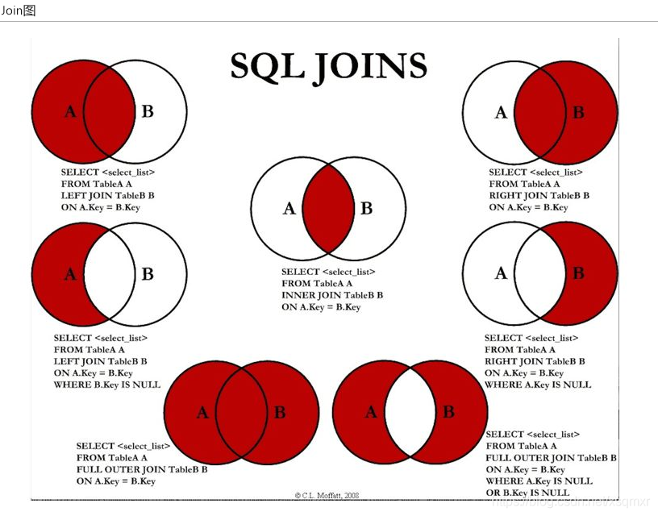
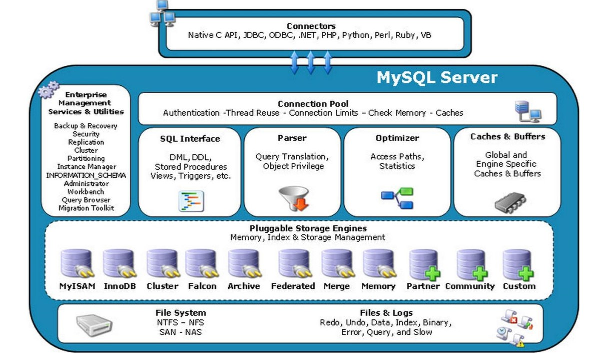

### DDL
``create`` ``alter``  ``drop``  ``rename``  ``truncate`` 都自动提交 `commit` 且不受 ``set autocommit = false`` 影响, ``rollback`` 对DDL操作都失效

``create database if not exists xxx ``

``drop database|table if exists xxx``

``DELETE TABLE IF EXISTS xxx;``// 删表内容

``TRUNCATE TABLE xxx;``// 清空表数据 不可 ``rollback``

``RENAME TABLE XXX TO YYY``

``ALTER TABLE`` 表名 ``ADD | MODIFY | CHANGE | DROP COLUMN`` 字段名 字段类型【字段约束】

``CREATE TABLE xxx LIKE xxx;``//复制结构

``CREATE TABLE xxx SELECT * FROM xxx;``//复制结构 + 数据

``CREATE TABLE emp2 AS SELECT employee_id,last_name,salary FROM employees;``//选择复制结构 如果起别名就会作为新表的表名

如果只想要某些字段 不想要数据 就给出一个where不成立的结果 就不会存在数据


复制数据到另一张表,表结构相同的表，且在同一数据库（如，table1,table2)（不同表结构也是如此）
- Sql ：insert into table1 select * from table2 (完全复制)
- insert into table1 select distinct * from table2(不复制重复纪录）
- insert into table1 select top 5 * from table2 (前五条纪录)

不在同一数据库中（如，db1 table1,db2 table2)
- sql: insert into db1..table1 select * from db2..table2 (完全复制)
- insert into db1..table1 select distinct * from db2table2(不复制重复纪录）
- insert into tdb1..able1 select top 5 * from db2table2 (前五条纪录)

位置 ：列级 vs 表级// 约束的分类

数量 ：单列 vs 多列

功能 ：not null | unique | primary key | auto increment | foreign | check| default 

``ALTER TABLE emp4 DROP INDEX emp4_email_uk``

``ALTER TABLE emp4 ADD CONSTRAINT emp4_email_uk UNIQUE(id)``

### DCL
``commit`` ``rollback`` ``grant`` ``revoke`` ``savepoint``

### DML / DQL
``insert``  ``delete``  ``update`` 逻辑删除,自增继续,会返回受影响的行数,支持回滚，``truncate table ``真删除 自增不会 不会返回受影响的行数，不支持回滚

``if(条件，表达式1，表达式2)``

```sql
case [表达式] // if / case 
when 值1 then 结果1 [else 结果2]
when 值2 then 结果2
...else 默认结果
end
```

```sql
select a.name,
case when b.id is null then '否' else '是' end '是否为掌门' 
from ...
```

```sql
SELECT last_name Last_name, job_id Job_id, 
CASE job_id 
WHEN 'AD_PRES' THEN 'A'
WHEN 'ST_MAN' THEN 'B'
WHEN 'IT_PROG' THEN 'C'
WHEN 'SA_REP' THEN 'D'
WHEN 'ST_CLERK' THEN 'E'
ELSE 'F'
END "gradeyx"
FROM employees;
```
IF(expr1,expr2,expr3) , IFNULL(expr1,expr2) , isnull(expr)

ifnull(字段,表达式)version() ,user(),database(),in(),not in(),between,not between(),

#### Like 搭配通配符  
``_`` 任意单个字符 ``__a``, ``a_``

``%`` 任意多个字符  ``%a%``    ``%a``    ``a%``

```where last_name like '_\_a%';``` 转义或#  ```'_#_a%' escape '#'；``` #开始的一个字符被省略,转义

```Select * from employee where last_name like 'a%';'____e%';'_$_%' escape '$';``` $开始的一个字符被省略,转义

### 比较运算符
``<>`` 判断两个值,字符串,表达式是否不相等

``<=>`` 安全的判断两个值,字符串,表达式是否相等

##### 非符号运算符
| 运算符      | 作用                           | 示例                                   |
| ----------- | ------------------------------ | -------------------------------------- |
| is null     | 值,字符串,表达式是否为空       | select b from table where a is null    |
| is notnull  | 不为空                         | where a is not null                    |
| least       | 多个值中的最小值               | select d from table where c least(a,b) |
| greatest    | 多个值中的最大值               | where c greatest(a,b)                  |
| between and | 一个值是否在两个值之间         | where c between a and b                |
| isnull      | 值,字符串,表达式是否为空       | where a isnull                         |
| in          | 一个值是否为列表中的任意一个值 | where c in (a,b)                       |
| not in      | 不是列表中的任意一个值         | where c not in (a,b)                   |
| like        | 模糊匹配                       | where a like b                         |
| regexp      | 值是否符合正则表达式的规则     | where a regexp b                       |
| rlike       | 值是否符合正则表达式的规则     | where a rlike b                        |

##### 逻辑运算符
| 运算符     | 作用     | 示例           |
| ---------- | -------- | -------------- |
| not 或 !   | 逻辑非   | select not a   |
| and 或 &&  | 逻辑与   | select a and b |
| or 或 \|\| | 逻辑或   | select a or b  |
| xor        | 逻辑异或 | select a xor b |

一起用 ``and`` 优先级高于 ``or``



##### JOIN / inner / outer  / union set / difference set
```sql
//INNER JOIN
select * from a inner join b on a.key=b.key

//LEFT OUTER JOIN
select * from a left join b on a.key=b.key

//RIGHT OUTER JOIN
select * from a right join b on a.key=b.key

// LEFT OUTER OUTER JOIN
select * from a left join b on a.key=b.key where b.key is null

// RIGHT OUTER OUTER JOIN
select * from a right join b on a.key=b.key where a.key is null

// 并集union SET,union会去重,速度慢,UNION All不会去重,速度快
// LEFT OUTER JOIN + RIGHT OUTER OUTER JOIN 也可以

select * from a full outer join b on a.key=b.key
mysql不支持上面的

select * from a left join b on a.key=b.key(找出A的所有)
union(去重)
select * from a right join b on a.key=b.key(找出B的所有)

// 差集difference SET  union会去重,速度慢,UNION All不会去重,速度快
select * from a full outer join b on a.key=b.key where a.key is null 	or b.key is null
mysql不支持上面的

select * from Table A left join Table B on A.Key = B.Key where B.Key is null(找出A的独有)
union(去重,排序)
select * from Table A right join Table B on A.Key = B.Key where A.Key is null(找出B的独有)
```
多条待联合的查询语句的查询列数必须一致，查询类型，字段意义最好一致;

union 需要两条或以上的select语句组成

每个查询必须包含相同的列，表达式或聚集函数(不需要以相同的次序列出)

列数据类型必须兼容:类型不需完全相同，但必须是DBMS可以隐式转换的类型

**两者的区别**

对重复结果的处理：UNION会去掉重复id记录，以第一个id为准，UNION ALL不会；

对排序的处理：UNION会排序，UNION ALL只是简单地将两个结果集合并；

效率方面的区别：因为UNION 会做去重和排序处理，因此效率比UNION ALL慢很多；

| 执行顺序 |
| -------- |
7 Select 查询列表 
1 From 表名1 别名
2 join 表名2 别名
3 on 连接条件
4 Where 【and】筛选条件
5 Group by 分组 + WITH ROLLUP,对分组之后的组函数进行求和
6 Having 分组后筛选
8 Order by 排序列表
9 limit (page - 1)*size,size 

过滤条件1有组函数，过滤条件1声明在having中 Having 先遍历再过滤

过滤条件2无组函数，推荐过滤条件2声明在where中 Where 遍历时就在过滤


select count(distinct 字段) from 表

Max/min/count/avg/sum 只适用数字,全都忽视null



### B+树存放多少行数据

InnoDB一棵B+树可以存放多少行数据？这个问题的简单回答是：约2千万

磁盘扇区、文件系统、InnoDB存储引擎都有各自的最小存储单元。


- 在计算机中磁盘存储数据最小单元是扇区,一个扇区的大小是512字节
- 文件系统（例如XFS/EXT4）他的最小单元是块一个块的大小是4k
- InnoDB存储引擎也有自己的最小储存单元——页（Page），一个页的大小是16K。
  - 文件系统中一个文件大小只有1个字节，但不得不占磁盘上4KB的空间。
  - innodb的所有数据文件（后缀为ibd的文件），他的大小始终都是16384（16k）的整数倍。

InnoDB存储引擎的最小存储单元是页，页可以用于存放数据也可以用于存放键值+指针，在B+树中叶子节点存放数据，非叶子节点存放键值+指针。

索引组织表通过非叶子节点的二分查找法以及指针确定数据在哪个页中，进而在去数据页中查找到需要的数据；

那么现在我们需要计算出非叶子节点能存放多少指针，其实这也很好算，我们假设主键ID为bigint类型，长度为8字节，而指针大小在InnoDB源码中设置为6字节，这样一共14字节，我们一个页中能存放多少这样的单元，其实就代表有多少指针，即16384/14=1170。那么可以算出一棵高度为2的B+树，能存放1170*16=18720条这样的数据记录。

根据同样的原理我们可以算出一个高度为3的B+树可以存放：1170117016=21902400条这样的记录。所以在InnoDB中B+树高度一般为1-3层，它就能满足千万级的数据存储。在查找数据时一次页的查找代表一次IO，所以通过主键索引查询通常只需要1-3次IO操作即可查找到数据。

为什么MySQL的索引要使用B+树而不是其它树形结构?比如B树？

简单版本回答是：
因为B树不管叶子节点还是非叶子节点，都会保存数据，这样导致在非叶子节点中能保存的指针数量变少（有些资料也称为扇出），指针少的情况下要保存大量数据，只能增加树的高度，导致IO操作变多，查询性能变低；