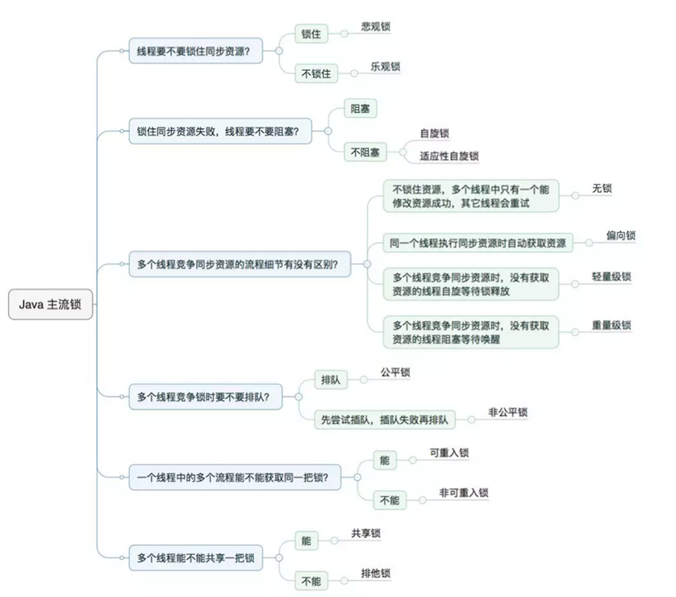
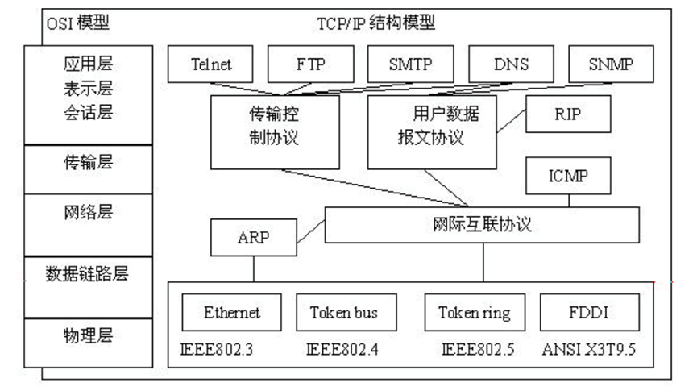
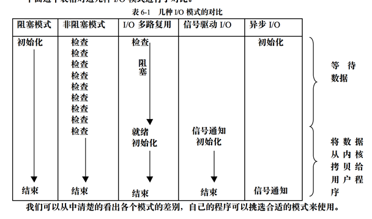
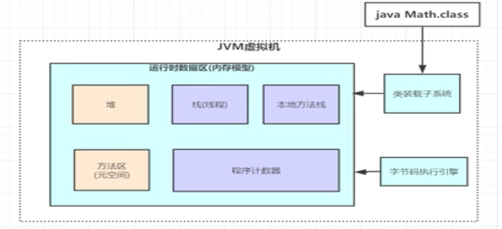
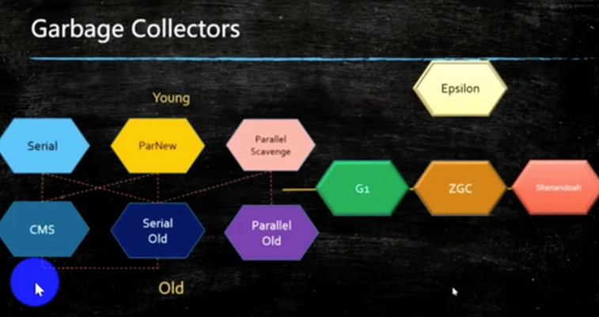

# 总结

- [总结](#总结)
  - [一、Linux网络编程](#一linux网络编程)
  - [1.1 进程通信的定义](#11-进程通信的定义)
  - [1.2 进程间通信的方式](#12-进程间通信的方式)
    - [1.2.1 管道的定义](#121-管道的定义)
    - [1.2.2五种进程间通信方式的比较](#122五种进程间通信方式的比较)
  - [1.3线程与进程的区别](#13线程与进程的区别)
  - [1.4多线程之间通信方式or线程池内数据如何保证一致性](#14多线程之间通信方式or线程池内数据如何保证一致性)
    - [1.4.1 volatile关键字的语义](#141-volatile关键字的语义)
    - [1.4.2 final关键字的语义](#142-final关键字的语义)
    - [1.4.3 sychronized关键字的内存语义](#143-sychronized关键字的内存语义)
    - [1.4.4 线程的5个基本的同步机制](#144-线程的5个基本的同步机制)
  - [1.5 Linux文件](#15-linux文件)
    - [1.5.1 Linux文件相关的系统调用都有哪些](#151-linux文件相关的系统调用都有哪些)
  - [1.5 Java主流锁](#15-java主流锁)
    - [1.5.1 悲观锁和乐观锁](#151-悲观锁和乐观锁)
    - [1.5.2 阻塞和非阻塞](#152-阻塞和非阻塞)
  - [1.6 简述一下BIO、AIO和NIO的区别](#16-简述一下bioaio和nio的区别)
  - [1.7 通信协议有哪些](#17-通信协议有哪些)
  - [1.8 TCP/IP结构模型](#18-tcpip结构模型)
    - [1.8.1 IP的四个主要功能](#181-ip的四个主要功能)
    - [1.8.2 控制位的取值及含义](#182-控制位的取值及含义)
    - [1.8.3 套接字的三种类型](#183-套接字的三种类型)
    - [1.8.4 五种IO模式](#184-五种io模式)
    - [1.8.5 简述Https流程](#185-简述https流程)
    - [1.8.6 TCP/IP三次握手建立连接（连接是全双工）](#186-tcpip三次握手建立连接连接是全双工)
    - [1.8.7 TPC/IP四次挥手关闭连接](#187-tpcip四次挥手关闭连接)
  - [二、JAVA](#二java)
  - [2.1 JVM](#21-jvm)
    - [2.1.1 简述JVM内存模型](#211-简述jvm内存模型)
    - [2.1.2 JVM内存结构](#212-jvm内存结构)
    - [2.1.3实例对象的存储](#213实例对象的存储)
    - [2.1.4如何实现基于引用计数的垃圾回收器，避免循环引用](#214如何实现基于引用计数的垃圾回收器避免循环引用)
    - [2.1.5可以作为GC ROOT的对象](#215可以作为gc-root的对象)
    - [2.1.6 finalizer有哪些替代](#216-finalizer有哪些替代)
    - [2.1.7 AQS如何避免加锁](#217-aqs如何避免加锁)
    - [2.1.8 JIT（Just in time complication）](#218-jitjust-in-time-complication)
    - [2.1.9 简述JVM的垃圾回收机制](#219-简述jvm的垃圾回收机制)
    - [2.1.10 方法区如何判断是否需要回收](#2110-方法区如何判断是否需要回收)
    - [2.1.11 JVM组成部分](#2111-jvm组成部分)
  - [2.2 JAVA基础和源码](#22-java基础和源码)
    - [2.2.1反射为什么能访问私有数据](#221反射为什么能访问私有数据)
    - [2.2.2 Java泛型的本质是什么](#222-java泛型的本质是什么)
    - [2.2.3 lambda表达式原理](#223-lambda表达式原理)
    - [2.2.4列举其他的函数式接口](#224列举其他的函数式接口)
  - [二、算法](#二算法)
  - [2.1 哈希](#21-哈希)
    - [2.1.1介绍一下一致性哈希算法](#211介绍一下一致性哈希算法)
    - [2.1.2介绍一下哈希槽](#212介绍一下哈希槽)
    - [2.1.2.1 哈希槽为什么是2的14次方](#2121-哈希槽为什么是2的14次方)
    - [2.1.3 二分查找算法](#213-二分查找算法)
  - [三、工程技术](#三工程技术)
  - [3.1 spring](#31-spring)
    - [3.1.1谈谈对spring的理解](#311谈谈对spring的理解)
    - [3.1.2谈谈对spring boot的理解](#312谈谈对spring-boot的理解)
    - [3.1.3谈谈对springcloud的理解](#313谈谈对springcloud的理解)
    - [3.1.4谈谈hystrix](#314谈谈hystrix)
  - [3.2设计模式具体使用](#32设计模式具体使用)
  - [3.3简单说一下分布式事务](#33简单说一下分布式事务)
  - [3.4 Kubernetes架构](#34-kubernetes架构)
  - [3.5 谈谈领域驱动设计](#35-谈谈领域驱动设计)
  - [3.6 稳定性](#36-稳定性)
    - [3.6.1隔离术](#361隔离术)
    - [3.6.2 风险巡检术](#362-风险巡检术)
    - [3.6.3 稳定性设计术](#363-稳定性设计术)
    - [3.6.4 流程规范术](#364-流程规范术)
  - [四、中间件](#四中间件)
  - [3.1 redis](#31-redis)
    - [3.1.1 redis的架构或redis的持久化架构](#311-redis的架构或redis的持久化架构)
    - [3.1.2 redis如何使用](#312-redis如何使用)
    - [3.1.3 redis在使用过程中如何保证高可用](#313-redis在使用过程中如何保证高可用)
    - [3.1.4 redis如何选择主节点？](#314-redis如何选择主节点)
    - [3.1.5 redis线程安全问题](#315-redis线程安全问题)
    - [3.1.6单线程的redis性能为何这么高](#316单线程的redis性能为何这么高)
    - [3.1.7 redis缓存淘汰算法lru](#317-redis缓存淘汰算法lru)
    - [3.1.8描述一下redis数据结构](#318描述一下redis数据结构)
      - [3.1.8.1 redis数据结构底层如何实现](#3181-redis数据结构底层如何实现)
      - [3.1.8.2 redis的sortedset的get的时间复杂度](#3182-redis的sortedset的get的时间复杂度)
    - [3.1.9缓存穿透、缓存击穿、缓存雪崩](#319缓存穿透缓存击穿缓存雪崩)
  - [3.2 Kafka](#32-kafka)
    - [3.2.1描述一下Kafka以及实现原理](#321描述一下kafka以及实现原理)
    - [3.2.2如何保证消息刚好消费一次](#322如何保证消息刚好消费一次)
    - [3.2.3 Kafka存储架构](#323-kafka存储架构)
    - [3.2.4 Kafka消费者拉取消息的频率](#324-kafka消费者拉取消息的频率)
    - [3.2.5 Kafka的性能优化](#325-kafka的性能优化)
  - [五、存储](#五存储)
  - [5.1 mysql](#51-mysql)
    - [5.1.1 mysql的主从复制](#511-mysql的主从复制)
    - [5.1.2 MySql的数据结构or索引原理](#512-mysql的数据结构or索引原理)
    - [5.1.3 MySql索引优化](#513-mysql索引优化)
    - [5.1.4聚集索引和非聚集索引](#514聚集索引和非聚集索引)
    - [5.1.5 聚集索引和非聚集索引的区别](#515-聚集索引和非聚集索引的区别)
    - [5.1.6怎样做分库分表](#516怎样做分库分表)
    - [5.1.7 sql查询所有成绩大于80的姓名](#517-sql查询所有成绩大于80的姓名)
    - [5.1.8 磁盘IO的优化](#518-磁盘io的优化)

## 一、Linux网络编程

## 1.1 进程通信的定义

进程通信IPC(Inter-ProcessCommunication)是进程之间互相交换信息的工作。进程的互斥、同步、通信是用来解决并发进程的资源竞争与协作的手段。通信包含同步，同步又包含互斥。

## 1.2 进程间通信的方式

信号，管道，管道又分为匿名管道和命名管道，共享资源。AT&T在UNIXSystem V中又引入了三种通信方式分别是：消息队列、信号量和共享内存。统称为System V IPC。

### 1.2.1 管道的定义

管道分为匿名管道和命名管道。匿名管道只能用于父子进程通讯，命名管道也就是FIFO管道可以用于公共通信。

### 1.2.2五种进程间通信方式的比较

1>管道：速度慢，容量优先，只能用于父子进程通信。

2>FIFO：速度慢，任何进程都能通信。

3>消息队列：容量受系统限制，而且要注意第一次读的时候要考虑上一次没有读完数据的问题。

4>信号量：不能传递复杂消息，只能用来同步。

5>共享内存区：能够很容易控制容量，速度快，但要保持同步。

## 1.3线程与进程的区别

进程是程序在执行过程中分配和管理资源的基本单位。线程是进程的一个实体，是CPU调度和分派的基本单位，它是比进程更小的独立运行的基本单位。线程自己基本上不拥有系统资源，只拥有一点在运行中必不可少的资源(程序计数器、一组寄存器和栈)，它与进程的其他线程共享进程的资源。

进程和线程是不同的操作系统资源管理方式。进程有独立的地址空间，一个进程崩溃后，在保护模式下不会对其他进程产生影响，而线程只是一个进程中的不同执行路径。线程有自己的堆栈和局部变量，但是线程没有单独的地址空间。一个线程死掉就等于整个进程死掉，所以多进程的程序要比多线程的程序健壮，但在进程切换时，耗费资源较大。对于一些要求同时进行并且又要共享某些变量的并发操作，只能用线程，不能用进程。

进程的通信包含资源的通信和状态的同步。因为线程资源是共享的，所以线程的通信基本就是线程的同步。

## 1.4多线程之间通信方式or线程池内数据如何保证一致性

锁机制：悲观锁、乐观锁

同步原语：如volatile、sychronized、final

等待唤醒机制：wait、notify

线程需要返回数据的可以用Callable、Future、FutureTask这些。

### 1.4.1 volatile关键字的语义

通过在读写操作前后添加内存屏障，达到两个效果：1是强制将修改的值写入主存，并将工作内存的值缓存失效，保证了不同线程对这个变量进行操作时的可见性。2是禁止指令重排。

### 1.4.2 final关键字的语义

根据JSR133规范

1>对于final变量的初始化重排查规则是：final关键字修饰的变量初始化的代码不能重排序到构造函数结束之后。

2>对final变量的读取重排序规则是:初次读对象引用与初次读该对象包含的final域，JMM禁止处理器重排序这两个操作。

其他方面，编译器有很大自由，能将对final字段的读操作移到同步屏障之外，也允许编译器将final字段的值保存到寄存器，在非final字段需要重新加载的那些地方，final字段无需重新加载。

### 1.4.3 sychronized关键字的内存语义

进入管程时将同步块内使用到的变量从工作内存清除，退出管程时把共享变量刷新到主内存。

### 1.4.4 线程的5个基本的同步机制

互斥量、读写锁、条件变量、自旋锁以及屏障

## 1.5 Linux文件

### 1.5.1 Linux文件相关的系统调用都有哪些

最常用的是5个: open、read、write、lseek和close。

## 1.5 Java主流锁

### 1.5.1 悲观锁和乐观锁  

悲观锁：获取数据时先加锁。如Synchronized关键字和基于AQS的锁。

乐观锁：基于无锁编程，常用的是CAS算法。如JUC的atomic包下的原子类。

### 1.5.2 阻塞和非阻塞

阻塞：需要操作系统切换CPU状态。

非阻塞：不需要切换CPU状态。

自旋锁:底层也是通过CAS实现。

自适应自旋锁：意味着自旋时间或次数不再固定，而是由前一次的状态来决定。

## 1.6 简述一下BIO、AIO和NIO的区别

1>BIO是同步阻塞通信

服务器实现模式为一个连接一个线程：客户端有连接请求时服务器端就需要启动一个线程进行处理。如果这个连接不做任何事情会造成不必要的线程开销。

2>NIO是同步非阻塞通信

服务器实现模式为一个请求一个线程：客户端发送的连接请求都会注册到多路复用器上，多路复用器轮序到连接有IO请求时才启动一个线程进行处理。

3>AIO是异步非阻塞通信

服务器实现模式为一个有效请求一个线程，客户端的IO请求是由操作系统先完成，再通知服务器应用去创建线程进行处理。

## 1.7 通信协议有哪些

XNS(XeroxNetwork Systems)协议、IPX(网际包交换)/SPX(排序包交换)协议、Apple Talk、SNA、TCP/IP

## 1.8 TCP/IP结构模型

大体分为三部分  

1>  Internet协议(IP)

2>  传输控制协议(TCP)和用户数据报文协议(UDP)

3>  处于TCP和UDP之上的一组协议专门开发的应用程序。它们包括:TELNET、文件传送协议(FTP)、域名服务(DNS)和简单的邮件传送程序(SMTP)等许多协议。

### 1.8.1 IP的四个主要功能

1>数据传送

2>寻址

3>路由选择

4>  数据报文的分段

### 1.8.2 控制位的取值及含义

URG 紧急指示字段

ACK 如果设置，该包包含确认

PSH 推入功能

RST 恢复链接

SYN 用于建立序号(同步序号)

FIN 数据不再从连接的发送点进入，结束总报文

### 1.8.3 套接字的三种类型

1>流式套接字（如TCP）

2>数据报套接字(如UDP)

3>原始套接字

### 1.8.4 五种IO模式

1>阻塞I/O

进程在调用recvfrom等待有拷贝到程序的数据区到一直到从recvfrom返回这段时间是阻塞的。进程这段时间会让出CPU时间片进行休眠等待。

2>非阻塞I/O

进程不断调用recvfrom进行检查，如果程序数据区还没有数据则立即返回一个错误。直到recvfrom检查到数据正常返回。

3>I/O多路复用

I/O多路复用是先调用select函数或poll函数，当有数据时才调用recvfrom进行真正的读写。

4>信号驱动I/O(SIGIO)

使用信号让内核在文件描述符就绪的时候使用SIGIO信号来通知。

5>  异步I/O  
我们如果想进行I/O操作，只需要告诉内核我们要进行I/O操作，然后内核会马上返回。具体的I/O和数据的拷贝全部由内核来完成，我们的程序可以继续向下执行。当内核完成所有的I/O操作和数据拷贝后，内核将通知我们的程序。异步I/O和信号驱动I/O的区别是：信号驱动I/O模式下，内核在操作可以被操作的时候通知给我们应用程序发送SIGIO消息。异步I/O模式下，内核在所有的操作都已经被内核操作结束之后才会通知我们的应用程序。

### 1.8.5 简述Https流程  

### 1.8.6 TCP/IP三次握手建立连接（连接是全双工）  

第一次握手：建立连接时，客户端发送SYN包到服务器，并进入syn\_send状态。

第二次握手：服务器收到syn包，确认客户端的syn为收到的序号+1，同时自己也发送一个syn包，即发送(syn+ack)包，此时服务器进入syn\_recv状态。

第三次握手：客户端收到服务器的syn+ack包，向服务器发送确认包ack，其中ack的值+1，此包发送完毕，客户端和服务器进入ESTABLISHED状态，完成三次握手。

### 1.8.7 TPC/IP四次挥手关闭连接

第一次挥手，客户端A发送一个FIN，用来关闭客户端到服务器的数据传送。

第二次挥手，服务器收到这个FIN，它发回一个ACK，确认序号为收到的序号+1。

第三次挥手，服务器关闭与客户端的连接，发送一个FIN给客户端。

第四次挥手，客户端发回ACK报文确认，并将确认序号设置为收到序号+1。

## 二、JAVA

## 2.1 JVM

### 2.1.1 简述JVM内存模型

根据JSR133规范,内存模型描述了一个给定程序和它的执行路径是否是一个合法的执行路径。

与这个相近的一个概念是JVM内存结构：

### 2.1.2 JVM内存结构

### 2.1.3实例对象的存储  

对象的实例(包括对象头、实例数据和填充数据)存储在堆，对象的元数据存储在方法区(元空间)，对象的引用存储在栈。

### 2.1.4如何实现基于引用计数的垃圾回收器，避免循环引用

数据结构我会用hashmap来保存对象的加减计数，要避免循环引用，需要添加辅助的工具比如基于引用遍历的垃圾回收器来清理它们。

### 2.1.5可以作为GC ROOT的对象

1>虚拟机栈中的局部变量表中引用的对象  

2>方法区中类静态属性引用的对象

3>方法区中常量引用的对象

4>本地方法栈中JNI引用的对象

5>由系统类加载器加载的类

6>存活的线程

7>用作同步监控的对象

8>被JVM持有的对象比如重要的异常处理类

### 2.1.6 finalizer有哪些替代

在java9中，finalizers的替代者是cleaners

### 2.1.7 AQS如何避免加锁

AQS抽象队列同步器本身是基于CLH队列的，通过自旋锁来进行资源的获取和释放，它本身就是一种锁实现。所以避免加锁可能是一个伪命题。但是有些常用的减少锁竞争的优化方式：比如在ConcurrentHashMap中使用锁分段技术来减小锁粒度，读写锁代替独占锁。

### 2.1.8 JIT（Just in time complication）

\-server 编译速度慢，启动后性能更高

\-XX:CompileThreshold默认1w次

\-XX:MaxFreqInlineSize=N

 -XX:MaxInlineSize=N

1>针对特定CPU型号的编译优化

2>热点数据减少查表次数

3>逃逸分析，直接栈上分配内存

4>寄存器分配

6>  热点代码缓存

7>  方法内联

### 2.1.9 简述JVM的垃圾回收机制

Java运行时内存的各个区域，对于程序计算器、虚拟机栈、本地方法栈这三个部分而言，生命周期随线程而生、随线程而灭。线程结束时内存就回收了。  

而方法区和堆区需要使用对象是否存活的算法来判断是否可以回收。

常用的判断是否可回收算法有：引用计数器、可达性分析算法。

引用计数器算法采用引用加减的方法，优点是速度快，基本不需要STW，缺点是循环引用对象无法回收。可达性分析算法是从GC ROOT开始向下搜索，当一个对象没有和任何一个GC ROOT相连时，证明对象不可达。

对象的回收还和引用强弱有关，按照引用强弱又可分为强引用、软引用、弱引用、虚引用。

目前一般垃圾收集器中采用的是可达性分析算法来标记引用。

垃圾回收算法主要有标记-清除、复制算法、标记-整理算法、分代收集算法。

### 2.1.10 方法区如何判断是否需要回收

1>该类所有的实例都已经被回收，也就是Java堆中不存在该类的实例。

2>加载该类的类加载器已经被回收。

3>该类对应的Class对应没有在任何地方被引用，无法在任何地方通过反射访问该类的方法。

### 2.1.11 JVM组成部分

## 2.2 JAVA基础和源码  

### 2.2.1反射为什么能访问私有数据

因为使用了字节码文件

### 2.2.2 Java泛型的本质是什么

把类型明确的工作推迟到创建对象或调用方法的时候。只要在编译期没出现告警，运行期就不会出现ClassCastException。

### 2.2.3 lambda表达式原理

基于单一抽象方法类型的接口，也就是函数式接口来实现。它会调用编译器生成静态方法，使用lambda表达式的地方，通过传递内部类实例，来调用函数式接口方法。

### 2.2.4列举其他的函数式接口

java.lang.Runnable、java.util.Comparator

## 二、算法

## 2.1 哈希

### 2.1.1介绍一下一致性哈希算法

在处理数据和多个缓存服务器之间对应关系的时候，可以使用哈希值取模运算，但是这时候如果需要增加或减少服务器，很多缓存会失效。一致性哈希是这个问题的一个解决方案：从0为起点到2的32次方-1做成一个哈希环。将服务器的IP地址对2的32次方取模，如果需要，每个服务器也可以复制一些虚拟节点同样映射到哈希环上。将数据的哈希值对2的32次方进行取模(2^32刚好是无符号整形的最大值)。根据取模结果离哪个节点最近决定映射到哪台服务器上。这样增加和减少节点，影响的都是它临近的节点。由于增加了虚拟节点，所以数据的压力会分散。

### 2.1.2介绍一下哈希槽

共2的14次方个槽，每台服务器分管一部分。插入数据时，根据CRC(循环冗余检验)16算法计算key对应的值，用该值对2的14次方取余数。在添加或删除节点时，只需要对节点的上哈希槽做调整。调整过程中映射先不改变，等数据迁移完成后，映射才修改。客户端可以向任何一个节点发送请求，然后由节点将请求重定向到正确的节点上。

### 2.1.2.1 哈希槽为什么是2的14次方

CRC16会输出一个16位结果，redis作者测试发现这个数对2的14次方取模会将key分布的很均匀，因此选了这个值。

### 2.1.3 二分查找算法

在有序数组中，每次先判断中间位置是否满足条件。满足则直接返回；不满足就看在前半段还是后半段。在可能满足目标条件的半段再次这样按照中间位置查找直接找到满足条件的或者确定不能满足条件。

## 三、工程技术

## 3.1 spring

### 3.1.1谈谈对spring的理解

Spring的目标:是要最大限度的简化开发工作，让开发人员集中精力于自己的业务逻辑，也是业务领域的开发。

开发的两个核心问题解耦和复用spring是这样解决的：

1>对于解耦

开发人员希望聚焦于业务领域的开发，首先要解决的事情是我修改一个业务代码，不希望显示层、模型层和控制层都要改。不希望改一个类，依赖它的类也需要改。Spring为了应对这个问题使用了控制反转的理念。将所有的依赖都由框架注入到一个上下文环境中(DI)。在这个环境中，Bean之间可以自由的使用。

2>对于复用

一些逻辑，比如日志，鉴权，很多地方都需要用到。这些与业务逻辑的关系又不是很紧密。这就用到了AOP(面向切面编程)。

Spring对解耦和复用的解决方案就是控制反转、依赖注入和AOP，在实现上

需要用到RobertMartin提出的SOLID原则。分别是单一职责、开放封闭、里氏替换、接口隔离和依赖倒置。控制反转、依赖注入和AOP，分别对应了三个spring的jar包：spring-beans、spring-context、spring-aop。每个包单一的负责一个核心功能的实现。这些都需要先做对象的实例化，这个功能由spring-core这个jar包来实现。在Spring-beans中，Spring使用工厂模式来管理程序中使用的对象Bean。每个Bean实例以BeanDefinition的形式被创建，通过java的反射机制将需要初始化的字段写入，最终保存在BeanDefinitionMap中。这整个过程由容器来实现，完成了控制反转。有了控制反转，开发者可以通过调用getBean获取到所需要的对象。spring-context提供文件列表的读入，将所有依赖的Bean放到一个Context中，就是常说的依赖注入。AOP的主要作用是不通过修改源代码的方式将功能代码织入来实现对方法的增强。实现的关键在于使用了代理模式。

### 3.1.2谈谈对spring boot的理解

使用约定大于配置的方式进一步简化Spring开发

### 3.1.3谈谈对springcloud的理解

SpringCloud是Spring为微服务架构思想做的一个一站式实现。它提供了服务注册发现Netflix Eureka、配置中心spring cloud config、负载均衡Netflix Ribbon、断路器Netflix Hystrix、路由Netflix Zuul。基本就是这些，因为美团这边主要用octo，spring cloud了解的不多。在实际项目中只用过spring cloud feign hystrix。

### 3.1.4谈谈hystrix

hystrix主要提供2种容错方法：资源隔离和熔断、降级。

资源隔离主要是线程的隔离，hystrix提供了两种线程隔离方式：线程池和信号量。线程池隔离是为每个类型的命令配置一个线程池，当线程池或请求队列饱和时，hystrix做快速失败处理，防止级联故障。

信号量隔离是对每个请求做信号量计数来控制并发请求量，防止请求线程大面积阻塞，从而达到限流和防止雪崩的目的。

熔断

在一段时间内，如果服务的错误百分比超过了一个阈值，就可以自动或手动触发断路器，停止对特定服务的所有请求。

降级

降级主要是做快速失败，使用者可以自定义fallback方法来定义失败后的处理逻辑。

## 3.2设计模式具体使用

Spring中大量使用设计模式

1>简单工厂模式，如Spring的BeanFactory

2>工厂方法，如Spring的FactoryBean接口

3>单例模式，Spring依赖注入Bean实例默认是单例的

4>适配器模式，Spring MVC的HandlerAdapter根据不同规则找到对应的Handler

5>代理模式，比如AOP

6>策略模式，比如加载资源文件的方式可以用ClassPathResource、FileSystemResource、ServletContextResourse、UrlResource。AOP的实现可以采用JDK动态代理和CGLIB代理。

7>装饰器模式，ApacheCommon大量使用装饰器模式，比如StringUtils、CollectionUtils这些工具类。

8>我自己写过一个观察者模式的，我做基于kubernetes的容器化项目，线上有几十个kubernetes集群。这些集群的信息是从数据库中读取的，因为比较少并改动不频繁。默认初始化时加载到内存中，数据库就相当于事件源。有一个线程会定时轮询数据库中的信息，一旦发生变化，就相当于是监听器监听到事件变化，则更新内存中数据。这样所有使用它的地方直接读取的就是最新的数据。

## 3.3简单说一下分布式事务

事务是n个事件要不全部成功要不全部失败。数据库事务是刚性事务，遵循ACID强一致性原则(原子性、一致性、隔离性、持久性)。

分布式事务是在分布式系统环境下由不同的服务之间通过网络协作完成的事务。分布式事务一般采用柔性事务。基于BASE(Basically Available、Soft state、Eventually consistent)理论。

我在实际工作中常用的主要有4种：

1>两阶段提交：预提交阶段判断是否满足条件，不满足则返回失败。满足则将资源预占住执行提交，提交阶段成功则返回成功，不成功则撤销提交操作。

举个我实际应用的例子：在我们申请服务器接口请求层就使用了这种方法，先预提交检查是否有服务器资源，有的话就将资源预占住，然后提交操作真正执行服务器申请。

2>异步确保型

将同步阻塞的事务操作变为异步操作。

举个我实际应用的例子：刚才提到的申请服务接口请求层。申请服务器接口实际上分成了请求层和执行层两层。因为申请服务器是一个耗时很长的操作。因为需要执行一系列的kubernetes操作，把容器创建出来，服务启动起来这些。平均需要30s。我们系统采用的方式是请求层判断是否满足申请服务器的条件，如果满足则发送两个mq，然后返回请求层的响应。这两个mq，一个是立即执行申请服务器的后续流程。另外一个是发送到延迟消息队列，5分钟后检查容器的状态看是否存在超时，超时则进行补偿处理。用户收到请求层提示成功后，再自己去轮询执行层的真正结果。

3>还有一个TCC解决方案是两阶段提交的改进，将整个业务逻辑显式的分成了try、confirm和cancel三个操作。这属于一种补偿性事务。

在之前负责美团金融交易时就使用过这种方式：先尝试支付，收到支付成功消息则返回结果，否则发起冲正(就是撤销)操作。

4>最大努力通知型

我做过一个统一降级开关的项目，一个降级开关是要对好几个子服务进行降级。这个降级接口收到请求验证符合降级条件后就返回「请求已受理，实际执行结果以通知为准」。同时异步的对每个子服务发起降级请求，请求有重试。所有请求成功或者重试超限后会发出通知各子服务的最终返回状态。

5>数据一致性算法

我听说过一些数据一致性算法，没有实际直接用过：比如Paxos、Raft、ZAB、Gossip这些少数服从多数的算法。具体内容没有研究过。由于目前的工作还是偏工程，所以我学习过的算法也就仅限于一致性哈希这种的。

## 3.4 Kubernetes架构

Kubernetes采用主从分布式架构，包括主节点、从节点，以及客户端命令行工具和其他附加项。

1>主节点

其中主节点负责对集群进行调度管理。由API Server、Scheduler、Cluster State Store（etcd）和Controller Manager Server组成。我们线上一个大集群master节点都是部署在三台物理机上，1主2从的架构。

1.1>Api server提供了统一的资源操作入口，主要用来处理REST操作。提供认证、授权、访问控制。确保它们生效，并执行相关业务逻辑，以及更新Cluster State Store中的相关对象。

1.2>Scheduler负责资源调度，按照预定的调度策略将Pod调度到相应的节点上。

1.3>ClusterState Store保存了整个集群的状态，主要用来共享配置和服务发现。我们这边用的是默认的etcd。

1.4>Controller-ManagerServer 负责维护集群的状态，比如故障检测、自动扩展、滚动更新等。默认提供Repication Controller、Node controller、Namespace Controller、Service Controller、Endpoints Controller、Persistent Controller、DaemonSet Controller。由于美团这边对容器的用法还是接近与虚拟机的用法。所以这边的容器管理已经全部从原来的基于RC的创建方式改成了直接基于Pod的创建方式。

2>再说从节点

从节点包含kubelet、kube proxy和Container Runtime。

2.1>kubelet维护容器的生命周期，并管理CSI（Container Storage Interface）和CNI（Container Network Interface）。存储方面美团这边主要使用FlexVolume插件进行LVM本地存储(逻辑卷管理)。目前也有部分是基于CSI连接EBS（弹性块存储）磁盘的。

2.2>kube-proxy基于一种公共访问策略提供访问pod的途径。

2.3>ContainerRuntime负责镜像管理以及Pod和容器的真正运行，我们这边用的docker。

3>kubectl

用于通过命令行与APIServer进行交互，实现在集群中进行各种资源的维护与管理操作。

4>附加项：对kubernetes核心功能的扩展，主要有网络、服务发现和可视化三类。

## 3.5 谈谈领域驱动设计

DDD不需要特殊的架构，只要是能将技术问题与业务问题分离的架构即可。强调保持领域模型复杂性与技术代码复杂性的隔离。核心价值点是协作、通用语言UL以及有界上下文。

战术有CQRS命令查询隔离、事件溯源、RESTful服务、消息传递、MVP最小可行产品、ACL防止损坏层、提炼核心、支撑和通用域。还有消除依赖、弱化依赖和控制依赖。这是我自己提出来的一个战术。并在之前的项目得到很好的应用。

## 3.6 稳定性

针对不同的场景和痛点，整体的方案也会不同。有一些主要的战术。

### 3.6.1隔离术

1>领域拆分隔离方面

    ACL防止损坏层

    有界上下文

    提炼核心、支撑和通用域

    分层架构

    CRUD增删改查简单架构

    CQRS命令查询隔离

    依赖消弱控

2>服务部署隔离方面

   环境拆分

    机房隔离

    通道隔离

    单元化

    泳道

    热点隔离

    读写隔离

    容器隔离

    拆库拆表

    动静隔离

    非核心流量隔离

3>服务间交互隔离方面

   超时熔断

   失败率超限降级

4>服务内资源隔离方面

    线程池隔离

    信号量隔离

### 3.6.2 风险巡检术

1>慢查询治理

2>超时治理

3>依赖治理：消除依赖、弱化依赖、控制依赖

4>系统破窗户治理

5>废弃代码资源治理

6>系统异常治理

7>告警治理

8>数据一致性治理

### 3.6.3 稳定性设计术

我们团队目前用的方案设计模板是我编写的，里面包含一个checklist有下面这些条目：

|内容|√|√|
|---|---|---|
|无状态化设计| | |
|幂等设计| | |
|包含容量预估与冗余设计| | |
|兜底策略设计| | |
|提供灰度方案| | |
|提供应急预案| | |
|核心链路尽量用成熟的技术，非核心链路可做技术探索| | |
|核心链路点对点设计，非核心链路有批量操作需设计审批流程或者熔断逻辑| | |
|包含超时和重试设计| | |
|核心数据需要对账| | |
|包含开关上线设计| | |
|敏感数据需要加密| | |

### 3.6.4 流程规范术

1>设计规范

设计按照统一的设计模板来进行。

2>开发规范

与第三方交互，交互前后都要打日志。交互后的日志要把第三方返回的结果打印出来。一旦第三方出现问题。我们拿着第三方返回的结果来跟第三方沟通。避免责怪他人讹的出现。

3>上线规范

提测分支至少2名同学进行code review。Reviewer一般为之前负责过此模块开发的同学和架构师。

Sonar静态代码检查、自动化测试要跑通。这些都是通过工具来保证的。

重大变更要开验收会进行项目验收。

因为我们有环境拆分，分成了线下环境和线上环境。发布线下环境后要观察2天以上才可以发布线上。发布有窗口期，只能在指定的流量低峰期发布。发布要提供紧急预案。

## 四、中间件

## 3.1 redis

### 3.1.1 redis的架构或redis的持久化架构

目前主流的架构是基于redis-cluster集群的无中心架构，采用哈希槽来做分布式存储。

redis与memcached相比，数据可以持久化，支持的数据类型丰富，支持服务端计算集合的并、交和补集。还支持多种排序功能。

Redis的所有数据保存在内存中，持久化方面支持半持久化模式和全持久化模式。

半持久化模式也叫RDB持久化是在指定时间间隔内将内存中的数据集快照通过异步方式保存到磁盘，实际操作过程是fork一个子进程，先将数据集写入临时文件，写入成功后，再替换之前的文件，用二进制压缩存储。

全持久化模式也叫AOF持久化是以日志的形式将每一次数据变化都写入到aof文件里。

### 3.1.2 redis如何使用

一台物理机部署mysql的读写性能在每秒几千，同配置的机器如果部署redis性能可达到mysql的几十倍，加上支持复杂的数据类型，可以方便的和对象进行映射，所以非常合适做缓存使用。但是value尽量不要太大，会影响性能，响应时间不能保证。另外可以使用set if not exist和expire设置过期时间命令来实现分布式锁。另外也可以做计数器之类的。

### 3.1.3 redis在使用过程中如何保证高可用

目前主流的基于redis-cluster集群的无中心架构，采用哈希槽来做分布式存储。哈希槽对应的节点是一主多从的。主节点发生故障，父节点会代替主节点承担流量。

### 3.1.4 redis如何选择主节点？

首先过滤掉不健康的数据节点，比如下线、断线的、失联的。然后选择slave-priority优先级最高的从节点返回，如果不存在则选择偏移量最大的从节点。也不存在则选择runid最小的节点。

### 3.1.5 redis线程安全问题

因为redis是单线程程序，所以是线程安全。

### 3.1.6单线程的redis性能为何这么高

redis是基于内存的，读写速度非常快，CPU不是瓶颈。单线程反而避免了不必要的上下文切换和竞争。另外采用了非阻塞的IO多路复用机制提高性能。

### 3.1.7 redis缓存淘汰算法lru

      Least recently used最近最少使用算法根据数据的历史访问记录来进行淘汰数据，最常见的实现是使用一个链表保存缓存数据，新数据插入到链表头部，每当缓存命中，则将数据移到链表头部，当链表满的时候，将链表尾部的数据丢弃。这种算法插入删除节点时间复杂度O(1)，获取节点的时间复杂度是O(n)

### 3.1.8描述一下redis数据结构

1\. 字符串 - 通过数值或 SDS 实现　　

2\. 列表 - 通过压缩列表或双端链表实现

3\. 哈希 - 通过压缩列表或字典实现

3\. 集合 - 通过整数集合或字典实现

4\. 有序集合 - 通过压缩列表的有序集合或跳跃表+字典组合的数据

#### 3.1.8.1 redis数据结构底层如何实现

1>redis的hash采用链地址法来处理冲突，没有使用红黑树优化。

2>redis自己构建了一种名叫Simple dynamic string(SDS)的数据结构,开发者不用担心字符串变更造成的内存溢出问题。常数时间复杂度获取字符串长度len字段。空间预分配free字段，会默认留够一定的空间防止多次重分配内存。

#### 3.1.8.2 redis的sortedset的get的时间复杂度

      集合是通过哈希表实现的，所以添加，删除，查找的复杂度都是O(1)。

### 3.1.9缓存穿透、缓存击穿、缓存雪崩

缓存穿透的解决方案：布隆过滤器、缓存空对象

缓存雪崩：缓存时间加入随机引子，尽可能分散缓存过期时间。

缓存击穿：热点数据在失效的瞬间直接请求数据库，解决方案：热点数据永不过期。

## 3.2 Kafka

### 3.2.1描述一下Kafka以及实现原理

Kafka是高吞吐量的、超强消息堆积的、有持久化能力的、快速进行消息处理的分布式消息系统中间件。

核心组件是producer、broker和consumer。broker和consumer通过zk来做分布式协调。client和server之间采用TCP协议。Kafka的存储架构方面……

### 3.2.2如何保证消息刚好消费一次

Kafka通常情况下不保证无重复消息，一般需要消费方自己做幂等。不过记得17年的时候读过一篇文章，Kafka的创始人写了一篇《正好一次传递与事务性消息》，里面介绍了将偏移量和消费端的状态更新一起写入DB来，忽略所有小于偏移量的消息，从而达到刚好一次产生副作用的目的。

### 3.2.3 Kafka存储架构

Kafka是一个分布式的、分区的、复制的提交日志服务。

      就是说消息会按照分区分布在集群的所有节点上。每个分区会有多个副本存储在不同的节点上。新的消息总是以追加的方式进行存储。

      分区和副本之间是是主从关系。主分片负责读写，从分片只是从主分片同步消息，用于在主分片出现问题时代替主分片。AP表示分区的所有副本，ISR表示和主副本同步的所有副本。如果副本超出同步范围，就叫做OSR。

      每个分区副本对应一个日志目录，目录下有多个日志分段。日志分段有大小上限，超过阈值会滚动创建新的日志分段。

      在物理上，每个日志分段由一个数据文件和一个索引文件组成。数据文件存储的是消息的真正内容，索引文件存储的数据文件的索引信息。

      索引文件采用内存映射加快读取速度。索引文件以稀疏的方式存储部分消息的偏移量到物理位置的对应关系，减少内存占用。这个偏移量是相对偏移量，并且单调递增。可以进一步减少内存的占用，并可使用二分查询快速确定偏移量的位置。

      数据文件的读取利用了现代操作系统针对磁盘读写的优化方案来加快磁盘的访问速度。比如，预读会提前将一个大磁盘快读入内存。后写会将很多小逻辑写合并起来组合成大物理写操作。还会将主内存剩余的所有空间内存都用作磁盘缓存。除了直接IO外的磁盘读写都会经过统一的磁盘缓存。消息直接在内核态使用零拷贝技术绕过用户缓冲区和socket缓冲区直接复制到网卡接口通过网络发送出去。

      以上是Kafka的核心处理。管理方面,Kafka有日志管理器和副本管理器。

Kafka服务启动时会创建一个日志管理类。负责日志的创建、检索、清理。每个日志分区都有一个全局的检查点文件。检查点表示日志已经刷新到磁盘的位置，主要用于故障的恢复。日志管理器也会定时将页面缓存中的数据真正flush到磁盘文件中。消息追加到日志中，有下面两种场景会发生刷新日志的动作。1是新创建一个日志分段，立即刷新旧的日志分段。2是日志中未刷新的消息数量超过配置项的值。

      日志管理器也会定时清理旧的日志分段。清理日志分段时从最旧的日志分段开始清理。有两种策略：一种是根据时间或大小策略，直接物理删除整个日志分段。另一是针对针对有键的消息进行日志合并压缩。

      副本管理器，追加消息时，生产者客户端会发送每个分区以及对应的消息集，拉取消息时，客户端会发送每个分区以及对应的拉取信息。服务端返回给客户端的响应结果也会按照分区分别返回。生产者可以用同步和异步模式发送生成请求给服务端。生产者发送的生产请求还有一个设置项，应答的值表示：生产者要求主副本收到指定数量的应答，才会认为生产请求完成了。如果生产者设置的应答值等于-1，服务端必须等待ISR所有副本都同步完消息，才会发送生产结果给生产者。Kafka在处理这种类型的请求时，会将延迟返回响应结果的请求放入延迟缓存队列。在操作完成或超时时，延迟操作会被从缓存队列中移除。

### 3.2.4 Kafka消费者拉取消息的频率

      因为消费者拉取数据采用轮询的方式，类似于死循环，在串行模式下是处理完消息结果后进行下一次拉取。在并行模式下是获取结果后就进行下一次拉取。轮询可以设置超时时间，超时时间内如果获取到的数据为空会多次轮询直到超时。

### 3.2.5 Kafka的性能优化

1>顺序写盘：Kafka在设计时采用追加方式来写入消息，这是典型的顺序写盘操作。可以充分利用操作系统对线性读写的深层优化，比如预读和后写。

预读会提前将一个大磁盘快读入内存。后写会将很多小逻辑写合并起来组合成大物理写操作。

2>页缓存，Kafka中大量使用了页缓存。消息都是先被写入页缓存，然后再由操作系统负责具体的刷盘操作。索引文件采用内存映射加快读取速度。索引文件以稀疏的方式存储部分消息的偏移量到物理位置的对应关系，减少内存占用。这个偏移量是相对偏移量，并且单调递增。可以进一步减少内存的占用，并可使用二分查询快速确定偏移量的位置。

3>零拷贝：消息直接在内核态使用零拷贝技术绕过用户缓冲区和socket缓冲区直接复制到网卡接口通过网络发送出去。

5>批量处理：生产者将多个消息封装成消息集，一次性发送到broker

## 五、存储

## 5.1 mysql

### 5.1.1 mysql的主从复制

      mysql主从复制是mysql高可用、高性能的基础。有三种复制模式：全同步模式、半同步模式、异步模式。mysql默认使用异步模式。

全同步模式是主节点和从节点全部执行了commit并确认才会向客户端返回成功。半同步模式是主节点只需要接收到其中一台从节点的返回信息就commit；否则需要等待直到超时时间然后切换成异步模式再提交。异步模式是主节点不会主动push bin log到从节点，直接返回成功。

      主从复制设计三个线程，一个运行在主节点（log dump thread）,其余两个(I/O thread， SQL thread)运行在从节点。当从节点连接主节点时，主节点会创建一个log dump线程，用于发送binlog内容。在读取binlog中的操作时，此线程会对主节点的binlog加锁，当读取完成时锁会被释放。当从节点上执行start slave命令后，从节点会创建一个I/O线程用来连接主节点，请求主库中更新的bin log。I/O线程接收到主节点bin log dump进程发来的更新之后，保存在本地relay log中。SQL线程负责读取relay log中的内容，解析成具体的操作并执行，最终保证主从数据的一致性。

      MySQL主从复制有三种方式：基于SQL语句的复制(statement-based replication,SBR)，基于行的复制(row-based replication,RBR),混合模式复制(mixed-based replication,MBR)。它们分别对应三种binlog文件格式。

      基于SQL语句的复制就是记录sql语句在binlog中，优点是只需要记录会修改数据的sql语句到binlog，减少binlog日志量，节约I/O，提高性能。缺点是在某些情况下，会导致主从节点中数据不一致(比如存储过程，函数等)。

基于行的复制（RBR）是mysql master将sql语句分解为基于行新的语句并记录在binlog中，优点是不会出现某些特定情况下的存储过程或者函数，或者触发器的调用或触发无法被正确复制的问题。缺点是会产生大量的日志，尤其是表结构更改会让日志暴增，同时增加binlog同步时间。也不能通过binlog解析获取执行过的sql语句，只能看到发生的数据变更。

      混合模式复制是以上两种模式的混合，对于一般的复制使用基于SQL语句的复制，对于基于SQL语句无法复制的操作则使用基于行的复制，mysql会根据执行的sql语句自己选择日志保存方式。

### 5.1.2 MySql的数据结构or索引原理

MySql实际使用的是B+Tree作为索引的数据结构，它实际上是多路平衡查找树。搜索的渐进时间复杂度是logdN。由于出度d是非常大的数据，通常超过100，所以搜索时I/O次数一般不会超过3次。但是只在叶子节点带有指向记录的指针，这样可以增加树的度。叶子节点通过指针相连来实现范围查询。

当B+Tree的数据项是复合的数据结构，B+Tree是按照从左到右的顺序来建立搜索树的，所以符合最左匹配原则。

### 5.1.3 MySql索引优化

对经常用作查询条件的、表连接的和经常出现在order by 、groupby之后的字段创建索引。可以利用最左匹配原则减少索引数量。因为索引多了会影响数据更新效率。

数据库字段最好不要允许为null，因为mysql很难对空值做查询优化。作为索引的字段值尽量不要有大量相同值，尽量选择区分度高、离散度大的。

索引字段要尽量小，因为索引所在的B+Tree的大小不超过一个内存页大小(mysql定制版16K)，是固定的，保证访问1个节点只需要1次IO。

### 5.1.4聚集索引和非聚集索引

聚集还是非聚集指的是B+Tree叶子节点存的是指针还是数据记录

MyISAM引擎索引和数据分离，使用的是非聚集索引。

InnoDB引擎数据文件就是索引文件，主键索引就是聚集索引。

聚集索引的好处之一：它对主键的排序查找和范围查找速度非常快，叶子节点的数据就是用户所要查询的数据。

聚集索引的好处之二：范围查询（range query），即如果要查找主键某一范围内的数据，通过叶子节点的上层中间节点就可以得到页的范围，之后直接读取数据页即可。

### 5.1.5 聚集索引和非聚集索引的区别

聚集索引

1.纪录的索引顺序与物理顺序相同

   因此更适合between and和order by操作

2.叶子结点直接对应数据

3.每张表只能创建一个聚集索引

非聚集索引

1.索引顺序和物理顺序无关

2.叶子结点不直接指向数据页

3.每张表可以有多个非聚集索引，需要更多磁盘和内容

   多个索引会影响insert和update的速度

### 5.1.6怎样做分库分表

分库分表分为垂直拆分和水平拆分。还有一种方式，同时结合和垂直拆分和水平拆分，比如主从表。

垂直拆分是按照领域分。水平拆分是数据量和流量的拆分。一般单表数据量超过千万性能会急剧下降需要拆表。单库TPS达到几千后，再增长就需要拆库。

刚才提到主从表，或者也有人成为子母表。是将业务主要信息放到主表，扩展信息用与主表关联的从表来存储。因为主表和从表的信息量不同。可以各自决定是否需要水平拆分。

### 5.1.7 sql查询所有成绩大于80的姓名

先扫描表，查出有成绩小于80的人的姓名，然后再次扫描表，用not in 或notexists 方法。

### 5.1.8 磁盘IO的优化

磁盘预读：根据局部预读性原理，计算机操作系统在一次IO时，不光把当前磁盘地址的数据，而且把相邻的数据也都读取到内存缓冲区内。

5.1.9mysql主从自动切换

mysql主从自动切换使用的是相对成熟的mha(Master HighAvailability)，一旦检测到主服务器故障，就会自动进行故障转移。及时有些从服务器没有收到最新的relay log，MHA自动从最新的从服务器上识别差异的relay log并把这些日志应用到其他从服务器上，因此所有的从服务器保持一致性了。MHA通常在几秒内完成故障转移，9-12秒可以检测出主服务器故障，8-10秒内关闭故障的主服务器以避免脑裂，几秒钟内应用异常的relay log到新的主服务器上，整个过程可以在1—30s

5.1.10事务的基本要素

原子性(Atomicity)、一致性(Consistency)、隔离性(Isolation)、持久性(Durabillity)

5.1.10.1事务隔离级别和不同级别的并发问题

ReadUncommitted读未提交级别下会引起脏读的并发问题

ReadCommitted 读提交级别下会引起不可重复读的并发问题

RepeatableRead 重复读级别下如果使用的是基于锁的并发控制，会引起幻读的并发问题

Serializable串行化级别下没有并发问题，但是并发度很低。

并发问题解决的原理主要有两种: LBCC和MVCC。基于锁的并发控制是悲观机制，而多版本并发控制是乐观机制。

Innodb会为每一行添加两个隐藏字段，一个表示该行的创建版本，一个表示该行的删除版本。填入的事务的版本号。

它是在一个时间点生成一个版本快照，对于RC级别下，是在事务在每次读数据的时候就创建一个read view。而RR级别下，是在事务一开始时创建一个read view。

5.1.11查询在什么时候不走索引

3种情况：1>不满足走索引的条件 2>走索引效率低于全表扫描 3>需要回表的查询结果集过大，超过了配置的范围

符合1的情况有：不满足最左匹配原则；查询条件使用了函数；or操作有一个字段没有索引；使用like条件以%开头

符合2的情况有：查询条件对null做判断，而null的值很多；一个字段区分度很小，比如性别、状态
