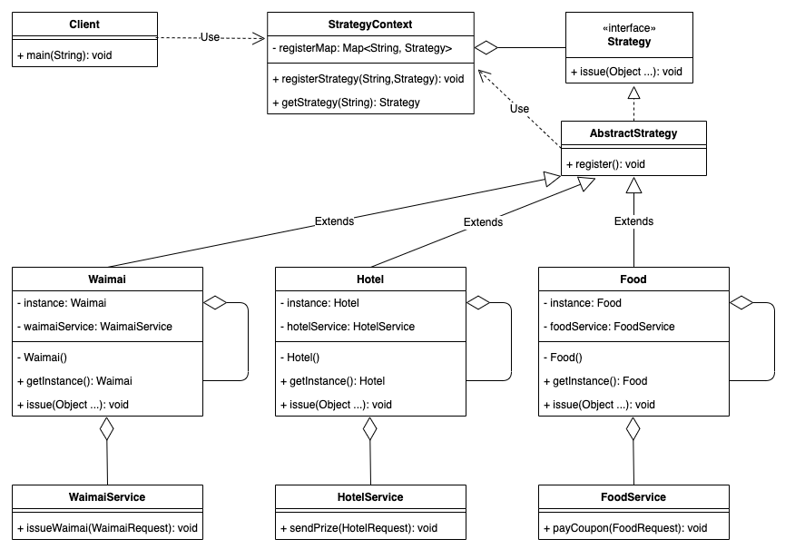
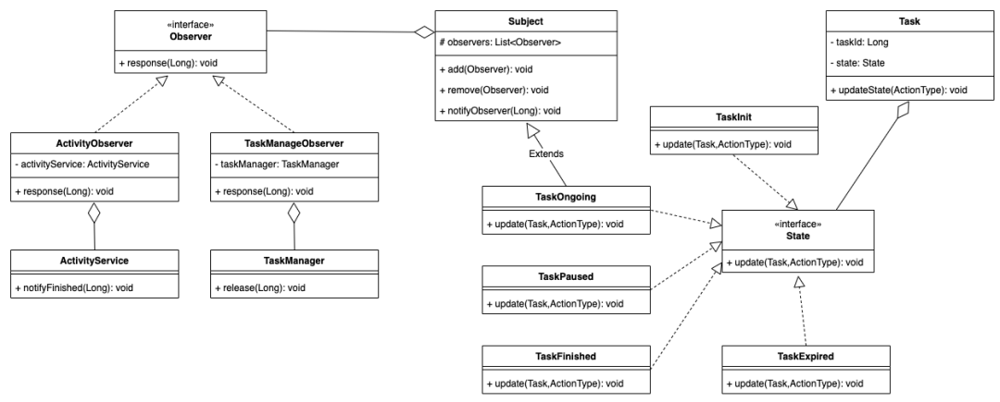
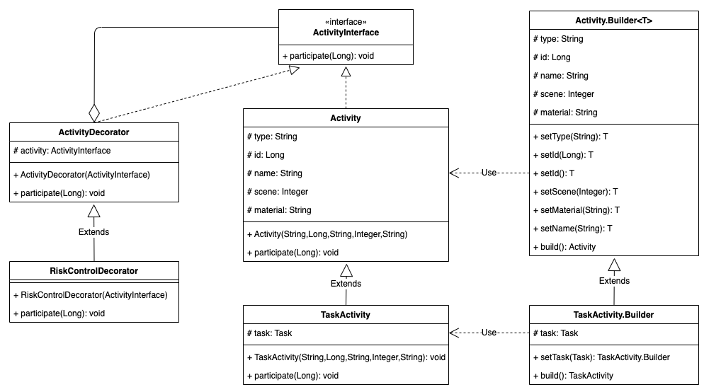

# 设计模式

- [设计模式](#设计模式)
  - [设计思想](#设计思想)
  - [示例](#示例)
    - [美团发放奖励 & 任务模型](#美团发放奖励--任务模型)
  - [SOLID原则](#solid原则)
  - [创建型](#创建型)
    - [类 工厂模式](#类-工厂模式)
    - [对象 抽象工厂模式](#对象-抽象工厂模式)
    - [对象 单例模式](#对象-单例模式)
    - [对象 建造者模式](#对象-建造者模式)
  - [结构型](#结构型)
    - [类 适配器模式](#类-适配器模式)
      - [适配器模式演示2](#适配器模式演示2)
    - [对象 装饰模式(Decorator)(包装器模式(Wrapper))](#对象-装饰模式decorator包装器模式wrapper)
    - [对象 代理模式](#对象-代理模式)
    - [对象 桥接模式](#对象-桥接模式)
  - [行为型](#行为型)
    - [类](#类)
    - [对象 观察者模式](#对象-观察者模式)
    - [对象 策略模式 & 与工厂模式的区别](#对象-策略模式--与工厂模式的区别)
      - [策略模式演示2](#策略模式演示2)

## 设计思想

1. 产品命名：以简单有趣为荣，以平庸难记为耻。

2. 单个函数：以短小精悍为荣，以冗长费神为耻。

3. 代码维护：以持续重构为荣，以停滞不前为耻。

4. 编程风格：以运用风格为荣，以随意编码为耻。

5. 程序设计：以开关上线为荣，以自信编码为耻。

6. 接口定义：以用户易用为荣，以复杂歧义为耻。

7. 断言分支：以实时报警为荣，以忽略分支为耻。

8. 监控报警：以定时调整为荣，以放弃维护为耻。

## 示例

### 美团发放奖励 & 任务模型

**[美团 设计模式二三事 点击链接](https://mp.weixin.qq.com/s/H2toewJKEwq1mXme_iMWkA)**



策略模式
> 策略模式定义了一系列的算法，并将每一个算法封装起来，使它们可以相互替换。策略模式通常包含以下角色：
>
> - 抽象策略（Strategy）类：定义了一个公共接口，各种不同的算法以不同的方式实现这个接口，环境角色使用这个接口调用不同的算法，一般使用接口或抽象类实现。
> - 具体策略（Concrete Strategy）类：实现了抽象策略定义的接口，提供具体的算法实现。
> - 环境（Context）类：持有一个策略类的引用，最终给客户端调用。

适配器模式
> 适配器模式：将一个类的接口转换成客户希望的另外一个接口，使得原本由于接口不兼容而不能一起工作的那些类能一起工作。适配器模式包含以下主要角色：
>
> - 目标（Target）接口：当前系统业务所期待的接口，它可以是抽象类或接口。
> - 适配者（Adaptee）类：它是被访问和适配的现存组件库中的组件接口。
> - 适配器（Adapter）类：它是一个转换器，通过继承或引用适配者的对象，把适配者接口转换成目标接口，让客户按目标接口的格式访问适配者。

单例模式
> 单例模式设计模式属于创建型模式，它提供了一种创建对象的最佳方式。
> 这种模式涉及到一个单一的类，该类负责创建自己的对象，同时确保只有单个对象被创建。这个类提供了一种访问其唯一的对象的方式，可以直接访问，不需要实例化该类的对象。

```java

// 策略类是没有状态的模型,可以做成单例; 环境类的获取策略方法职责很明确，要做到完全对修改封闭; 可以将策略类单例化以减少开销，并实现自注册的功能彻底解决分支判断。
// 如果使用了Spring框架，还可以利用Spring的Bean机制来代替上述的部分设计，直接使用@Component和@PostConstruct注解即可完成单例的创建和注册，代码会更加简洁。

// 策略接口
interface Strategy {void issue(Object ... params);}

// 策略上下文，用于管理策略的注册和获取
class StrategyContext {
    private static final Map<String, Strategy> registerMap = new HashMap<>();
    // 注册策略
    public static void registerStrategy(String rewardType, Strategy strategy) {registerMap.putIfAbsent(rewardType, strategy);}
    // 获取策略
    public static Strategy getStrategy(String rewardType) {return registerMap.get(rewardType);}}

// 抽象策略类
abstract class AbstractStrategy implements Strategy {
    // 类注册方法
    public void register() {StrategyContext.registerStrategy(getClass().getSimpleName(), this);}}

// 单例外卖策略
class Waimai extends AbstractStrategy implements Strategy {
    private static final Waimai instance = new Waimai();
    private WaimaiService waimaiService;
    private Waimai() {register();}
    public static Waimai getInstance() {return instance;}
    @Override
    public void issue(Object... params) {
        WaimaiRequest request = new WaimaiRequest();
        // 构建入参
        request.setWaimaiReq(params);
        waimaiService.issueWaimai(request);}}

// 单例酒旅策略
class Hotel extends AbstractStrategy implements Strategy {
    private static final Hotel instance = new Hotel();
    private HotelService hotelService;
    private Hotel() {register();}
    public static Hotel getInstance() {return instance;}
    @Override
    public void issue(Object... params) {
        HotelRequest request = new HotelRequest();
        request.addHotelReq(params);
        hotelService.sendPrize(request);}}

// 单例美食策略
class Food extends AbstractStrategy implements Strategy {
    private static final Food instance = new Food();
    private FoodService foodService;
    private Food() {register();}
    public static Food getInstance() {return instance;}
    @Override
    public void issue(Object... params) {
        FoodRequest request = new FoodRequest(params);
        foodService.payCoupon(request);}}

```



使用状态模式设计出了高内聚、高扩展性、单一职责的任务的整个状态机实现，以及做到松耦合的、符合依赖倒置原则的任务状态变更通知方式。

任务模型: 任务模型的设计。你需要重点关注状态的流转变更，以及状态变更后的消息通知。

状态模式
> 状态模式：对有状态的对象，把复杂的“判断逻辑”提取到不同的状态对象中，允许状态对象在其内部状态发生改变时改变其行为。状态模式包含以下主要角色：
>
> - 环境类（Context）角色：也称为上下文，它定义了客户端需要的接口，内部维护一个当前状态，并负责具体状态的切换。
> - 抽象状态（State）角色：定义一个接口，用以封装环境对象中的特定状态所对应的行为，可以有一个或多个行为。
> - 具体状态（Concrete State）角色：实现抽象状态所对应的行为，并且在需要的情况下进行状态切换。

```java
// 状态模式: 经过状态模式处理后的任务类的耦合度得到降低，符合开闭原则。状态模式的优点在于符合单一职责原则，状态类职责明确，有利于程序的扩展。但是这样设计的代价是状态类的数目增加了，因此状态流转逻辑越复杂、需要处理的动作越多，越有利于状态模式的应用。除此之外，状态类的自身对于开闭原则的支持并没有足够好，如果状态流转逻辑变化频繁，那么可能要慎重使用。

// 任务状态枚举
@AllArgsConstructor
@Getter
enum TaskState {
    INIT("初始化"),
    ONGOING( "进行中"),
    PAUSED("暂停中"),
    FINISHED("已完成"),
    EXPIRED("已过期");
    private final String message;}

// 行为枚举
@AllArgsConstructor
@Getter
enum ActionType {
    START(1, "开始"),
    STOP(2, "暂停"),
    ACHIEVE(3, "完成"),
    EXPIRE(4, "过期");
    private final int code;
    private final String message;}

// 任务状态抽象接口
interface State {
    // 默认实现，不做任何处理
    default void update(Task task, ActionType actionType) {
        // do nothing
        }}

// 任务初始状态
class TaskInit implements State {
    @Override
    public void update(Task task, ActionType actionType) {
        if  (actionType == ActionType.START) {
            TaskOngoing taskOngoing = new TaskOngoing();
            taskOngoing.add(new ActivityObserver());
            taskOngoing.add(new TaskManageObserver());
            task.setState(taskOngoing);}}}
            
// 任务进行状态
class TaskOngoing extends Subject implements State {  
    @Override
    public void update(Task task, ActionType actionType) {
        if (actionType == ActionType.ACHIEVE) {
            task.setState(new TaskFinished());
            // 通知
            notifyObserver(task.getTaskId());
        } else if (actionType == ActionType.STOP) {
            task.setState(new TaskPaused());
        } else if (actionType == ActionType.EXPIRE) {
            task.setState(new TaskExpired());}}}

// 任务暂停状态
class TaskPaused implements State {
    @Override
    public void update(Task task, ActionType actionType) {
        if (actionType == ActionType.START) {
            task.setState(new TaskOngoing());
        } else if (actionType == ActionType.EXPIRE) {
            task.setState(new TaskExpired());}}}

// 任务完成状态
class TaskFinished implements State {}
// 任务过期状态
class TaskExpired implements State {}

@Data
class Task {
    private Long taskId;
    // 初始化为初始态
    private State state = new TaskInit();
    // 更新状态
    public void updateState(ActionType actionType) {
        state.update(this, actionType);}}

```

观察者模式: 通过观察者模式，小明让任务状态和通知方实现松耦合（实际上观察者模式还没能做到完全的解耦，如果要做进一步的解耦可以考虑学习并使用发布-订阅模式，这里也不再赘述）。

> 观察者模式：指多个对象间存在一对多的依赖关系，当一个对象的状态发生改变时，所有依赖于它的对象都得到通知并被自动更新。这种模式有时又称作发布-订阅模式、模型-视图模式，它是对象行为型模式。观察者模式的主要角色如下。
>
> - 抽象主题（Subject）角色：也叫抽象目标类，它提供了一个用于保存观察者对象的聚集类和增加、删除观察者对象的方法，以及通知所有观察者的抽象方法。
> - 具体主题（Concrete Subject）角色：也叫具体目标类，它实现抽象目标中的通知方法，当具体主题的内部状态发生改变时，通知所有注册过的观察者对象。
> - 抽象观察者（Observer）角色：它是一个抽象类或接口，它包含了一个更新自己的抽象方法，当接到具体主题的更改通知时被调用。
> - 具体观察者（Concrete Observer）角色：实现抽象观察者中定义的抽象方法，以便在得到目标的更改通知时更新自身的状态。

```java
// 观察者模式: 

// 抽象观察者
interface Observer {void response(Long taskId); // 反应
}

// 抽象目标
abstract class Subject {
    protected List<Observer> observers = new ArrayList<Observer>();
    // 增加观察者方法
    public void add(Observer observer) {observers.add(observer);}

    // 删除观察者方法
    public void remove(Observer observer) {observers.remove(observer);}

    // 通知观察者方法
    public void notifyObserver(Long taskId) {
        for (Observer observer : observers) {
            observer.response(taskId);}}}

// 活动观察者
class ActivityObserver implements Observer {
    private ActivityService activityService;
    @Override
    public void response(Long taskId) {activityService.notifyFinished(taskId);}}

// 任务管理观察者
class TaskManageObserver implements Observer {
    private TaskManager taskManager;
    @Override
    public void response(Long taskId) {taskManager.release(taskId);}}

// 最后，小明将任务进行状态类优化成使用通用的通知方法，并在任务初始态执行状态流转时定义任务进行态所需的观察者：

```

代码重构



小明发现活动的构造不够合理，主要问题表现在：

   1. 活动的构造组件较多，导致可以组合的构造函数太多，尤其是在模型增加字段时还需要去修改构造函数；
   2. 部分组件的构造存在一定的顺序关系，但是当前的实现没有体现顺序，导致构造逻辑比较混乱，并且存在部分重复的代码。

发现问题后，小明回忆自己的学习成果，马上想到可以使用创建型模式中的建造者模式去做重构：
> 建造者模式：指将一个复杂对象的构造与它的表示分离，使同样的构建过程可以创建不同的表示。它是将一个复杂的对象分解为多个简单的对象，然后一步一步构建而成。它将变与不变相分离，即产品的组成部分是不变的，但每一部分是可以灵活选择的。建造者模式的主要角色如下:
>
> 1. 产品角色（Product）：它是包含多个组成部件的复杂对象，由具体建造者来创建其各个零部件。
> 1. 抽象建造者（Builder）：它是一个包含创建产品各个子部件的抽象方法的接口，通常还包含一个返回复杂产品的方法 getResult()。
> 1. 具体建造者(Concrete Builder）：实现 Builder 接口，完成复杂产品的各个部件的具体创建方法。
> 1. 指挥者（Director）：它调用建造者对象中的部件构造与装配方法完成复杂对象的创建，在指挥者中不涉及具体产品的信息。

根据建造者模式的定义，上述活动的每个字段都是一个产品。

```java
// 抽象活动接口
interface ActivityInterface {
   void participate(Long userId);
}


// 活动类
class Activity implements ActivityInterface {
    protected String type;
    protected Long id;
    protected String name;
    protected Integer scene;
    protected String material;
    // 全参构造函数
   public Activity(String type, Long id, String name, Integer scene, String material) {
        this.type = type;
        this.id = id;
        this.name = name;
        this.scene = scene;
        this.material = material;
    }
    @Override
    public void participate(Long userId) {
        // do nothing
    }
    // 静态建造器类，使用奇异递归模板模式允许继承并返回继承建造器类
    public static class Builder<T extends Builder<T>> {
        protected String type;
        protected Long id;
        protected String name;
        protected Integer scene;
        protected String material;
        public T setType(String type) {
            this.type = type;
            return (T) this;
        }
        public T setId(Long id) {
            this.id = id;
            return (T) this;
        }
        public T setId() {
            if ("period".equals(this.type)) {
                this.id = 0L;
            }
            return (T) this;
        }
        public T setScene(Integer scene) {
            this.scene = scene;
            return (T) this;
        }
        public T setMaterial(String material) {
            this.material = material;
            return (T) this;
        }
        public T setName(String name) {
            if ("period".equals(this.type)) {
                this.name = "period" + name;
            } else {
                this.name = "normal" + name;
            }
            return (T) this;
        }
        public Activity build(){
            return new Activity(type, id, name, scene, material);
        }
    }
}
// 任务型活动
class TaskActivity extends Activity {
    protected Task task;
   // 全参构造函数
    public TaskActivity(String type, Long id, String name, Integer scene, String material, Task task) {
        super(type, id, name, scene, material);
        this.task = task;
    }
   // 参与任务型活动
    @Override
    public void participate(Long userId) {
        // 更新任务状态为进行中
        task.getState().update(task, ActionType.START);
    }
    // 继承建造器类
    public static class Builder extends Activity.Builder<Builder> {
        private Task task;
        public Builder setTask(Task task) {
            this.task = task;
            return this;
        }
        public TaskActivity build(){
            return new TaskActivity(type, id, name, scene, material, task);
        }
    }
}

// 抽象装饰角色
abstract class ActivityDecorator implements ActivityInterface {
    protected ActivityInterface activity;
    public ActivityDecorator(ActivityInterface activity) {
        this.activity = activity;
    }
    public abstract void participate(Long userId);
}
// 能够对活动做风险控制的包装类
class RiskControlDecorator extends ActivityDecorator {
    public RiskControlDecorator(ActivityInterface activity) {
        super(activity);
    }
    @Override
   public void participate(Long userId) {
        // 对目标用户做风险控制，失败则抛出异常
       Risk.doControl(userId);
        // 更新任务状态为进行中
        activity.participate(userId);
    }
}

```

上面的建造器没有使用诸如抽象建造器类等完整的实现，但是基本是完成了活动各个组件的建造流程。使用建造器的模式下，可以先按顺序构建字段type，然后依次构建其他组件，最后使用build方法获取建造完成的活动。这种设计一方面封装性好，构建和表示分离；另一方面扩展性好，各个具体的建造者相互独立，有利于系统的解耦。可以说是一次比较有价值的重构。在实际的应用中，如果字段类型多，同时各个字段只需要简单的赋值，可以直接引用Lombok的@Builder注解来实现轻量的建造者。

```java
// 这个代码直接对代码改造,不好; 最好能尽可能避免对旧方法的直接修改，同时为方法增加风控，也是一类比较常见的功能新增，可能会在多处使用。
public void participate(Long userId) {
    // 对目标用户做风险控制，失败则抛出异常
    Risk.doControl(userId);
    // 更新任务状态为进行中
    task.state.update(task, ActionType.START);
}

```

> 装饰器模式的定义：指在不改变现有对象结构的情况下，动态地给该对象增加一些职责（即增加其额外功能）的模式，它属于对象结构型模式。装饰器模式主要包含以下角色：
>
> 1. 抽象构件（Component）角色：定义一个抽象接口以规范准备接收附加责任的对象。
> 1. 具体构件（ConcreteComponent）角色：实现抽象构件，通过装饰角色为其添加一些职责。
> 1. 抽象装饰（Decorator）角色：继承抽象构件，并包含具体构件的实例，可以通过其子类扩展具体构件的功能。
> 1. 具体装饰（ConcreteDecorator）角色：实现抽象装饰的相关方法，并给具体构件对象添加附加的责任。

## SOLID原则

1. **SRP：单一职责原则**，任何一个软件模块应该只对某一类行为者负责。是指类变化的原因，单一职责原则规定一个类应该有且仅有一个引起它变化的原因，否则类应该被拆分（There should never be more than one reason for a class to change）。
2. **OCP：开闭原则**，设计良好的软件应该易于扩展(对扩展开放)，同时抗拒修改(对修改关闭)。是面向对象程序设计的终极目标，它使软件实体拥有一定的适应性和灵活性的同时具备稳定性和延续性
   1. 对软件测试的影响: 软件遵守开闭原则的话，软件测试时只需要对扩展的代码进行测试就可以了，因为原有的测试代码仍然能够正常运行。
   2. 可以提高代码的可复用性: 粒度越小，被复用的可能性就越大；在面向对象的程序设计中，根据原子和抽象编程可以提高代码的可复用性。
   3. 可以提高软件的可维护性: 遵守开闭原则的软件，其稳定性高和延续性强，从而易于扩展和维护。
   - 可以通过“抽象约束、封装变化”来实现开闭原则，即通过接口或者抽象类为软件实体定义一个相对稳定的抽象层，而将相同的可变因素封装在相同的具体实现类中。
   - 因为抽象灵活性好，适应性广，只要抽象的合理，可以基本保持软件架构的稳定。而软件中易变的细节可以从抽象派生来的实现类来进行扩展，当软件需要发生变化时，只需要根据需求重新派生一个实现类来扩展就可以了。
3. **LSP：里氏替换原则**，尽量使用抽象(如父类)，避免使用具体(如子类)，以便于方便的进行替换。里氏替换原则通俗来讲就是：子类可以扩展父类的功能，但不能改变父类原有的功能。也就是说：子类继承父类时，除添加新的方法完成新增功能外，尽量不要重写父类的方法。
   1. 子类可以实现父类的抽象方法，但不能覆盖父类的非抽象方法
   2. 子类中可以增加自己特有的方法
   3. 当子类的方法重载父类的方法时，方法的前置条件（即方法的输入参数）要比父类的方法更宽松
   4. 当子类的方法实现父类的方法时（重写/重载或实现抽象方法），方法的后置条件（即方法的的输出/返回值）要比父类的方法更严格或相等
4. **ISP：接口隔离原则**，客户端不应该依赖于它不需要的接口。这里啰嗦两句，Bob大叔在自己的巅峰之作《架构整洁之道》中详细介绍了SOLID原则，后来设计原则逐渐演变为六大，多出来的一个是LOD迪米特法则，又称最少知识原则，我一直找不到六大设计原则的出处，知道的朋友还烦请告知。我个人观点，接口隔离原则与迪米特法则异曲同工，所以没有必要放进来。
   1. 优点:将臃肿庞大的接口分解为多个粒度小的接口，可以预防外来变更的扩散，提高系统的灵活性和可维护性。
   2. 接口隔离提高了系统的内聚性，减少了对外交互，降低了系统的耦合性。
   3. 如果接口的粒度大小定义合理，能够保证系统的稳定性；但是，如果定义过小，则会造成接口数量过多，使设计复杂化；如果定义太大，灵活性降低，无法提供定制服务，给整体项目带来无法预料的风险。
   4. 使用多个专门的接口还能够体现对象的层次，因为可以通过接口的继承，实现对总接口的定义。
   5. 能减少项目工程中的代码冗余。过大的大接口里面通常放置许多不用的方法，当实现这个接口的时候，被迫设计冗余的代码。
   - 实现: 接口尽量小，但是要有限度。一个接口只服务于一个子模块或业务逻辑。
   - 为依赖接口的类定制服务。只提供调用者需要的方法，屏蔽不需要的方法。
   - 了解环境，拒绝盲从。每个项目或产品都有选定的环境因素，环境不同，接口拆分的标准就不同深入了解业务逻辑。
   - 提高内聚，减少对外交互。使接口用最少的方法去完成最多的事情。
5. **DIP：依赖反转原则**，多使用抽象接口，尽量避免使用多变的实现类。在软件设计中，细节具有多变性，而抽象层则相对稳定，因此以抽象为基础搭建起来的架构要比以细节为基础搭建起来的架构要稳定得多。这里的抽象指的是接口或者抽象类，而细节是指具体的实现类。
   1. 优点: 依赖倒置原则可以降低类间的耦合性。
   2. 依赖倒置原则可以提高系统的稳定性。
   3. 依赖倒置原则可以减少并行开发引起的风险。
   4. 依赖倒置原则可以提高代码的可读性和可维护性。
   - 实现: 每个类尽量提供接口或抽象类，或者两者都具备。
   - 变量的声明类型尽量是接口或者是抽象类。
   - 任何类都不应该从具体类派生。
   - 使用继承时尽量遵循里氏替换原则。

|设计原则 |一句话归纳 |目的|
|---|---|---|
|开闭原则| 对扩展开放，对修改关闭| 降低维护带来的新风险|
|依赖倒置原则| 高层不应该依赖低层，要面向接口编程| 更利于代码结构的升级扩展|
|单一职责原则| 一个类只干一件事，实现类要单一| 便于理解，提高代码的可读性|
|接口隔离原则| 一个接口只干一件事，接口要精简单一| 功能解耦，高聚合、低耦合|
|迪米特法则| 不该知道的不要知道，一个类应该保持对其它对象最少的了解，降低耦合度| 只和朋友交流，不和陌生人说话，减少代码臃肿|
|里氏替换原则| 不要破坏继承体系，子类重写方法功能发生改变，不应该影响父类方法的含义| 防止继承泛滥|
|合成复用原则| 尽量使用组合或者聚合关系实现代码复用，少使用继承| 降低代码耦合|

实际上，这些原则的目的只有一个：降低对象之间的耦合，增加程序的可复用性、可扩展性和可维护性。  
记忆口诀：访问加限制，函数要节俭，依赖不允许，动态加接口，父类要抽象，扩展不更改。  
在程序设计时，我们应该将程序功能最小化，每个类只干一件事。若有类似功能基础之上添加新功能，则要合理使用继承。对于多方法的调用，要会运用接口，同时合理设置接口功能与数量。最后类与类之间做到低耦合高内聚。


## 创建型

1. 单例（Singleton）模式：某个类只能生成一个实例，该类提供了一个全局访问点供外部获取该实例，其拓展是有限多例模式。
2. 原型（Prototype）模式：将一个对象作为原型，通过对其进行复制而克隆出多个和原型类似的新实例。
3. 工厂方法（FactoryMethod）模式：定义一个用于创建产品的接口，由子类决定生产什么产品。
4. 抽象工厂（AbstractFactory）模式：提供一个创建产品族的接口，其每个子类可以生产一系列相关的产品。
5. 建造者（Builder）模式：将一个复杂对象分解成多个相对简单的部分，然后根据不同需要分别创建它们，最后构建成该复杂对象。

### 类 工厂模式

```java
public interface Sender {  
    public void Send();}  

public class MailSender implements Sender {  
    @Override  
    public void Send() {  
        System.out.println("this is mailsender!");}}  

public class SmsSender implements Sender {  

    @Override  
    public void Send() {  
        System.out.println("this is sms sender!");  }}  

public class SendFactory {  

    public static Sender produceMail(){  
        return new MailSender();}  

    public static Sender produceSms(){  
        return new SmsSender();}}  

public class FactoryTest {  

    public static void main(String[] args) {      
        Sender sender = SendFactory.produceMail();  
        sender.Send();}}  
```

### 对象 抽象工厂模式

```java
public interface Provider {  
    public Sender produce();}  

public class SendMailFactory implements Provider {  

    @Override  
    public Sender produce(){  
        return new MailSender();}}  

public class SendSmsFactory implements Provider{  

    @Override  
    public Sender produce() {  
        return new SmsSender();}}  

public class Test {  

    public static void main(String[] args) {  
        Provider provider = new SendMailFactory();  
        Sender sender = provider.produce();  
        sender.Send();  }}  
// 总结：如果要新增发送微信，则只需做一个实现类，实现Sender接口，同时做一个工厂类，实现Provider接口，就OK了，无需去改动现成的代码。这样做，拓展性较好！
// 所有工厂模式中，抽象工厂模式最先进。
```

### 对象 单例模式

```java
// 懒汉
class Bank {
    private Bank() {}
    private volatile static Bank instance = null;
    public static Bank getInstance() {
        // 方式一：效率稍差
        // synchronized (Bank.class) {
        // if(instance == null){
        // instance = new Bank();}
        // return instance;}

        // 方式二：效率更高,双重检索
        if (instance == null) {
            synchronized (Bank.class) {
                if (instance == null) {
                    instance = new Bank();}}}
    return instance;}}

// 饿汉
public class SingleTon1(){
    private SingleTon1(){}
    private static SingleTon1 singleton = new SingleTon1();
public static getInstance(){return singleton ;}}

// 静态内部类,推荐此方式;JVM类加载机制来保证初始化实例对象时只有一个线程
public class Singleton {
    private Singleton() {}
    public static Singleton getInstance() {return SingletonHolder.sInstance;}
    private static class SingletonHolder {
        private static final Singleton sInstance = new Singleton();}}

// 使用容器实现单例模式
public class SingletonManager {
    private static Map<String, Object> objMap = new HashMap<String, Object>();
    private Singleton() { }public static void registerService(String key, Objectinstance) {
            if (!objMap.containsKey(key) ) {
            objMap.put(key, instance) ;}}
    public static ObjectgetService(String key) {
            return objMap.get(key) ;}}

// 给实例构造函数protected或private权限，可以通过相关反射方法，改变其权限，创建多个实例
public class Test {
    public static void main(String args[]) {
    private Singleton() {};
    Singleton singleton = Singleton.getInstance();try
    {
            Constructor<Singleton> constructor = Singleton.class.getDeclaredConstructor();
            constructor.setAccessible(true);
            Singleton singletonnew = constructor.newInstance();
            System.out.println(singleton == singletonnew);
            // 输出结果为 false
        }catch(
    Exception e){
    }}}
    // 解决方案：可以给构造函数加上判断，限制创建多个实例，
    private Singleton() {
            if (null != Singleton.singleton) {
            throw new RuntimeException();}}
```

### 对象 建造者模式

将一个复杂对象分布创建。如果一个超大的类的属性特别多，我们可以把属性分门别类，不同属性组成一个稍微小一点的类，再把好几个稍微小点的类窜起来。比方说一个电脑，可以分成不同的稍微小点的部分CPU、主板、显示器。CPU、主板、显示器分别有更多的组件，不再细分。

```java
@Data
public class Computer{
    private CPU cpu;//cpu 是个接口，有不同实现如InterCPU AMDCPU 等等
    private MainBoard mainBoard;//mainBoard 是个接口，有不同的实现
    private DisPlayer disPlayer;//disPlayer 是个接口，有不同的实现}

public abstract class Builder { 
    abstract void buildCPU(); 
    abstract void buildMainBoard(); 
    abstract void buildDisPlayer(); 
    abstract Computer createComputer(); } 

public class XiaoMiBuilder extends Builder{
    private Computer computer = new Computer();
    @Override
    void buildCPU() {
        computer.setCpu(new InterCPU());}
    @Override
    void buildMainBoard() {
        computer.setMainBoard(new AMainBoard());}
    @Override
    void buildDisPlayer() {
        computer.setDisPlayer(new ADisPlayer());}
    @Override
    Computer createComputer() {
        return computer;}}
```

SpringBoot实现了0配置，几乎所有的配置都写到了java代码中，大量的配置不得不让配置类采用建造者模式，这样层次比较清晰。

## 结构型

### 类 适配器模式

FutureTask 本身实现了RunnableFuture,构造器又注入了Callable,这是一个适配器模式

1. 构造方法一：传入参数为Callable接口

    ```java
    public class FutureTask<V> implements RunnableFuture<V>;

    public FutureTask(Callable<V> callable) {
        if (callable == null)
            throw new NullPointerException();
        this.callable = callable;
        this.state = NEW; }      // ensure visibility of callable}
    ```

2. 构造方法二：传入的参数为Runnable接口

    ```java
    // 这是FutureTask的构造方法
    public FutureTask(Runnable runnable, V result) {
        // 调用Executors类中的callable方法进行转化
        this.callable = Executors.callable(runnable, result);
        this.state = NEW;}       // ensure visibility of callable}
    ```

- Executors类中的callable方法

    ```java
    public static <T> Callable<T> callable(Runnable task, T result) {
        if (task == null)
            throw new NullPointerException();
        // 返回类型是Callable
        // 这里就开始使用适配器模式了
        return new RunnableAdapter<T>(task, result);}
    ```

- 在Executors中内部类：即我们的适配器类

    ```java
    // 实现了Callable接口
    static final class RunnableAdapter<T> implements Callable<T> {
        final Runnable task;
        final T result;
        // 传入Runnable接口（实现类）和返回值
        RunnableAdapter(Runnable task, T result) {
            this.task = task;
            this.result = result;}

        // 实现call（）方法
        public T call() {
            // 在call方法中调用Runnable实现类中的run（）方法
            // 变相实现了将Runnable转化为Callable的过程
            task.run();
            // 返回值（Callable接口的call方法有返回值）
            return result;}}
    ```

#### 适配器模式演示2

适配器，顾名思义，是让两个不兼容的东西可以一起工作。例如插座的电源是220V，手机直接给他220V 50HZ的交流电我相信一般都会直接炸了（除了诺基亚...）手机充电器就进行了适配，将电压变小，交流电变成直流电。除了这种需要改变属性的操作（比较好说，不举例子了），适配器还用于在接口继承方面。假设一个顶级接口有一大堆方法需要实现类实现，我新写了个类只是想选择的实现一两个接口，那其他的方法我是不是都需要实现一下，即使是空实现（单纯实现，不进行任何逻辑操作），这是我们就需要一个适配器类，空实现那些方法，我的新类只需要继承这个适配器类就好了，要是想实现某个方法，只需要重写掉配置类中对应的方法就好。这种模式基本都会用到，毕竟谁的代码还没个顶级接口啊。

```java
public interface ATopIntf {
    public void one();
    public void two();
    public void three();}

public class Adapter implements ATopIntf {
    @Override
    public void one() { }
    @Override
    public void two() { }
    @Override
    public void three() { }}

public class You extends Adapter {
    @Override
    public void one() {
        super.one();
        System.out.println("one");}}
```

### 对象 装饰模式(Decorator)(包装器模式(Wrapper))

装饰模式
一个装饰类，在原来类的基础上增加一点功能。是不是和代理模式很像，我甚至可以将整个代码搬过来照样可以说的通的。这两个模式意思上有点差别，代理模式是原对象做不了那件事，必须让代理对象去做，主导侧重于代理对象，比如说买车。装饰模式是说，就是让原对象直接去做这件事，只是功能上增强一点，主导在于原对象。比如说炒菜的时候撒点盐。

### 对象 代理模式

Spring的AOP用的是动态代理，何为动态不看了，用过Spring的小伙伴都知道吧。单纯看一下最基础代理模式是什么样的。代理就是，一个对象辅助另一个对象去做某件事，同时还可以增加一点辅助功能。例如，你买车，的确是你花钱把车买到了，但是你不可能直接去和厂家谈吧，你应该通过4S店购买，同时4S店帮助你入保险扣税等操作，最终你才得到了你想要的车。

```java
public interface Buy {
    public void buyCar();}
    
public class People implements Buy {
    @Override
    public void buyCar() {
        System.out.println("you get a car");}}

public class ProxyPeople implements Buy{
    private People people;
    public ProxyPeople(People people){
        this.people=people;}

    @Override
    public void buyCar() {
        System.out.println("4s店帮你纳税、上保险...");
        people.buyCar();}

    public static void main(String[] args) {
        Buy buy = new ProxyPeople(new People());
        buy.buyCar();}}

//输出：
4s店帮你纳税、上保险...
you get a car
```

### 对象 桥接模式

就是用于抽象化和实现化的解耦。又是解耦，貌似设计模式就是教我们如何优雅的解耦。提高了代码的拓展性，并且可以实现代码的动态切换。
最开始的Ball、Soccer、BasketBall接着用，增加新的类

```java
public  class BallCut {
    private Ball ball;
    public Ball getBall() {
        return ball;}

    public void setBall(Ball ball) {
        this.ball = ball;}

    public void create(){
         System.out.println(ball.create());}

    public static void main(String[] args) {
        BallCut ballCut = new BallCut();
        ballCut.setBall(new Soccer());
        ballCut.create(); //give you a soccer
        ballCut.setBall(new BasketBall());
        ballCut.create(); //give you a basketBall}}
```

## 行为型

### 类

### 对象 观察者模式

一个对象(subject)被其他多个对象(observer)所依赖。则当一个对象变化时，发出通知，其它依赖该对象的对象都会收到通知，并且随着变化。

比如 声音报警器和闪光灯报警器分别订阅热水器温度，热水器温度过高时，发出通知，两个报警器分别发声、闪光以实现报警。
又比如很多人订阅微信公众号，该公众号有更新文章时，自动通知每个订阅的用户。

```java
public interface Observer {  
    public void update();}  

public class Observer1 implements Observer {  

    @Override  
    public void update() {  
        System.out.println("observer1 has received!");}}  

public class Observer2 implements Observer {  

    @Override  
    public void update() {  
        System.out.println("observer2 has received!");}}

public interface Subject {  

    /*增加观察者*/  
    public void add(Observer observer);  

    /*删除观察者*/  
    public void del(Observer observer);  

    /*通知所有的观察者*/  
    public void notifyObservers();  

    /*自身的操作*/  
    public void operation();}

public abstract class AbstractSubject implements Subject {  

    private Vector<Observer> vector = new Vector<Observer>();  
    @Override  
    public void add(Observer observer) {  
        vector.add(observer);}

    @Override  
    public void del(Observer observer) {  
        vector.remove(observer);}

    @Override  
    public void notifyObservers() {  
        Enumeration<Observer> enumo = vector.elements();  
        while(enumo.hasMoreElements()){  
            enumo.nextElement().update();}}

public class MySubject extends AbstractSubject {  

    @Override  
    public void operation() {  
        System.out.println("update self!");  
        notifyObservers();}}

public class ObserverTest {  

    public static void main(String[] args) {  
        Subject sub = new MySubject();  
        sub.add(new Observer1());  //订阅这个对象
        sub.add(new Observer2());  

        sub.operation();  //发出改变的一个通知}} 

```

### 对象 策略模式 & 与工厂模式的区别

- 定义与使用场合：一个系统需要动态地在几种类似的算法中选择一种。
- 与工厂模式异同：实例化一个对象的位置不同。对工厂模式而言，实例化对象是放在了工厂类里面。而策略模式实例化对象的操作在调用的地方。本质都是继承与多态。
- 例子： 现有 加/减/乘 几种算法，输入参数返回值都一样（可以理解成类似的算法）。现在需要在调用时动态配置算法策略，实现对不同算法的调用。

```java
public interface Strategy {
   public int doOperation(int num1, int num2);}

public class OperationAdd implements Strategy{
   @Override
   public int doOperation(int num1, int num2) {
      return num1 + num2;}}

public class OperationSubstract implements Strategy{
   @Override
   public int doOperation(int num1, int num2) {
      return num1 - num2;}}

public class OperationMultiply implements Strategy{
   @Override
   public int doOperation(int num1, int num2) {
      return num1 * num2;}}

public class Context {
   private Strategy strategy;

   public Context(Strategy strategy){
      this.strategy = strategy;}

   public int executeStrategy(int num1, int num2){
      return strategy.doOperation(num1, num2);}}

public class StrategyPatternDemo {
   public static void main(String[] args) {
       //实例化对象的位置在调用处
      Context context = new Context(new OperationAdd());        
      System.out.println("10 + 5 = " + context.executeStrategy(10, 5));

      context = new Context(new OperationSubstract());        
      System.out.println("10 - 5 = " + context.executeStrategy(10, 5));

      context = new Context(new OperationMultiply());        
      System.out.println("10 * 5 = " + context.executeStrategy(10, 5));}}
```

另一种实现 Map+函数式接口

用上了Java8的新特性lambda表达式

- 判断条件放在key中
- 对应的业务逻辑放在value中

这样子写的好处是非常直观，能直接看到「判断条件对应的业务逻辑」

需求：根据优惠券(资源)类型「resourceType」和编码「resourceId」查询派发方式「grantType」

```java
@Service
public class QueryGrantTypeService {
 
    @Autowired
    private GrantTypeSerive grantTypeSerive;
    private Map<String, Function<String,String>> grantTypeMap=new HashMap<>();

    /**
     *  初始化业务分派逻辑,代替了if-else部分
     *  key: 优惠券类型
     *  value: lambda表达式,最终会获得该优惠券的发放方式
     */
    @PostConstruct
    public void dispatcherInit(){
        grantTypeMap.put("红包",resourceId->grantTypeSerive.redPaper(resourceId));
        grantTypeMap.put("购物券",resourceId->grantTypeSerive.shopping(resourceId));
        grantTypeMap.put("qq会员",resourceId->grantTypeSerive.QQVip(resourceId));}
 
    public String getResult(String resourceType){
        //Controller根据 优惠券类型resourceType、编码resourceId 去查询 发放方式grantType
        Function<String,String> result=getGrantTypeMap.get(resourceType);
        if(result!=null){
         //传入resourceId 执行这段表达式获得String型的grantType
            return result.apply(resourceId);}

        return "查询不到该优惠券的发放方式";}}
```

如果单个 if 语句块的业务逻辑有很多行的话，我们可以把这些 业务操作抽出来，写成一个单独的Service，即：

```java
//具体的逻辑操作
// 入参String resourceId是用来查数据库的，这里简化了，传参之后不做处理。
@Service
public class GrantTypeSerive {

    public String redPaper(String resourceId){
        //红包的发放方式
        return "每周末9点发放";}

    public String shopping(String resourceId){
        //购物券的发放方式
        return "每周三9点发放";}

    public String QQVip(String resourceId){
        //qq会员的发放方式
        return "每周一0点开始秒杀";}}

@RestController
public class GrantTypeController {

    @Autowired
    private QueryGrantTypeService queryGrantTypeService;

    @PostMapping("/grantType")
    public String test(String resourceName){
        return queryGrantTypeService.getResult(resourceName);}}
```

**总结**: 策略模式通过接口、实现类、逻辑分派来完成，把 「if语句块」的逻辑抽出来写成「一个类」，更好维护。  
Map+函数式接口通过Map.get(key)来代替 if-else的业务分派，能够避免策略模式带来的类增多、难以俯视整个业务逻辑的问题。

#### 策略模式演示2

策略模式
定义一组算法, 将每个算法都封装起来, 并且使它们之间可以互换。可以说是一组算法的封装，根据客户端给出的不同要求，进行不同的运算。比如下面这个简易计算器。

```java
public interface Strategy {
     public void operate();}

//妙计一：初到吴国
public class BackDoor implements Strategy {
     @Override
     public void operate() {
          System.out.println("找乔国老帮忙，让吴国太给孙权施加压力，使孙权不能杀刘备");}}

// 三个实现类（ConcreteStrategy）

//求吴国太开绿灯放行
public class GivenGreenLight implements Strategy {
     @Override
     public void operate() {
          System.out.println("求吴国太开个绿灯，放行");}}
 
//孙夫人断后，挡住追兵
public class BlackEnemy implements Strategy {
     @Override
     public void operate() {
          System.out.println("孙夫人断后，挡住追兵");}}
```

环境类（Context)

```java
public class Context {
     private Strategy strategy;
     //构造函数，要你使用哪个妙计
     public Context(Strategy strategy){
          this.strategy = strategy;}
     
     public void setStrategy(Strategy strategy){
          this.strategy = strategy;}
     
     public void operate(){
          this.strategy.operate();}}
```

下面就是使用的情况了

```java
public class Zhaoyun {
 
public static void main(String[] args) {
     Context context;
 
     System.out.println("----------刚到吴国使用第一个锦囊---------------");
     context = new Context(new BackDoor());
     context.operate();
     System.out.println("\n");
 
     System.out.println("----------刘备乐不思蜀使用第二个锦囊---------------");
     context.setStrategy(new GivenGreenLight());
     context.operate();
     System.out.println("\n");
 
     System.out.println("----------孙权的追兵来了，使用第三个锦囊---------------");
     context.setStrategy(new BlackEnemy());
     context.operate();
     System.out.println("\n");}}
```
