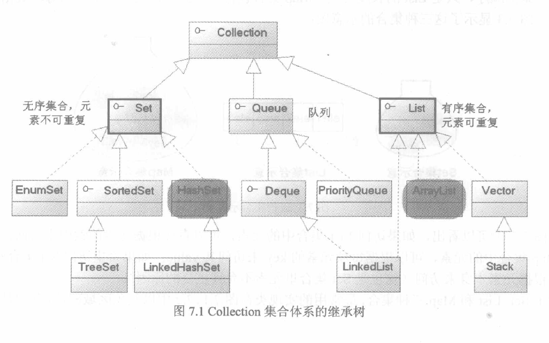
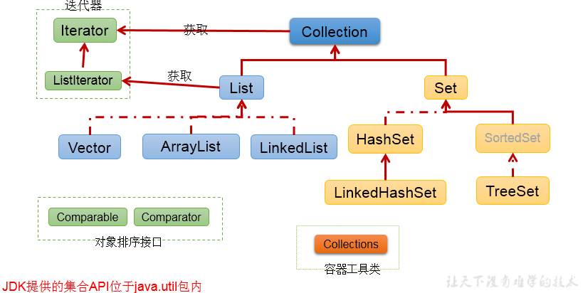
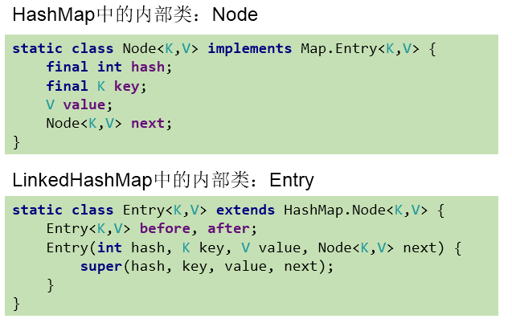

# Collection & Map

- [Collection & Map](#collection--map)
  - [Collection 继承关系](#collection-继承关系)
    - [Collections工具类](#collections工具类)
  - [Set](#set)
    - [Set排序](#set排序)
  - [List](#list)
    - [ArrayList源码分析](#arraylist源码分析)
    - [LinkedList源码分析](#linkedlist源码分析)
    - [Vector源码分析](#vector源码分析)
  - [Map](#map)
    - [HashMap](#hashmap)
    - [ConcurrentHashMap](#concurrenthashmap)
      - [原理](#原理)
      - [常用方法](#常用方法)
    - [TreeMap的使用](#treemap的使用)

## Collection 继承关系




```java
Iterator iterator = coll.iterator();//执行多次返回多个
    //hasNext():判断是否还下一个元素
    while(iterator.hasNext()){
    //next():①指针下移 ②将下移以后集合位置上的元素返回
    System.out.println(iterator.next());
}
```

### Collections工具类

1. reverse(List)：反转 List 中元素的顺序
1. shuffle(List)：对 List 集合元素进行随机排序
1. sort(List)：根据元素的自然顺序对指定 List 集合元素升序排序
1. sort(List，Comparator)：根据指定的 Comparator 产生的顺序对 List 集合元素进行排序
1. swap(List，int， int)：将指定 list 集合中的 i 处元素和 j 处元素进行交换
1. Object max(Collection)：根据元素的自然顺序，返回给定集合中的最大元素
1. Object max(Collection，Comparator)：根据 Comparator 指定的顺序，返回给定集合中的最大元素
1. Object min(Collection)
1. Object min(Collection，Comparator)
1. int frequency(Collection，Object)：返回指定集合中指定元素的出现次数
1. void copy(List dest,List src)：将src中的内容复制到dest中
1. boolean replaceAll(List list，Object oldVal，Object newVal)：使用新值替换 List 对象的所旧值
1. ArrayList和HashMap都是线程不安全的，如果程序要求线程安全，我们可以将ArrayList、HashMap转换为线程安全的。使用synchronizedList(List list） 和 synchronizedMap(Map map）synchronizedSet 或者使用COW家族

## Set

元素添加过程：(以HashSet为例)

1. 我们向HashSet中添加元素a,首先调用元素a所在类的hashCode()方法，计算元素a的哈希值，
2. 此哈希值接着通过某种算法计算出在HashSet底层数组中的存放位置（即为：索引位置，判断
3. 数组此位置上是否已经元素：
    1. 如果此位置上没其他元素，则元素a添加成功。 --->情况1
    2. 如果此位置上其他元素b(或以链表形式存在的多个元素，则比较元素a与元素b的hash值：
        1. 如果hash值不相同，则元素a添加成功。--->情况2
        2. 如果hash值相同，进而需要调用元素a所在类的equals()方法：
            1. equals()返回true,元素a添加失败
            2. equals()返回false,则元素a添加成功。--->情况2
对于添加成功的情况2和情况3而言：元素a 与已经存在指定索引位置上数据以链表的方式存储。
   - jdk 7 :元素a放到数组中，指向原来的元素。头插法
   - jdk 8 :原来的元素在数组中，指向元素a，尾插法
总结：**七上八下**,HashSet底层：数组+链表的结构。（前提：jdk7)

### Set排序

```java
自然排序中，比较两个对象是否相同的标准为：compareTo()返回0.不再是equals().
//方式一：自然排序 Comparable:compareTo() user中重写
@Test
    public void test1(){
        TreeSet set = new TreeSet();
        //失败：不能添加不同类的对象
//        set.add(123);
//        set.add(456);
//        set.add("AA");
//        set.add(new User("Tom",12));
            //举例一：
//        set.add(34);
//        set.add(-34);
//        set.add(43);
//        set.add(11);
//        set.add(8);
        //举例二：
        set.add(new User("Tom",12));
        set.add(new User("Jerry",32));
        set.add(new User("Jim",2));
        set.add(new User("Mike",65));
        set.add(new User("Jack",33));
        set.add(new User("Jack",56));

        Iterator iterator = set.iterator();
        while(iterator.hasNext()){
            System.out.println(iterator.next());}}

定制排序中，比较两个对象是否相同的标准为：compare()返回0.不再是equals().
//方式二：定制排序 Comparator:compare() 调用重写
    @Test
    public void test2(){
        Comparator com = new Comparator() {
            //照年龄从小到大排列
            @Override
            public int compare(Object o1, Object o2) {
                if(o1 instanceof User && o2 instanceof User){
                    User u1 = (User)o1;
                    User u2 = (User)o2;
                    return Integer.compare(u1.getAge(),u2.getAge());
                }else{
                    throw new RuntimeException("输入的数据类型不匹配");}}};

        TreeSet set = new TreeSet(com);
        set.add(new User("Tom",12));
        set.add(new User("Jerry",32));
        set.add(new User("Jim",2));
        set.add(new User("Mike",65));
        set.add(new User("Mary",33));
        set.add(new User("Jack",33));
        set.add(new User("Jack",56));

        Iterator iterator = set.iterator();
        while(iterator.hasNext()){
            System.out.println(iterator.next());}}
```

## List

### ArrayList源码分析

jdk7 ArrayList源码

1. ArrayList list = new ArrayList();//底层创建了长度是10的Object[]数组elementData
2. list.add(123);//elementData[0] = new Integer(123);
3. ...
4. list.add(11);//如果此次的添加导致底层elementData数组容量不够，则扩容。
5. 默认情况下，扩容为原来的容量的1.5倍，同时需要将原有数组中的数据复制到新的数组中。

结论：建议开发中使用带参的构造器：ArrayList list = new ArrayList(int capacity)

jdk 8ArrayList源码中的变化

1. ArrayList list = new ArrayList();//底层Object[] elementData初始化为{}.并没创建长度为10的数组
2. list.add(123);//第一次调用add()时，底层才创建了长度10的数组，并将数据123添加到elementData[0]
3. ...
4. 后续的添加和扩容操作与jdk 7 无异

小结：jdk7中的ArrayList的对象的创建类似于单例的饿汉式，而jdk8中的ArrayList的对象的创建类似于单例的懒汉式，延迟了数组的创建，节省内存。

### LinkedList源码分析

LinkedList的源码分析：

1. LinkedList list = new LinkedList(); 内部声明了Node类型的first和last属性，默认值为null
2. list.add(123);//将123封装到Node中，创建了Node对象。
3. 其中，Node定义为：体现了LinkedList的双向链表的说法

```java
    private static class Node<E> {
    E item;
    Node<E> next;
    Node<E> prev;
    Node(Node<E> prev, E element, Node<E> next) {
    this.item = element;
    this.next = next;
    this.prev = prev;}}
```

### Vector源码分析

Vector的源码分析

jdk7和jdk8中通过Vector()构造器创建对象时，底层都创建了长度为10的数组。
在扩容方面，默认扩容为原来的数组长度的2倍。

## Map


### HashMap

作为Map的主要实现类；线程不安全的，效率高；存储null的key和value；数组+链表(jdk7及之前)，数组+链表+红黑树(jdk 8)

在可以确定HashMap容量时，最好Map map = new HashMap(list.size()/负载因子)来初始化，避免自动扩容带来的性能损耗

- HashMap在jdk7中实现原理

1. HashMap map = new HashMap():在实例化以后，底层创建了长度是16的一维数组Entry[] table。
2. ...可能已经执行过多次put...
3. map.put(key1,value1):
4. 首先，调用key1所在类的hashCode()计算key1哈希值，此哈希值经过某种算法计算以后，得到在Entry数组中的存放位置。
    1. 如果此位置上的数据为空，此时的key1-value1添加成功。 ----情况1
    1. 如果此位置上的数据不为空，(意味着此位置上存在一个或多个数据(以链表形式存在)),比较key1和已经存在的一个或多个数据的哈希值：
        1. 如果key1的哈希值与已经存在的数据的哈希值都不相同，此时key1-value1添加成功。----情况2
        1. 如果key1的哈希值和已经存在的某一个数据(key2-value2)的哈希值相同，继续比较：调用key1所在类的equals(key2)方法，比较：
        1. 如果equals()返回false:此时key1-value1添加成功。----情况3
        1. 如果equals()返回true:使用value1替换value2。
补充：关于情况2和情况3：此时key1-value1和原来的数据以链表的方式存储。  
在不断的添加过程中，会涉及到扩容问题，当超出临界值(且要存放的位置非空)时，扩容。默认的扩容方式：扩容为原来容量的2倍，并将原的数据复制过来。

- HashMap在jdk8中相较于jdk7在底层实现方面的不同

  - new HashMap():底层没创建一个长度为16的数组
  - jdk 8底层的数组是：Node[\],而非Entry[]
  - 首次调用put()方法时，底层创建长度为16的数组
  - jdk7底层结构只：数组+链表。jdk8中底层结构：数组+链表+红黑树
  - 形成链表时，七上八下(jdk7:新的元素指向旧的元素。jdk8：旧的元素指向新的元素）
  - 当数组的某一个索引位置上的元素以链表形式存在的数据个数 > 8 且当前数组的长度 > 64时，
  - 此时此索引位置上的所数据改为使用红黑树存储。


- 常量

  - DEFAULT_INITIAL_CAPACITY : HashMap的默认容量，16
  - DEFAULT_LOAD_FACTOR：HashMap的默认加载因子：0.75
  - threshold：扩容的临界值，= 容量 \* 填充因子：16 * 0.75 => 12
  - TREEIFY_THRESHOLD：Bucket中链表长度大于该默认值，转化为红黑树:8
  - MIN_TREEIFY_CAPACITY：桶中的Node被树化时最小的hash表容量:64

- 遍历

```java
    Iterator<Map.Entry<String, Integer>> entryIterator = map.entrySet().iterator();
    while (entryIterator.hasNext()) {
        Map.Entry<String, Integer> next = entryIterator.next();
        System.out.println("key=" + next.getKey() + " value=" + next.getValue());}

    Iterator\<String> iterator = map.keySet().iterator();
    while (iterator.hasNext()){
        String key = iterator.next();
        System.out.println("key=" + key + " value=" + map.get(key));}
两种遍历方式推荐上面，效率高
```

### ConcurrentHashMap

学习并发编程的绝佳示例：volatile, cas, 锁, 链表, 红黑树

| Map集合类         | KeyValue          | Super       | JdkDesc                        |
| ----------------- | ----------------- | ----------- | ------------------------------ |
| Hashtable         | 不可null-不可null | Dictionary  | 1.0,线程安全，过时             |
| ConcurrentHashMap | 不可null-不可null | AbstractMap | 1.5,锁分段技术或cas            |
| TreeMap           | 不可null-可null   | AbstractMap | 1.2,线程不安全，有序           |
| HashMap           | 可null-可null     | AbstractMap | 1.2,线程不安全，resize死链问题 |

- LinkedHashMap:保证在遍历map元素时，可以照添加的顺序实现遍历。原因：在原的HashMap底层结构基础上，添加了一对指针，指向前一个和后一个元素。对于频繁的遍历操作，此类执行效率高于HashMap。
  - LinkedHashMap继承于HashMap,LinkedHashMap内部提供了Entry，替换HashMap中的Node.
- TreeMap:保证照添加的key-value对进行排序，实现排序遍历。此时考虑key的自然排序或定制排序底层使用红黑树
- Hashtable:作为古老的实现类；线程安全的，效率低；不能存储null的key和value

#### 原理

1. ConcurrentHashMap的 锁分段技术:先将数据分成一段一段的存储,给每一段数据分配一把锁,当一个线程占用锁访问其中一段数据时,其它段的数据也能被其它线程访问
2. ConcurrentHashMap是由 Segment数组结构 和 HashEntry数组结构组成(JDK8改为NODE节点)
   - Segment是一种可重入锁(ReentrantLock),在ConcurrentHashMap里扮演锁的角色,且以数组的形式存在于一个ConcurrentHashMap中.
3. HashEntry则用于存储键值对
   - 一个Segment里包含一个HashEntry数组,每个HashEntry是一个链表结构的元素
   - 每个Segment守护着一个HashEntry数组里的元素,当对HashEntry数组数据修改时,必须先获取它对应的Segment锁

#### 常用方法

- 添加：put(Object key,Object value)
- 删除：remove(Object key)
- 修改：put(Object key,Object value)
- 查询：get(Object key)
- 长度：size()
- 遍历：keySet() / values() / entrySet()
- 查询键 containsKey()
- 查询值 containsValue()

元素查询的操作：

- boolean containsKey(Object key)：是否包含指定的key
- boolean containsValue(Object value)：是否包含指定的value
- Object get(Object key)：获取指定key对应的value
- int size()：返回map中key-value对的个数
- boolean isEmpty()：判断当前map是否为空
- boolean equals(Object obj)：判断当前map和参数对象obj是否相等

元视图操作的方法：

- Set keySet()：返回所有key构成的Set集合
- Collection values()：返回所有value构成的Collection集合
- Set entrySet()：返回所有key-value对构成的Set集合



### TreeMap的使用

```java
//向TreeMap中添加key-value，要求key必须是由同一个类创建的对象
//因为要照key进行排序：自然排序 、定制排序

使用Properties读取配置文件
//Properties:常用来处理配置文件。key和value都是String类型
public static void main(String[] args)  {
    FileInputStream fis = null;
    try {
        Properties pros = new Properties();
        fis = new FileInputStream("jdbc.properties");
        pros.load(fis);//加载流对应的文件
        String name = pros.getProperty("name");
        String password = pros.getProperty("password");
        System.out.println("name = " + name + ", password = " + password);
    } catch (IOException e) {
        e.printStackTrace();
    } finally {
        if(fis != null){
            try {
                fis.close();
            } catch (IOException e) {
                e.printStackTrace();}}}
```
