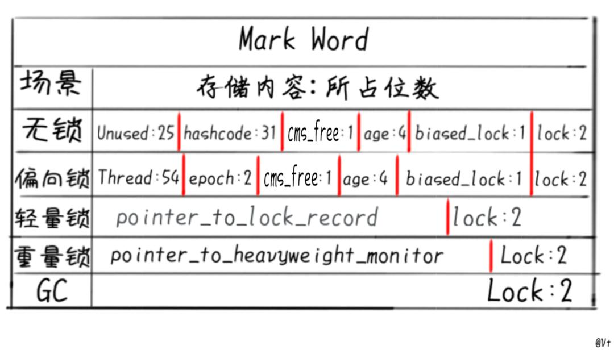

# OOP

- [OOP](#oop)
  - [基础](#基础)
    - [SOLID原则](#solid原则)
      - [未被证实的细节,不一定正确](#未被证实的细节不一定正确)
    - [三大编程范式](#三大编程范式)
    - [稳定性问题分为逻辑问题和架构问题](#稳定性问题分为逻辑问题和架构问题)
    - [Java各种命名和字节](#java各种命名和字节)
    - [基础知识说明](#基础知识说明)
    - [String类](#string类)
    - [各种条件判断的思路](#各种条件判断的思路)
    - [数组的声明](#数组的声明)
      - [Arrays 的使用](#arrays-的使用)
    - [随机数](#随机数)
      - [随机数的总分类](#随机数的总分类)
  - [类(类成员)](#类类成员)
    - [重载和重写的区别](#重载和重写的区别)
    - [final、finalize、finally的区别？](#finalfinalizefinally的区别)
    - [不可变类](#不可变类)
    - [修饰符关键字](#修饰符关键字)
      - [枚举类](#枚举类)
  - [对象的结构](#对象的结构)
    - [对象头(Header) HotSpot虚拟机](#对象头header-hotspot虚拟机)
    - [实例数据(Instance Data)](#实例数据instance-data)
    - [对齐填充(Padding)](#对齐填充padding)

## 基础

### SOLID原则

- SRP：单一职责原则，任何一个软件模块应该只对某一类行为者负责。
- OCP：开闭原则，设计良好的软件应该易于扩展(对扩展开放)，同时抗拒修改(对修改关闭)。
- LSP：里氏替换原则，尽量使用抽象(如父类)，避免使用具体(如子类)，以便于方便的进行替换。
- ISP：接口隔离原则，客户端不应该依赖于它不需要的接口。这里啰嗦两句，Bob大叔在自己的巅峰之作《架构整洁之道》中详细介绍了SOLID原则，后来设计原则逐渐演变为六大，多出来的一个是LOD迪米特法则，又称最少知识原则，我一直找不到六大设计原则的出处，知道的朋友还烦请告知。我个人观点，接口隔离原则与迪米特法则异曲同工，所以没有必要放进来。
- DIP：依赖反转原则，多使用抽象接口，尽量避免使用多变的实现类。

#### 未被证实的细节,不一定正确

代码即注释，注释不用在每个方法都写。这时候能表达自身意义的代码就更加重要。注意：我们也可以保留setXXX、getXXX的命名规范，因为jackson等序列化反序列化的组件会根据set、get方法对参数赋值，上面的命名风格在序列化时会有问题。

fluent风格

   ```java
   public class Person {
      private String name;
      private int armCount = 2;// 胳膊数默认为2
      private int legCount = 2;// 腿数默认为2
      public static Person builder() {
         return new Person.Builder();}
      public Person setName(String name) {
         this.name = name;
         return this;}
      public Person armCount(int armCount) {
         this.armCount = armCount;
         return this;}
      public void legCount(int legCount) {
         this.legCount = legCount;}}
   Person.builder().name("Jane").armCount(2).legCount(2);
   ```

- 属性需要计算的vo,需要重写get方法,保证每次获取的时候得到的都是最新的值
- 子类继承父类执行顺序
  - 先按照顺序 父类的静态属性(指向一个方法)或方法 子类的静态属性(指向一个方法)或方法 ; 静态方法不能被重写
  - 然后是父类的按顺序普通属性(指向一个方法)和代码块 最后是构造方法(如果子类重写了方法,就会执行之类的方法)
  - 子类的按顺序普通属性(指向一个方法)和代码块 最后是构造方法

### 三大编程范式

1. 结构化编程
   - 结构化编程对程序控制权的直接转移进行了限制和规范
   - 对结构化编程的结构举个例子，大家就明白了：顺序结构、分支结构和循环结构。现在大多数编程语言都禁止使用goto这样的无限制跳转语句，因为它将会损害程序的整体结构
2. 面向对象编程
   - 面向对象编程对程序控制权的间接转移进行了限制和规范
   - 面向过程和面向对象最大的不同在于，面向对象有更好的可读性和重用性
   - 记得头几年评价别人代码写的不怎么样会这样说：这个同学用面向对象的语言写出了面向过程的程序
3. 函数式编程
   - 函数式编程对程序中的赋值进行了限制和规范
   - 面向对象编程是对数据进行抽象，函数式编程是对行为的抽象

### 稳定性问题分为逻辑问题和架构问题

- 逻辑问题三板斧：理念正确、流程规范、刨根问底。
- 所谓英雄，要志气远大，计谋精良。胸怀能包含宇宙，志气能吞吐天地。对稳定性建设来说就是既要有道，又要有术，道为先。

### Java各种命名和字节

1. 源文件/类名/接口：XxxYyyZzz
2. 类成员/方法/变量：xxxYyyZzz
3. Final 常量：XXX_YYY_ZZZ
4. 包：xxx.yyy.zzz

| 类型   | 名称         | 字节 |
| ------ | ------------ | ---- |
| 整数   | Byte         | 1    |
|        | Short        | 2    |
|        | Int(默认)    | 4    |
|        | Long  L      | 8    |
| 浮点数 | Double(默认) | 8    |
|        | Float F      | 4    |
| 字符   | Char         | 2    |
| 布尔   | Boolean      | 1    |

实际容量 byte / char / short --> int --> long --> float --> double

byte / char / short 三者进行运算都会提升到int

//数字[48,57] 大写字母A-Z[65,90] 小写字母a-z[97,122],打印字母(char)65

### 基础知识说明

函数中定义的基本类型变量，对象的引用变量都在函数的栈内存中分配。

- 栈内存特点，数数据一执行完毕，变量会立即释放，节约内存空间。
- 栈内存中的数据，没有默认初始化值，需要手动设置。

堆内存用来存放new创建的对象和数组。

- 堆内存中所有的实体都有内存地址值。
- 堆内存中的实体是用来封装数据的，这些数据都有默认初始化值。
- 堆内存中的实体不再被指向时，JVM启动垃圾回收机制，自动清除，这也是JAVA优于C++的表现之一（C++中需要程序员手动清除）。

常量的说明

- 常量与常量的拼接结果在常量池。且常量池中不会存在相同内容的常量。(相同的常量会赋值)
- 只要其中有一个是变量，结果就在堆中
- 如果拼接的结果调用intern()方法，返回值就在常量池中
- X + y + "k"  从左到右 先加减 再做拼接

### String类

- String类这种在修改享元对象时，先将原有对象复制一份，
- 然后在新对象上再实施修改操作的机制称为“Copy On Write”
- new String("xxx") + new String("yyy")先在堆里生成xxx yyy 并缓存到常量池xxx yyy
- 因为是调用stringbuilder 只会在堆里有xxxyyy ，除非常量相加 或者 常量 + final，只要有变量就是在堆里
- intern是检查常量池里面有没有对应的，有就引用给返回值 没有就自己生成一个引用，指向堆里面 之后别的常量使用时就是指向堆里的引用
- 且 "aaa" + "bbb"先在常量池里存在"aaa" "bbb" 再相加得到"aaabbb";

字符串常量池(String Constant Pool): 字符串常量池中的字符串只存在一份！

class常量池(Class Constant Pool)：

- 字面量包括：1.文本字符串 2.八种基本类型的值 3.被声明为final的常量等;
- 符号引用包括：1.类和方法的全限定名 2.字段的名称和描述符 3.方法的名称和描述符。

运行时常量池(Runtime Constant Pool)：

- 运行时常量池存在于内存中，也就是class常量池被加载到内存之后的版本，不同之处是：它的字面量可以动态的添加(String#intern()),符号引用可以被解析为直接引用
- JVM在执行某个类的时候，必须经过加载、连接、初始化，而连接又包括验证、准备、解析三个阶段。而当类加载到内存中后，jvm就会将class常量池中的内容存放到运行时常量池中，由此可知，运行时常量池也是每个类都有一个。在解析阶段，会把符号引用替换为直接引用，解析的过程会去查询字符串常量池，也就是我们上面所说的StringTable，以保证运行时常量池所引用的字符串与字符串常量池中是一致的。

\n \t能被识别成换行，制表符，表达就要\\n,\\t

10 > 10  10 < 10  都是false.

### 各种条件判断的思路

If else

- 条件范围 小的在上面 大的在下面，条件互斥则无所谓；
- if-else 不超过 2 层，块中代码 1~5 行，直接写到块中，否则封装为方法
- if-else 超过 2 层，但块中的代码不超过 3 行，尽量使用卫语句
- if-else 超过 2 层，且块中代码超过 3 行，尽量使用策略模式

Do…while

```java
    1.初始化条件
    do{
        3.循环体
        4.迭代条件
    }whlie(2.循环条件);
```

While

> 不知道循环次数可用此

For

> 知道循环次数可用此 for(;;)

Break

> 在循环中终止当前作用域循环；

Continue

> 在循环中终止当前作用域当次循环，循环下一次; 后面如有标签，则会执行标签语句

Return

> 比 break 作用更大一些 可以终止方法

Switch case

可以作用在byte上，不能作用在long上，JDK1.7之后可以作用在String上

```java
Switch ( 条件表达式结果只能是byte/short/int/char/枚举/String) {
Case 值1: 穿透
Case 值2 :不用break，就会从符合的case一直向下运行，每个case都会被执行一次。可以用来写倒放的月份天数；
Case 值3: 后也不能写变量，只能写常量;
Switch 比 if 速度更快一些; }
```

| 类别                          | 单词                                                 |
| ----------------------------- | ---------------------------------------------------- |
| 添加/插入/创建/初始化/加载    | add、append、insert、create、initialize、load        |  |
| 删除/销毁                     | delete、remove、destroy、drop                        |
| 打开/开始/启动                | open、start                                          |
| 关闭/停止                     | close、stop                                          |
| 获取/读取/查找/查询           | get、fetch、acquire、read、search、find、query       |
| 设置/重置/放入/写入/释放/刷新 | set、reset、put、write、release、refresh             |
| 发送/推送                     | send、push                                           |
| 接收/拉取                     | receive、pull                                        |
| 提交/撤销/取消                | submit、cancel                                       |
| 收集/采集/选取/选择           | collect、pick、select                                |
| 提取/解析                     | sub、extract、parse                                  |
| 编码/解码                     | encode、decode                                       |
| 填充/打包/压缩                | fill、pack、compress                                 |
| 清空/拆包/解压                | flush、clear、unpack、decompress                     |
| 增加/减少                     | increase、decrease、reduce                           |
| 分隔/拼接                     | split、join、concat                                  |
| 过滤/校验/检测                | filter、valid、check                                 |
| 容量/大小/长度                | capacity、size、length                               |
| 实例/上下文                   | instance、context                                    |
| 配置                          | config、settings                                     |
| 头部/前面/前一个/第一个       | header、front、previous、first                       |
| 尾部/后面/后一个/最后一个     | tail、back、next、last                               |
| 区间/区域/某一部分/范围/规模  | range、interval、region、area、section、scope、scale |
| 缓存/缓冲/会话                | cache、buffer、session                               |
| 本地/局部/全局                | local、global                                        |
| 成员/元素                     | member、element                                      |
| 菜单/列表                     | menu、list                                           |
| 源/目标                       | source、destination、target                          |

### 数组的声明

```java
String[] names3;//声明一个数组
String names3[];//声明一个数组
String[] names3=newString[]{"aaa","bbb"};//初始化并赋值
String[] names4={"aa","cc","ff"}; //此格式不可更改
动态 
int[] scores=new int[5];

```

#### Arrays 的使用

```java
Arrays:提供了很多操作数组的方法。
2.使用：
//1.boolean equals(int[] a,int[] b):判断两个数组是否相等。
    int[] arr1 = new int[]{1,2,3,4};
    int[] arr2 = new int[]{1,3,2,4};
    boolean isEquals = Arrays.equals(arr1, arr2);
    System.out.println(isEquals);
    
    //2.String toString(int[] a):输出数组信息。
    System.out.println(Arrays.toString(arr1));
    
        
    //3.void fill(int[] a,int val):将指定值填充到数组之中。
    Arrays.fill(arr1,10);
    System.out.println(Arrays.toString(arr1));
    
    //4.void sort(int[] a):对数组进行排序。
    Arrays.sort(arr2);
    System.out.println(Arrays.toString(arr2));
    
    //5.int binarySearch(int[] a,int key)
    int[] arr3 = new int[]{-98,-34,2,34,54,66,79,105,210,333};
    int index = Arrays.binarySearch(arr3, 210);
    if(index >= 0){
        System.out.println(index);
    }else{
        System.out.println("未找到");}
```

### 随机数

1. 0-x之间的随机数：Math.round(Math.random()*x);
2. x至y之间的随机数//包含y为(y - x + 1)+x),Math.round(Math.random()*(y-x)+x);
3. 1-x之间的随机数：Math.ceil(Math.random()*x);

#### 随机数的总分类

1. Random
   1. Math.Random
   2. RandomStringUtils
   3. RandomUtils
2. SecureRandom
   1. UUID.randomUUID
   2. RandomUtil.getSecureRandom()
3. ThreadLocalRandom
   1. RandomUtil.getRandom()

## 类(类成员)

必须是具体的和公开的,类成员(static)不能访问成员，因为作用域差距和初始化时间不一样

1. 属性: 普通属性、静态属性、类也可以作为属性
   - 局部变量：声明在方法内 / 方法形参 / 代码块内 / 构造器形参 / 构造器内部的变量 ( 除了类之外的自己命名的东西)
   - 成员变量：直接定义在类的一对{ }内，可使用权限修饰符

    | 差异       | 局部变量                             | 成员变量                             |
    | ---------- | ------------------------------------ | ------------------------------------ |
    | 位置       | 类中又被其他( ){ }包裹起来自己命名的 | 类的{ }内                            |
    | 权限修饰符 | 不可用                               | 可用                                 |
    | 初始默认值 | 无                                   | 看初始化值表                         |
    | 内存位置   | 栈空间                               | 属性方法在堆(非static)，普通变量在栈 |
    | 重名       | 拥有更高优先级(就近原则)             | 重名用this.名调用                    |

   - new出来的对象拥有独立的属性 (非static）
   - 相同点：
     - 格式：数据类型  变量名 = 变量值
     - 先声明，后使用 (都是使用者自己命名的) 变量都有其对应的作用域
   - 不同点：
     - 属性：直接定义在类的一对{ }内。
     - 局部变量:声明在方法内 / 方法形参 / 代码块内 / 构造器形参 / 构造器内部的变量 ( 除了类之外的自己命名的东西)
   - 权限修饰符的不同
     - 属性：可以在声明属性时，指明其权限，使用权限修饰符。
     - 常用的权限修饰符：private、public、缺省、protected  --->封装性
     - 局部变量：不可以使用权限修饰符
   - 默认初始化值的情况：
     - 属性：类的属性，根据其类型，都有默认初始化值。
     - 整型（byte、short、int、long）：0
     - 浮点型（float、double）：0.0
     - 字符型（char）：0  （或'\u0000'）
     - 布尔型（boolean）：false
     - 引用数据类型（类、数组、接口）：null
     - 局部变量：没有默认初始化值。
       - 意味着，我们在调用局部变量之前，一定要显式赋值。
       - 特别地：形参在调用时，我们赋值即可。
     - 内存中加载的位置：
       - 属性：加载到堆空间中   （非static）
       - 局部变量：加载到栈空间
     - jvm加载对象及各属性方法的位置
       - 变量在栈 类的所有属性\方法都在堆。普通的变量属性值是在栈
       - 普通对象的属性在堆里。静态属性在方法区
       - 局部变量和属性重名，局部变量有更高的优先级，重名使用this.名称访问属性

2. 方法 static和普通方法加载时间不一致，不能乱放(初始化对象才初始化方法)
   - 可变参数形参：
     - String ... str、
     - 有具体数量形参的方法优先被调用
     - 与本类方法名相同，形参不同构成重载
     - 名字相同，形参类型相同 且为数组的方法不能共存
     - 可变个数形参在方法的形参中，必须声明在末尾
     - 可变个数形参在方法的形参中,最多只能声明一个可变形参。
     - 方法形参值传递：复制值或地址传入
3. 构造器
   - 如果写了显示有参，则需要自己补一个无参的
   - 构造器必须与类同名（如果一个源文件中有多个类，那么构造器必须与公共类同名）
   - 每个类可有多个构造器，构造器可有多个参数，可重载，构造器无返回值
   - 构造器总是伴随着new操作一起调用
   - 接口无构造  
4. 代码块
   - new对象初始化按顺序是
     1. 祖父级的父类static代码块，
     2. 父类static代码块，
     3. 自己的static代码块，
     4. 然后是祖父级的代码块，构造，
     5. 父级代码块，构造，
     6. 自己的代码块，构造
   - static代码块在类加载时按照定义顺序加载，普通代码块是在new对象创建时调用，static代码块可以为静态属性赋值
   - 初始化之后，static代码块不再执行
5. 内部类(内含接口，枚举) Outer$Inner
   - 普通内类只能声明普通成员，但是可以访问外部的所有成员（包括静态）
      1. 外类外使用要new两次
      2. Out1.Inner1 inner2 =new Outer1().new Inner1(); //粗体匿名
      3. 内类可以被static修饰，但是只能访问外部的静态成员
      4. 在外类内使用inner跟普通的一样，外类外静态内类不用创建外类对象，直接创建内类对象，在外类外使用要外类类名.内类类名使用
   - 局部(非类成员)（只能存在方法内,权限限于方法内或作用域,不能用static,1.8之后访问外类无需final）
   - 匿名(非类成员)（无构造器，1.8之后访问外类无需final,无static方法，static属性）
      - 只用一次的局部类，new 类名(){ eat(){ } }.eat(); { }内写代码，最后要分号因为是表达式,走后可以直接调用{ }内的方法
   - 成员类(类成员)
     - 静态
       - static修饰符。外部类加载时只会加载静态域，静态内部类只能访问外部类的类成员，不能访问外部类的实例方法和实例成员
       - 外部类可用内部类.属性 来使用内部类的成员
     - 非静态 其中的代码块与普通代码块作用一致

JSON小知识: 远程调用的时候,返回值的类型如List<> 需要指定泛型,feign上面也要指定泛型(建议复制方法签名),不然就会变成别的格式被解析,从而不被识别

### 重载和重写的区别

- 两同两小一大原则：
  1. 两同：方法名和参数列表相同
  2. 两小：返回值或声明异常比父类小(或相同)
  3. 一大：访问修饰符比父类的大（或相同）
  4. 父类方法被private，子类相同不算重写
- Overload是方法重载
  - 指的是在同一个类中，方法名称相同，形参列表不同的两个或者多个方法，和返回值类型无关。
- Override是方法的重写
  - 指的是子类在继承父类时，当父类的方法体不适用于子类时，子类可重写父类的方法。重写必须遵守方法名和形参列表与父类的被重写的方法相同，而返回值类型可以小于等于父类被重写的方法（如果是基本数据类型和void必须相同），权限修饰符可以大于等于父类被重写的方法，抛出的异常列表可以小于等于父类被重写的方法。

### final、finalize、finally的区别？

- final是表示最终的，是一个修饰符，修饰类时表示不能被继承，修饰方法时表示不能被子类重写，修饰属性和局部变量时表示值不能被修改，是个常量
- finally是表示最终块，是异常处理的一部分，和try..catch一起使用，不管是否发生异常都要执行的代码放在finally块中
- finalize是表示最终方法，是java.lang.Object类的一个方法，在对象被垃圾回收时调用

### 不可变类

- 被final private修饰
- 创建该类的实例后，实例属性不可被改变
- 8个包装类，String都是
- 该类的实例整个周期都是初始化的值

3大特性

1. 封装
2. 继承
   - 继承先执行父辈的无参构造器 再执行子类的构造 方法采用参考就近和重写，子类继承父类的属性 构造 方法  改写一些 属性/方法 符合自己使用，继承状态 子类在第一行调用父类的构造器 默认为无参

    ```java
    public class Test {
        public static void main(String[] args) {
            Base b1 = new Base();
            Base b2 = new Sub();}}
    class Base{
        Base(){method(100);}
        public void method(int i){
            System.out.println("base : " + i);}}
    class Sub extends Base{
        Sub(){
            super.method(70);}
        public void method(int j){
            System.out.println("sub : " + j);}}// 100 100 70
    ```

3. 多态
   - 父类的应用指向子类的对象
   - 在多态中必须存在有继承关系的子类和父类。且子类重写了同一种方法
   - 多态状态子类的独特方法不能被调用，只能调用重写的父类方法
   - 属性静态绑定，方法动态绑定

4. 转型
   1. 向上转型 : 通过子类对象(小范围)实例化父类对象(大范围),这种属于自动转换
      - 将子类的引用赋给父类对象，只有这样该引用才既能可以调用父类的方法，又能调用子类的方法。
      - 但是父类的属性不会被子类覆盖，而是两者同时存在
   2. 向下转型 : 通过父类对象(大范围)实例化子类对象(小范围),这种属于强制转换
      - 对象 instanceof 类/子类  判断某对象是否是某类的实例
      - A  instanceof B ，A是B的对象或者B的子类对象都会返回true，instanceof的目的就是为了向下强转

### 修饰符关键字

1. Static
   - Static 修饰除了构造器之外的所有成员
   - 修饰之后就变成了类成员，初始化类的时候同时初始化类成员，可以通过类访问，也可以通过对象访问，但实际上都是通过类来访问；即使某个实例为null,也可以访问类成员
   - 静态相互访问，普通二者皆可，不推荐
   - 静态函数不和对象绑定，他们不包含this指针。
   - 静态函数不能声明为const，而且不能使用this指针。
   - static 属性/方法在方法区  普通的在堆
   - static 属性/方法在没创建对象之前就已经存在，普通的要创建对象之后才存在
   - static属性在类的所有对象都是共用的
   - static随类消失，非static随对象消失
   - 静态方法,以及静态成员,都会比普通类,方法,成员,优先进入内存的!
   - (后进来的)调用(先进来的)
2. This
   - 就近调用 当前对象  或 当前正在创建的对象
   - 也可以调用构造 不同参数的构造 通过this（不同参数） 来调用
     - 我们在类的构造器中，可以显式的使用"this(形参列表)"方式，调用本类中指定的其他构造器
     - 构造器中不能通过"this(形参列表)"方式调用自己
     - 如果一个类中有n个构造器，则最多有 n - 1构造器中使用了"this(形参列表)"
     - 规定："this(形参列表)"必须声明在当前构造器的首行
     - 构造器内部，最多只能声明一个"this(形参列表)"，用来调用其他的构造器
   - 构造内部也可以用this（有/无参数）来调用
3. Super
   - 在子类的方法体里 第一行用super调用父类的方法
   - 子类构造默认访问父类空参构造方法：
   - 子类继承父类的数据，可能还会使用父类的数据。所以，子类初始化之前，一定要先完成父类数据的初始化
   - 每一个构造方法的第一条语句默认都是：super()
   - 调用父类的同名属性用super.
4. abstract模板
   - abstract 修饰类成为抽象类 不能创建对象，有构造
   - 修饰方法没有方法体,但抽象类可以有非abstract方法
   - 抽象方法必须在抽象类里
   - 子类继承抽象父类，必须重写全部抽象方法，不想重写子类也要变成抽象；
   - 不能修饰变量，主要用在多态,抽象就是无实体，只是一个概念
5. interface规范
   - interface修饰，所有变量默认public static final必赋值
   - 所有方法默认abstract(无普通方法)/内类/枚举都是public static/无构造器/无代码块
   - 一个实现类可以实现多个接口，必须实现(override)接口的所有抽象方法，且可以同时继承父类
   - 类 单继承多实现 /  接口 可以继承多个接口
   - 使用时，接口作为引用类型然后创建实现类的对象
   - 1.8后default带方法体不强制重写;
   - static用接口名直接调用,且不能用对象名调用
   - 接口可以拥有多个默认方法(default)，同时如只定义了一个抽象方法，则该接口依然是函数式接口
6. Final
   - final修饰类无继承，变量不可变，修饰方法不可被重写，可重载
   - 成员变量须赋值或在代码块，构造中赋值，否则将一直使用默认值，代码错误
   - 普通方法不能对final的成员变量赋值或者初始值
   - 局部变量可以声明不赋值，有一次赋值的机会，重复赋值，非法
   - 不能对final的形参赋值，非法
   - 对于引用类型，只能保证地址不变，内容改变可以
   - 父类final private 方法，子类相同不算重写
7. package
   - 包 作为一个整体 在文件首行声明
   - 表示当前文件夹下的所有文件共属一个包，public可以相互引用。而不用显示import
   - 同包下不能有同名的接口和类。不同包的可以
   - 子包下的文件 使用需要导入
8. Import
   - 声明在包 和 类之间
   - import  XXX.*
   - 使用不同包同名的类，一个引入 一个要全部输入路径（全类名）
   - com.atguigu.exer3.Account acct1 = new com.atguigu.exer3.Account(1000,2000,0.0123);
9. Enum
   - 默认继承Enum
   - 构造器private
   - 属性默认为公开静态常量，在第一个；之前写出所有属性名字，逗号隔开
   - public enum 名字
   - 常量（形参），常量（形参）；
   - 属性
   - 构造器
   - @override toString
   - 调用   枚举名 变量 = 枚举名.常量；
   - 常用方法：name / toString / orinal / values / valueof

#### 枚举类

1. 问
   - 枚举允许继承类吗？
   - 枚举允许实现接口吗？
   - 枚举可以用等号比较吗？
   - 可以继承枚举吗？
   - 枚举可以实现单例模式吗？
   - 当使用compareTo()比较枚举时，比较的是什么？
   - 当使用equals()比较枚举的时候，比较的是什么？
2. 答
   - 枚举不允许继承类。Jvm在生成枚举时已经继承了Enum类，由于Java语言是单继承，不支持再继承额外的类（唯一的继承名额被Jvm用了）。
   - 枚举允许实现接口。因为枚举本身就是一个类，类是可以实现多个接口的。
   - 枚举可以用等号比较。Jvm会为每个枚举实例对应生成一个类对象，这个类对象是用public static final修饰的，在static代码块中初始化，是一个单例。
   - 不可以继承枚举。因为Jvm在生成枚举类时，将它声明为final。
   - 枚举本身就是一种对单例设计模式友好的形式，它是实现单例模式的一种很好的方式。
   - 枚举类型的compareTo()方法比较的是枚举类对象的ordinal的值。
   - 枚举类型的equals()方法比较的是枚举类对象的内存地址，作用与等号等价。
3. 知识点
   - Enum类有两个成员变量：name和ordinal。其中，name用于记录枚举常量的名字。比如APPLE、ORANGE和BANANA。ordinal用于记录枚举常量在声明时的顺序(从0开始)。比如APPLE是0、ORANGE是1、BANANA是2。
   - Enum类有一个构造函数，它有两个入参，分别为name和ordianl赋值。
   - Enum类重写了toString()方法，返回枚举常量的name值。
   - Enum类重写了equals()方法，直接用等号比较。
   - Enum类不允许克隆，clone()方法直接抛出异常。（保证枚举永远是单例的）
   - Enum类实现了Comparable接口，直接比较枚举常量的ordinal的值。
   - Enum类有一个静态的valueOf()方法，可以根据枚举类型以及name返回对应的枚举常量。
   - Enum类不允许反序列化，为了保证枚举永远是单例的。

## 对象的结构

### 对象头(Header) HotSpot虚拟机



1. **Mark Word**存储对象自身的运行时数据
   1. 哈希码(identity_hashcode):25位的对象标识Hash码，采用延迟加载技术。调用方法System.identityHashCode()计算，并会将结果写到该对象头中。当对象被锁定时，该值会移动到管程Monitor中。如果
   2. GC分代年龄(age)：四位数，最大表示15，所以设置-XX:MaxTenuringThreshold选项最大值为15的原因
   3. 锁状态标志(lock):2位的锁状态标记位
   4. biased_lock：对象是否启用偏向锁的标记,1启动，0没有启用
       | biased_lock | lock | 状态     | 说明                         |
       | ----------- | ---- | -------- | ---------------------------- |
       | 0           | 01   | 无锁     | 对象本身的哈希码             |
       | 1           | 01   | 偏向锁   | 当前占用此对象的线程ID       |
       | 0           | 00   | 轻量级锁 | 存储指向线程栈中锁记录的指针 |
       | 0           | 10   | 重量级锁 | 指针指向的是monitor对象      |
       | 0           | 11   | GC标记   |                              |
      - monitor在JVM中是基于C++的实现的，ObjectMonitor中有几个关键属性：
        - _owner：指向持有ObjectMonitor对象的线程
        - _WaitSet：存放处于wait状态的线程队列
        - _EntryList：存放处于等待锁block状态的线程队列
        - _recursions：锁的重入次数
        - _count：用来记录该线程获取锁的次数
   5. 偏向线程ID(thread):持有偏向锁的线程ID。
   6. 偏向时间戳(epoch)
   7. ptr_to_lock_record：指向栈中锁记录的指针。
   8. ptr_to_heavyweight_monitor：指向管程Monitor的指针。
2. **Klass Word**(32bits) 是对象指向它的类的元数据的指针(类型指针klass pointer)
   1. 这一部分用于存储对象的类型指针，该指针指向它的类元数据，JVM通过这个指针确定对象是哪个类的实例。该指针的位长度为JVM的一个字大小，即32位的JVM为32位，64位的JVM为64位。
   2. 如果应用的对象过多，使用64位的指针将浪费大量内存，统计而言，64位的JVM将会比32位的JVM多耗费50%的内存。为了节约内存可以使用选项+UseCompressedOops开启指针压缩，其中，oop即ordinary object pointer普通对象指针。开启该选项后，下列指针将压缩至32位：
      - 每个Class的属性指针（即静态变量）
      - 每个对象的属性指针（即对象变量）
      - 普通对象数组的每个元素指针
   3. 当然，也不是所有的指针都会压缩，一些特殊类型的指针JVM不会优化，比如指向PermGen的Class对象指针(JDK8中指向元空间的Class对象指针)、本地变量、堆栈元素、入参、返回值和NULL指针等。
   4. 虚拟机通过这个指针来确定这个对象是哪个类的实例。并不是所有的虚拟机实现都必须在对象数据上保留类型指针，换句话说查找对象的元数据信息并不一定要经过对象本身。
3. **array length**:数组对象Mark Word还多出来一个array length(32bits)部分，
   1. 如果对象是一个数组，那么对象头还需要有额外的空间用于存储数组的长度，这部分数据的长度也随着JVM架构的不同而不同：32位的JVM上，长度为32位；64位JVM则为64位。64位JVM如果开启+UseCompressedOops选项，该区域长度也将由64位压缩至32位。
   2. 虚拟机可以通过普通Java对象的元数据信息确定Java对象的大小，但是从数组的元数据中无法确定数组的大小。  

### 实例数据(Instance Data)

### 对齐填充(Padding)
