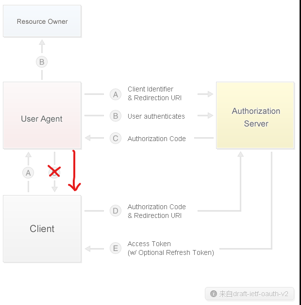

# JWT&OAuth

模式选择

1. 单一服务器模式
2. SSO模式: CAS单点登录，OAuth2
3. Token模式
    - 优点：token无状态，session有状态；基于标准化：API可以采用标准化的JWT
    - 缺点：占用宽带，在服务器端无法销毁token

透明令牌：随机生成的字符串标识符，无法被猜测，资源服务器需要通过后端渠道发送回OAuth2授权服务器的令牌检查端点，才能检验令牌是否有效，并获取claims/scopes等信息

自包含令牌：包含关于用户和客户的元数据和声明(claims)，通过检查签名，期望的颁发者(issuer),期望的接收人aud(audience),或者scope,资源服务器可以在本地校验令牌，通常实现为签名的JWT

JWT（一种规范，主要实现有JWS，JWE）

1. 认证 Authentication；
2. 授权 Authorization // 注意这两个单词的区别；
3. 联合识别；
4. 客户端会话（无状态的会话）；
5. 客户端机密。

名词解释：

1. JWS：Signed JWT签名过的jwt
2. JWE：Encrypted JWT部分payload经过加密的jwt；**目前加密payload的操作不是很普及**
3. JWK：JWT的密钥，也就是我们常说的scret；
4. JWKset：JWT key set在非对称加密中，需要的是密钥对而非单独的密钥，在后文中会阐释；
5. JWA：当前JWT所用到的密码学算法；
6. nonsecure JWT：当头部的签名算法被设定为none的时候，该JWT是不安全的；因为签名的部分空缺，所有人都可以修改。

三部分：

- header:typ | alg | jti | cty
- payload 这一部分不能放关键信息，会被破解
- Registered Claims
  - iss  【issuer】发布者的url地址
  - sub 【subject】该JWT所面向的用户，用于处理特定应用，不是常用的字段
  - aud 【audience】接受者的url地址
  - exp 【expiration】 该jwt销毁的时间；unix时间戳
  - nbf  【not before】 该jwt的使用时间不能早于该时间；unix时间戳
  - iat   【issued at】 该jwt的发布时间；unix 时间戳
  - jti    【JWT ID】 该jwt的唯一ID编号
- Public Claims
- Private Claims
- signture 这一部分加密

Oauth2



Code 换取accessToken只能换一次,accessToken可以使用多次

SpringSession

装饰者模式,spsession 在filter里面把原始的request包装成自己的request,后续的request.getsession都是从包装类里面获取,包装类重写了这些方法,变成了在redis中操作session

## 加密ymal文件

引入该依赖

```xml
<dependency>
    <groupId>com.github.ulisesbocchio</groupId>
    <artifactId>jasypt-spring-boot-starter</artifactId>
    <version>3.0.3</version>
</dependency>
```

引入这个依赖,下面的配置可以省略 就是简单配置一下前缀后缀，为了解析加密字符串用的

```yml
jasypt:
  encryptor:
    property:
      prefix: ENC(
      suffix: )```
```

配置密钥,在yml(及其不推荐)中或者启动参数

```yml
jasypt:
encryptor:
property:
prefix: ENC(
suffix: )
password: # 你的密钥
```

推荐 ``VM options:-Djasypt.encryptor.password=你的密钥``

获取加密的数据

``` java
public class Jasypt {
    public static void main(String[] args) {
        BasicTextEncryptor textEncryptor = new BasicTextEncryptor();
        // 加密密钥
        textEncryptor.setPassword("sirwsl");
        // 要加密的数据（如数据库的用户名或密码）
        String username = textEncryptor.encrypt("root");
        String password = textEncryptor.encrypt("123");
        System.out.println("加密：username:" + username);
        System.out.println("加密：password:" + password);
    }
}
```

或者这样

``` java
@SpringBootTest
class JasyptTest {

    @Resource
    private StringEncryptor stringEncryptor;
    @Test
    public void test() {
        //加密
        String username = stringEncryptor.encrypt("root");
        System.out.println("加密username: " + username);

        String decUsername = stringEncryptor.decrypt(username);
        System.out.println("解密username: " + decUsername);

        //加密
        String password = stringEncryptor.encrypt("123456");
        System.out.println("password: " + password);
        String decPassword = stringEncryptor.decrypt(password);
        System.out.println("解密password: " + decPassword);}}
```

最后这样将加密字符串输入yml

``` yml
spring:
  application:
    name: demo-encryption
# 数据库驱动：
  datasource:
    driver-class-name: com.mysql.cj.jdbc.Driver
    url: jdbc:mysql://localhost:3306/demo?serverTimezone=UTC&useUnicode=true&characterEncoding=UTF-8&zeroDateTimeBehavior=convertToNull&allowMultiQueries=true
    password: ENC(Y8CJa4AfPV+/snhdJ6ADg0wWuNQIJ1v2UQuyejJm7lPE76jdbr2I82rMvLRX2sT9)
    username: ENC(cN5buxefuYaZBJ8/XCXWA3GAJdkPz0hBogIwG9uGjI8DH1v2oKLm1TQYD8aBhX9A)

#下面的配置可忽略
jasypt:
  encryptor:
    property:
      prefix: ENC(
      suffix: )
    #password: xxx
```
