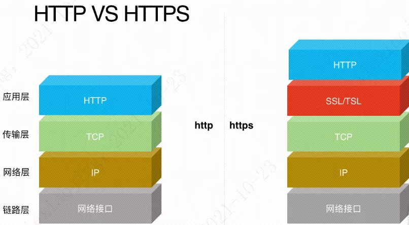

- [red服务从前端调用gray服务时报错：跨域错误。经排查确认由于http的域名下从前端调用https导致。](#red服务从前端调用gray服务时报错跨域错误经排查确认由于http的域名下从前端调用https导致)
  - [1、为什么会发生问题？](#1为什么会发生问题)
  - [2、为什么没有做跨域处理？](#2为什么没有做跨域处理)
  - [3、为什么测试环境没有问题？](#3为什么测试环境没有问题)
  - [4、为什么调用端使用http协议？](#4为什么调用端使用http协议)
  - [5、为什么调用方是post调用，实际上的请求却是options?](#5为什么调用方是post调用实际上的请求却是options)
- [一个请求过来都经过了什么？](#一个请求过来都经过了什么)
  - [一、 首先是关于HTTPS的](#一-首先是关于https的)
  - [二、然后是关于DNS的](#二然后是关于dns的)
  - [三、 下面开始公司的7层代理](#三-下面开始公司的7层代理)
  - [四、 nginx反向代理和负载均衡](#四-nginx反向代理和负载均衡)
  - [五、 WEB应用服务](#五-web应用服务)
  - [https协议传输默认使用443端口，那什么情况下必须使用443,什么情况下不使用443？](#https协议传输默认使用443端口那什么情况下必须使用443什么情况下不使用443)
  - [使用443的端口的同时，80端口还会用吗？](#使用443的端口的同时80端口还会用吗)
  - [安全层原理](#安全层原理)
  - [CA证书](#ca证书)
  - [要求各个团队梳理域名是否存在证书将要到期的安全风险。怎么来给团队下发具体任务呢？](#要求各个团队梳理域名是否存在证书将要到期的安全风险怎么来给团队下发具体任务呢)

| TCP/IP            | protocol            |
| ----------------- | ------------------- |
| Application       | Http,FTP,Telnet,DNS |
| Transport         | TCP,UDP             |
| Network           | IP,ICMP,ARP         |
| Physical&DataLink | Link                |

## red服务从前端调用gray服务时报错：跨域错误。经排查确认由于http的域名下从前端调用https导致。

### 1、为什么会发生问题？  

出于安全原因，浏览器限制从脚本内发起的跨源HTTP请求。当一个资源从与该资源本身所在的服务器不同源，请求一个资源时，资源会发起一个跨域 HTTP 请求。

同源的判断标准是：
- 协议
- 域名
- 端口号

以上三者都要相同。发生问题的请求，由于其中域名默认只要求顶级域名相同，此条件满足；协议一个是https，一个是http，不满足；https端口为443，http端口为80，不满足。总体不满足同源策略，而且被访问的后端没有做跨域处理。  

### 2、为什么没有做跨域处理？  

因为顶级域名相同，并未考虑到有跨域问题。且整个在测试环境下测试通过，并未发生问题。  

### 3、为什么测试环境没有问题？  

因为测试环境，同时支持http和https两种方式，当时配置时没有考虑两者直接的差异，直接使用http的路径。  
在生产环境，根据安全的要求，关闭了http方式，只能使用https方式，造成问题。  

### 4、为什么调用端使用http协议？

因为调用端的框架是几年前的老系统，线上环境追求稳定性，变更成本高，目前还维持之前的现状。

### 5、为什么调用方是post调用，实际上的请求却是options?

出于安全考虑，并不是所有域名访问后端服务都可以。其实在正式跨域之前，浏览器会根据需要发起一次预检（也就是option请求）。预检请求不成功，不会发起正式请求。

浏览器将CORS请求分为两类：简单请求（simple request）和非简单请求（not-simple-request）,简单请求浏览器不会预检，而非简单请求会预检。

同时满足下列三大条件，就属于简单请求，否则属于非简单请求
- 请求方式只能是：GET、POST、HEAD
- HTTP请求头限制这几种字段：Accept、Accept-Language、Content-Language、Content-Type、Last-Event-ID
- Content-type只能取：application/x-www-form-urlencoded、multipart/form-data、text/plain
    

对于简单请求，浏览器直接请求，会在请求头信息中，增加一个origin字段，来说明本次请求来自哪个源（协议+域名+端口）。服务器根据这个值，来决定是否同意该请求，服务器返回的响应会多几个头信息字段，如图所示：上面的头信息中，三个与CORS请求相关，都是以Access-Control-开头。

- Access-Control-Allow-Origin：该字段是必须的，* 表示接受任意域名的请求，还可以指定域名
- Access-Control-Allow-Credentials：该字段可选，是个布尔值，表示是否可以携带cookie，（注意：如果Access-Control-Allow-Origin字段设置 *，此字段设为true无效)
- Access-Control-Allow-Headers：该字段可选，里面可以获取Cache-Control、Content-Type、Expires等，如果想要拿到其他字段，就可以在这个字段中指定。
    
**经验教训**

首先是知识方面：之前对同域有误解，认为只需要顶级域名相同。实际上需要符合域名、协议和端口三者同源的同源策略。

其次是没有对线上线下的差异做仔细的调研分析。  

**后续优化**

首先要修复问题，跨域有风险。可以使用调用方自带的代理功能。被调用方提供一个RPC调用，调用方使用代理来转换。

**根域名**

简单的来说就是类似.com这种，或者中国的.cn英国的.uk日本的.jp，这些是由“互联网名称与数字地址分配机构”（The Internet Corporation for Assigned Names and Numbers ，简称ICANN）来分配的。

**顶级域名**

简单来说顶级域名就是就是在根域名的前面加上你自己定义的字母或数字等字符串包括连字符-（包括连字符但是不能连续是连字符，且连字符不能在第一个）例如这样web.com或者web.cn这样的既是顶级域名。

**二级域名**

当你注册了一个顶级域名后，例如web.cn，你就可以在你的互联网服务提供商的dns解析系统上自由分配你的二级域名或者三级域名等等，web1.web.cn,web2.web1.web.cn等等，以此类推根域名前面有几个字符串就是几级域名。

## 一个请求过来都经过了什么？

我面试人家的时候特别喜欢问一个问题：”请描述一下一个请求过来到响应完成都做了什么，越详细越好。” 对于一个高手来说，他只要回答好了这一个问题，技术面试就通过了。所以如果我要去面试，我就把这个问题的答案压缩到40分钟到1个小时。因为一般的技术面试都是这个时间段哒，虽然我其实很想讲上两天。哎，一看我们部门就是做业务的。

为了让人家听懂，我一般会设置一个业务场景。比如说：现在用户要开始上传一个视频。那么业务上要经过用户打开浏览器页面，用户点击[选择视频文件]按钮，JS端调用系统本地文件选择器，JS端将视频信息写入到浏览器页面，用户点击[开始上传]，此时开始发送请求。

我去哪里都是随身带纸笔哒，为了直观，我会画出页面效果，还不忘补充一句：选择完视频，JS端是可以获取到视频信息哒，如：名称，大小。可以根据业务需要直接在页面上展示，用户可以对名称进行编辑。

 那么我就开始描述一下这个请求到响应都做了什么啦：

### 一、 首先是关于HTTPS的

请求通过POST的方式经过HTTPS协议发送到服务器端。HTTPS本身并非协议，而是标准的HTTP协议架在SSL/TLS协议之上的一种结构。由于HTTP协议是基于TCP/IP进行通讯的，所以HTTPS必须暴露IP和端口，这部分不加密。

HTTPS需要在服务器端生成私钥，我们服务器端用的RSA算法加密哒(对于有好几个算法发明专利的我来说，面试时涉及到算法的地方是绝对不能漏掉哒)。然后创建签名请求的证书，然后可以去CA授权或者自己签发证书，最后将证书配置到nginx里。因为服务器上HTTPS是我配的，所以我会把这部分详细的讲出来。

HTTPS在传输数据前需要客户端与服务端进行一次握手，在握手过程中将确立双方加密传输数据的密码信息。握手的时候才用非对称加密和HASH算法，握手后数据的传输才用对称加密。

握手过程如下：

1. 浏览器将自己支持的一套加密规则发送给网站。

2. 网站从中选出一组加密算法与HASH算法，并将自己的身份信息用证书的形式发送给浏览器。证书里包含了网站地址，加密公约，以及证书的颁发机构等信息。

3. 获得网站证书之后浏览器要做以下工作：

   1. 验证证书的合法性(盘发证书的机构是否合法，是否过期，证书中包含的网站地址是否与正在访问的地址一致等)，如果证书受信任，则浏览器栏里面会显示一个小锁头，否则会给出证书不受信任的提示。一般的浏览器对于自己签发的证书都会给不收信息的提示。

   2. 如果证书受信任，或者用户接受了不受信任的证书，浏览器会生成一串随机数的密码，用最开始约定好的HASH方式，把握手消息取HASH值，然后用用证书中提供的公钥加密”握手消息+握手消息HASH值”发送给服务端。

   3. 服务端拿到客户端传来的密码，用自己的私钥来解密握手消息取出随机数密码，再用随机数密码解密握手消息与HASH值，并与传过来的HASH值做对比确认是否一致。然后服务端自己也生成一个随机密码加密一段握手消息(握手消息+握手消息的HASH值)给客户端。

   4. 客户端用随机数解密并计算握手消息的HASH，如果与服务端发来的HASH一致，此时握手过程结束，之后的所有通信数据将有之前浏览器和服务器生成的随机码生成的一个新的随机密码并利用对称加密算法进行加密。利用客户端和服务端的随机码来生成数据传输的随机码是为了防止写死的假随机码带来的安全隐患，使用对称加密是因为对称加密的加密加密过程比非对称快得多。

常用的非对称加密算法有: RSA,DSA/DSS; 对称加密算法有: AES,RC4,3DES; HASH算法:MD5,SHA1,SHA256。

### 二、然后是关于DNS的

请求会访问我们公司云存储那边的DNS(Domain Name System, 域名系统)，这是因特网上作为域名和IP地址相互映射的一个分布式数据库，能够使用户更方便的访问互联网，而不用去记住能够被机器直接读取的IP数串。通过域名或主机名，最终得到该域名或主机名对应的IP地址的过程叫做域名解析(或主机名解析)。DNS协议运行在UDP协议之上，使用端口号53。DNS会有一些策略将静态的东西直接返回给浏览器，只有动态部分才继续向后面传递。发生过测试人员在同一台机器上在不同的浏览器上用不同用户登录，结果刷新页面看到用户变了的奇怪现象，是DNS策略造成的（不负责这一块，不赘述）。

### 三、 下面开始公司的7层代理

主要作用是转发到对应的业务nginx代理，公司使用的是SLB进行流量分发，负载均衡(不负责这一块，略过)

### 四、 nginx反向代理和负载均衡

我有个什么都想说明白的习惯。提到反向代理，就要先说正向代理。正向代理一般叫代理。就是请求发起人找一个代理做一件事情，真正做事情的人只认识代理不认识请求发起人。常用FQ，就是http中介的一种：代理。所以我们使用FQ代理服务器连接上了国外的网站，但那个网站并不知道我们在使用。

反向代理是服务提供方出一个代理，请求人只跟代理打交道。比如这里请求只发给了nginx这个代理，后面的就是nginx自己进行处理，找到真正的业务处理服务器。如果是静态请求，如css,js啥的，就直接转向静态服务器。如果是动态请求就转向WEB应用服务器。然而不管是静态服务器还是WEB应用服务器都是有好几台服务器。Nginx按照一定的策略对请求向业务服务器进行分配，让压力不集中在一台服务器，这就是负载均衡了。

Nginx除了配置实际处理业务的服务器，还可以配置一些安全策略，比如如果一个IP在1秒内请求了100次，那么将视为攻击，直接返回错误码，不向后传递请求。还可以配置超时等待时间，多媒体文件的允许大小等。

其实……，负载均衡在SLB代理那层已经做了，但是安全方面需要各个业务端自己处理，我们每个物理机基本上只提供一个服务，所以可以直接使用80端口的

### 五、 WEB应用服务

WEB应用服务总体采用SOA架构。分成WEB前端，后台服务，API服务，共同模块和代理接口模块。

WEB前端是返回页面的，API服务是PC，手机各端都用到的共同接口。后台服务通过代理接口模块来和API服务及WEB前端服务进行通信。代理接口里含有传递消息的可序列化POJO。共同模块含有一些公共方法。

请求根据nginx提供的IP和端口找到服务器上对应的WEB前端服务。我们服务器上部署的是resin。我们的WEB 服务采用的是SpringMVC框架(面试官哥哥会不会汗流满面，终于说到正题上了)。SpringMVC的实现原理和核心思想老掉牙了，略过(面试官哥哥是不是要惊愕了，其实只想听这个)。不过spring作为一个久经考验的框架，里面用到了几乎所有的设计模式，是应该好好总结一下的(以后专门写一篇，此处略过，面试官哥哥是不是又该开始擦汗了)。

Resin WEB应用中除了SpringMVC还有一些细小的逻辑，如一般会配置utf8编码器，logback监听器，guava限流。请求经过Spring加载上下文，上下文可以使用类加载，配置文件加载等多种方式（策略模式）。加载后我们调用的只是ApplicationContext(门面模式)，当然它同时也是一个Bean工厂(工厂模式)。DispatcherServlet将请求映射到处理器。我看过DispatcherServlet的源码，在初始化策略的时候，还支持多种类型的处理器（适配器模式）。处理器要经过拦截器对请求的用户身份等进行校验，校验不通过直接返回错误，校验通过找到对应的controller然后就开始进行参数校验。

校验不成功返回错误码。成功后HttpClient调用采用了Restful架构的视频资源系统进行内容创建。创建不成够返回错误码。成功则需要在数据库插入一条记录。调用DUBBO后台服务，服务的service层调用couchbase缓存取出当前记录是否存在，不存在则调用mybatis持久层框架到mysql数据库进行操作。操作成功后httpclient调用Restful架构的云存储那边返回视频上传初始化参数。结果回到controller里包装成ModelAndView对象，再经过拦截器注入一些session参数。因为http协议是无状态的，现在的系统又都是分布式的，不支持session，所以每次都需要在拦截器里将参数再塞入进去。然后原路返回响应。客户端收到响应后断开连接。因为http请求是无连接的。

当然处理过程中会用到好多基于AOP的，比如调试，分析埋点，日志。

浏览器收到响应里含有的上传初始化链接（返回结果里带着的）就会调用这个链接将真正的视频介质传进去。经过别的部门的云存储，云转码。转码那边会给我用消息队列，我们用的是qpidd mq采用direct的exchange发送到队列。我们这边的监听器监听到队列里的消息就将消息解析存到数据库。总体流程图如下：

### https协议传输默认使用443端口，那什么情况下必须使用443,什么情况下不使用443？

大家想一下端口的本质是什么。其实端口有两种，一种是物理端口，比如集线器、路由器的端口。大学的时候记得有门课叫集成电路，里面有讲到过。另一种是逻辑端口，是TCP/IP协议的端口，也常叫网络端口。本质上一个端口是用来绑定服务的，那服务器用监听什么端口，客户端就要向哪个端口发起请求。我们自己也可以写个简单的例子，写过这个例子应该很容易就能明白。《懂了！国际算法体系对称算法DES原理》也有完整的例子。

简单点说服务端可以自己决定什么端口提供服务。但是呢，大家各自为政，记忆起来麻烦也不便于端口管理。所以逻辑端口也进行了划分。其中0~1023是公认端口，比如80就默认是http的端口、443就是https的端口。这样约定好了，就不需要特殊来记了。所以一些对全人类开发的公网网站，就是用的默认端口。但是你自己或者公司内部用的或者和合作方商量好的，也可以用其他端口，只要服务提供方认就行。

### 使用443的端口的同时，80端口还会用吗？

这就是涉及到https的本质了。https本质是http协议上加了一个安全层。安全层做了一些处理，http要做的事情一点也没有减少。就相当于在药粒外加了一层胶囊，本质上起作用的还是药粒呀；快递送来的海鲜放在保鲜箱里还加了保鲜袋本质还是买的海鲜呀。所以当然要用啦。

### 安全层原理

既然https协议本质只是http上加了安全层，本文就主要将安全层是怎么实现的。当然要靠加密。加密又分成对称加密和非对称加密。要使用对称加密，客户端和服务端要有一个相同的秘钥，这个秘钥怎么能安全的传输就成了问题。非对称加密是公钥只能用来加密，私钥只能用来解密。那服务端自己存私钥，客户端来请求的时候，服务端把公钥发给它就可以了。

那有的朋友就问了，那别的客户端来请求是不是也拿到的是同一个公钥呀，信息就不安全了呀。没错，同一个服务端给所有的客户端返回的是相同的公钥。但是威胁网络安全的黑客需要是截获信息，不是公钥。信息发送方用公钥把信息加密了，黑客没有私钥解不开。他能拿到公钥和密文，想解开那就只能暴力破解，把所有语言文字的组合用公钥试一下看看和截获到的密文是不是一样的。如果用常用的RSA2048的话，要80年。

总之，非对称加密是比较安全的，但是它慢。通常加解密速度是对称加密的几百倍，信息大了速度还会快速下降。所以https协议是用非对称加密沟通一个对称秘钥。真正的信息就用对称秘钥来加解密了。

### CA证书
	
很多人都听过网络抓包吧。抓包的原理和黑客截获信息差不多，都是自己作为一个代理。客户端B想访问C网站，黑客D发现了。D就伪装成了C把自己的公钥发给了B。B发请求“我是B，我的提货卡号码是XBXB”到网站C时，黑客D截获了这个信息，用自己的私钥解开，之后把数据篡改成“我是D，我的提货卡号码是XBXB”发给网站C。于是本来B的东西就被D领走了。抓包也是这种充当代理的原理。

为了防止这一问题。客户端就需要在收到公钥的时候做一下判断，信任的公钥才使用。于是出现了一些大家都很认可的组织，它们可以颁发公钥。

打个比方，在唐朝，贺知章贺老可谓是少有的文坛官场双得意的代表，“二月春风”没少光顾他家。从7品官做到3品大员，是皇帝的老铁，为国服务50年后退休皇帝了还送豪宅，后来还被追封礼部尚书。《长安十二时辰》里那个80多的老头何监就是影射的贺知章，因为他退休前的官职就是监事，人称贺监。不少诗坛大家就是受了他的推荐才与皇帝建立了通信成为了公务员。所以，贺监还有一个身份是“大唐最佳星探”。

这里贺监就是大家都认可的组织，在贺监80多岁的时候，40多岁的李白找到贺监，请求他给自己签发一份公钥。贺监就用自己的私钥给他做了签发写了推荐信，不仅如此，还金龟换酒传为佳话。皇帝想选公务员，李白拿出了贺监的推荐信。皇帝一看，确实是贺监的笔迹，马上就给李白封了公务员。

这里提一下，很多时候https抓包可以成功，原理是客户端很多时候并不验证证书的合法性。有个选项check=false。那至于哪些是认证机构，这个是系统预装的。可以在IE浏览器的internet选项里查到预装的证书。在中国，很多金融机构，它们的认证机构是央行。这些证书都是有有效期的，有的三年一签发、有的五年一签发。

上面图中有显示，证书除了公钥信息，还有数字签名信息。数字签名当然需要有信息来进行签名，具体信息就是我们在生成密钥时需要输入的那些，如下图：

### 要求各个团队梳理域名是否存在证书将要到期的安全风险。怎么来给团队下发具体任务呢？

1. 要梳理的是提供https服务的服务端，只有服务端才会需要找认证机构签发证书
2. 只有需要外部认证的证书有过期的概念，自己签发的可以更新也可以不更新。可以通过向服务端发请求的获取到证书，查看证书是谁签发的、有效期是哪天

架构师经常面临着需要做出正确的决策，比如连续几天团队都在执行生产程序发布，但是后面几天大家有纪律涣散的趋势，这时候应该敏锐的察觉到并及时指出并纠正。这些都需要对原理或者事情的走向有深刻的认知才能做出正确和及时的判断。