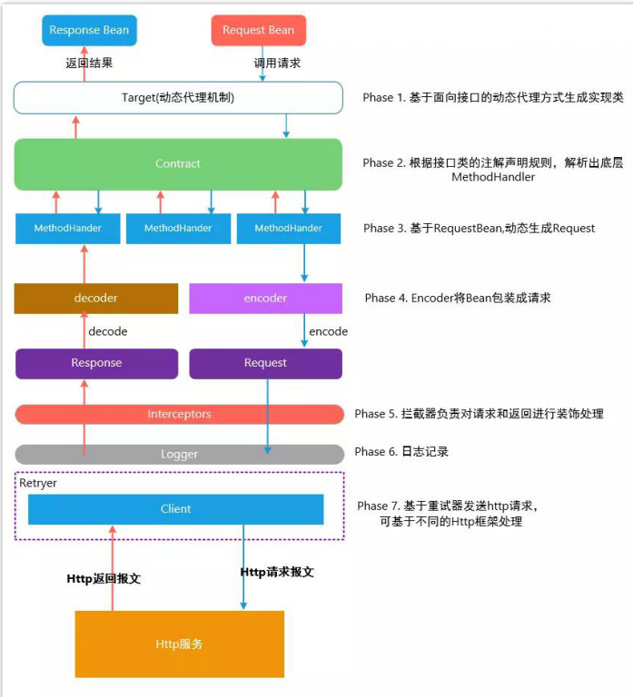

# Spring

- [Spring](#spring)
  - [基础](#基础)
    - [Bean](#bean)
      - [IOC & DI](#ioc--di)
      - [bean范围](#bean范围)
      - [bean生命周期](#bean生命周期)
      - [对象交给spring管理的3种方式及应用](#对象交给spring管理的3种方式及应用)
      - [三级缓存](#三级缓存)
      - [自动配置原理](#自动配置原理)
    - [AOP](#aop)
      - [环绕通知](#环绕通知)
      - [事务](#事务)
  - [SpringMVC](#springmvc)
    - [Model、ModelMap、Map](#modelmodelmapmap)
  - [幂等性](#幂等性)
    - [token 机制](#token-机制)
    - [各种锁机制](#各种锁机制)
      - [数据库悲观锁](#数据库悲观锁)
      - [数据库乐观锁](#数据库乐观锁)
      - [业务层分布式锁](#业务层分布式锁)
      - [各种唯一约束](#各种唯一约束)
      - [数据库唯一约束](#数据库唯一约束)
    - [redis set 防重](#redis-set-防重)
    - [防重表](#防重表)
    - [全局请求唯一 id](#全局请求唯一-id)

## 基础

### Bean

#### IOC & DI

- 依赖注入(DI Dependency Injection)和控制反转(IOC Inversion of Control)是从不同的角度的描述的同一件事情，就是指通过引入IOC容器，利用依赖关系注入的方式，实现对象之间的解耦。
- DI依赖项注入, 通常是构造或setter
- BeanWrapper接口, 实例化getbean得到的并不是原实例对象，而是被BeanWrapper包装的bean,存放在CurrentHashmap
- BeanWrapper根据CustomEditorConfigurer对对象进行属性注入，类型转换

#### bean范围

bean的范围: Singleton(default)  /  Prototype  /  Session  /  Rquest

#### bean生命周期


1. Bean的实例化
2. Bean的属性注入
3. 调用BeanNameAware的setBeanName()
4. 调用BeanFactoryAware的setBeanFactory()
5. 调用ApplicationContextAware的setApplicationContext()
6. 调用BeanPostProcessor的预初始化方法(ioc就是在这里执行的,注入被代理的对象)
7. 调用InitializingBean的afterPropertiesSet()
8. 调用自定义初始化方法
9. 调用BeanPostProcessor的初始化后方法
10. bean可以使用了
11. 调用DisposableBean的destory()
12. 调用自定义销毁方法
13. 结束

```java
@SuppressWarnings("unchecked")
protected <T> T doGetBean(String name, @Nullable Class<T> requiredType, @Nullable Object[] args, boolean typeCheckOnly) throws BeansException {

  String beanName = transformedBeanName(name);
  Object bean;

  // Eagerly check singleton cache for manually registered singletons.
  Object sharedInstance = getSingleton(beanName);
  if (sharedInstance != null && args == null) {
    if (logger.isTraceEnabled()) {
      if (isSingletonCurrentlyInCreation(beanName)) {
        logger.trace("Returning eagerly cached instance of singleton bean '" + beanName +
            "' that is not fully initialized yet - a consequence of a circular reference");}
      else {
        logger.trace("Returning cached instance of singleton bean '" + beanName + "'");}}
    bean = getObjectForBeanInstance(sharedInstance, name, beanName, null);}

  else {
    // Fail if we're already creating this bean instance:
    // We're assumably within a circular reference.
    if (isPrototypeCurrentlyInCreation(beanName)) {
      throw new BeanCurrentlyInCreationException(beanName);}

    // Check if bean definition exists in this factory.
    BeanFactory parentBeanFactory = getParentBeanFactory();
    if (parentBeanFactory != null && !containsBeanDefinition(beanName)) {
      // Not found -> check parent.
      String nameToLookup = originalBeanName(name);
      if (parentBeanFactory instanceof AbstractBeanFactory) {
        return ((AbstractBeanFactory) parentBeanFactory).doGetBean(
            nameToLookup, requiredType, args, typeCheckOnly);}
      else if (args != null) {
        // Delegation to parent with explicit args.
        return (T) parentBeanFactory.getBean(nameToLookup, args);}
      else if (requiredType != null) {
        // No args -> delegate to standard getBean method.
        return parentBeanFactory.getBean(nameToLookup, requiredType);}
      else {
        return (T) parentBeanFactory.getBean(nameToLookup);}}

    if (!typeCheckOnly) {
      markBeanAsCreated(beanName);}

    try {
      RootBeanDefinition mbd = getMergedLocalBeanDefinition(beanName);
      checkMergedBeanDefinition(mbd, beanName, args);

      // Guarantee initialization of beans that the current bean depends on.
      String[] dependsOn = mbd.getDependsOn();
      if (dependsOn != null) {
        for (String dep : dependsOn) {
          if (isDependent(beanName, dep)) {
            throw new BeanCreationException(mbd.getResourceDescription(), beanName,
                "Circular depends-on relationship between '" + beanName + "' and '" + dep + "'");}
          registerDependentBean(dep, beanName);
          try {
            getBean(dep);}
          catch (NoSuchBeanDefinitionException ex) {
            throw new BeanCreationException(mbd.getResourceDescription(), beanName,
                "'" + beanName + "' depends on missing bean '" + dep + "'", ex);}}}

      // Create bean instance.
      if (mbd.isSingleton()) {
        sharedInstance = getSingleton(beanName, () -> {
          try {
            return createBean(beanName, mbd, args);}
          catch (BeansException ex) {
            // Explicitly remove instance from singleton cache: It might have been put there
            // eagerly by the creation process, to allow for circular reference resolution.
            // Also remove any beans that received a temporary reference to the bean.
            destroySingleton(beanName);
            throw ex;}});
        bean = getObjectForBeanInstance(sharedInstance, name, beanName, mbd);}

      else if (mbd.isPrototype()) {
        // It's a prototype -> create a new instance.
        Object prototypeInstance = null;
        try {
          beforePrototypeCreation(beanName);
          prototypeInstance = createBean(beanName, mbd, args);}
        finally {
          afterPrototypeCreation(beanName);}
        bean = getObjectForBeanInstance(prototypeInstance, name, beanName, mbd);}

      else {
        String scopeName = mbd.getScope();
        if (!StringUtils.hasLength(scopeName)) {
          throw new IllegalStateException("No scope name defined for bean ´" + beanName + "'");}

        Scope scope = this.scopes.get(scopeName);
        if (scope == null) {
          throw new IllegalStateException("No Scope registered for scope name '" + scopeName + "'");}
        try {
          Object scopedInstance = scope.get(beanName, () -> {
            beforePrototypeCreation(beanName);
            try {
              return createBean(beanName, mbd, args);}
            finally {
              afterPrototypeCreation(beanName);}});

          bean = getObjectForBeanInstance(scopedInstance, name, beanName, mbd);}

        catch (IllegalStateException ex) {
          throw new BeanCreationException(beanName,
              "Scope '" + scopeName + "' is not active for the current thread; consider " +
              "defining a scoped proxy for this bean if you intend to refer to it from a singleton",
              ex);}}}

    catch (BeansException ex) {
      cleanupAfterBeanCreationFailure(beanName);
      throw ex;}}

  // Check if required type matches the type of the actual bean instance.
  if (requiredType != null && !requiredType.isInstance(bean)) {
    try {
      T convertedBean = getTypeConverter().convertIfNecessary(bean, requiredType);
      if (convertedBean == null) {
        throw new BeanNotOfRequiredTypeException(name, requiredType, bean.getClass());}
      return convertedBean;}

    catch (TypeMismatchException ex) {

      if (logger.isTraceEnabled()) {
        logger.trace("Failed to convert bean '" + name + "' to required type '" +
            ClassUtils.getQualifiedName(requiredType) + "'", ex);}
      throw new BeanNotOfRequiredTypeException(name, requiredType, bean.getClass());}}
  return (T) bean;}
```


> 另一个版本


1. 当调用者通过 getBean(beanName)向容器请求某一个 Bean 时，如果容器注册了org.springframework.beans.factory.config.InstantiationAwareBeanPostProcessor 接口，在实例化 Bean 之前，将调用接口的 postProcessBeforeInstantiation()方法；
2. 根据配置情况调用 Bean 构造函数或工厂方法实例化 Bean；
3. 如果容器注册了 InstantiationAwareBeanPostProcessor 接口，在实例化 Bean 之后，调用该接口的 postProcessAfterInstantiation()方法，可在这里对已经实例化的对象进行一些“梳妆打扮”；
4. 如果 Bean 配置了属性信息，容器在这一步着手将配置值设置到 Bean 对应的属性中，不过在设置每个属性之前将先调用InstantiationAwareBeanPostProcessor 接口的postProcessPropertyValues()方法；
5. 调用 Bean 的属性设置方法设置属性值；
6. 如果 Bean 实现了 org.springframework.beans.factory.BeanNameAware 接口，将调用setBeanName()接口方法，将配置文件中该 Bean 对应的名称设置到 Bean 中；
7. 如果 Bean 实现了 org.springframework.beans.factory.BeanFactoryAware 接口，将调用 setBeanFactory()接口方法，将 BeanFactory 容器实例设置到 Bean 中；
8. 如果 BeanFactory 装配了 org.springframework.beans.factory.config.BeanPostProcessor后处理器，将调用 BeanPostProcessor 的 Object postProcessBeforeInitialization(Object bean, String beanName)接口方法对 Bean 进行加工操作。其中入参 bean 是当前正在处理的 Bean，而 beanName 是当前 Bean 的配置名，返回的对象为加工处理后的 Bean。用户可以使用该方法对某些 Bean 进行特殊的处理，甚至改变 Bean 的行为， BeanPostProcessor 在 Spring 框架中占有重要的地位，为容器提供对 Bean 进行后续加工处理的切入点， Spring 容器所提供的各种“神奇功能”（如 AOP，动态代理等）都通过 BeanPostProcessor 实施；
9. 如果 Bean 实现了 InitializingBean 的接口，将调用接口的 afterPropertiesSet()方法；
10. 如果在\<bean>通过 init-method 属性定义了初始化方法，将执行这个方法；
11. BeanPostProcessor 后处理器定义了两个方法：其一是 postProcessBeforeInitialization() 在第 8 步调用；其二是 Object postProcessAfterInitialization(Object bean, String beanName)方法，这个方法在此时调用，容器再次获得对 Bean 进行加工处理的机会；
12. 如果在\<bean>中指定 Bean 的作用范围为 scope=“prototype”，将 Bean 返回给调用者，调用者负责 Bean 后续生命的管理， Spring 不再管理这个 Bean 的生命周期。如果作用范围设置为 scope=“singleton”，则将 Bean 放入到 Spring IoC 容器的缓存池中，并将 Bean引用返回给调用者， Spring 继续对这些 Bean 进行后续的生命管理；
13. 对于 scope=“singleton”的 Bean，当容器关闭时，将触发 Spring 对 Bean 的后续生命周期的管理工作，首先如果 Bean 实现了 DisposableBean 接口，则将调用接口的afterPropertiesSet()方法，可以在此编写释放资源、记录日志等操作；
14. 对于 scope=“singleton”的 Bean，如果通过\<bean>的 destroy-method 属性指定了 Bean 的销毁方法， Spring 将执行 Bean 的这个方法，完成 Bean 资源的释放等操作。
15. 可以将这些方法大致划分为三类：
16. Bean 自身的方法：如调用 Bean 构造函数实例化 Bean，调用 Setter 设置 Bean 的属性值以及通过\<bean>的 init-method 和 destroy-method 所指定的方法；
17. Bean 级生命周期接口方法：如 BeanNameAware、 BeanFactoryAware、 InitializingBean 和 DisposableBean，这些接口方法由 Bean 类直接实现；
18. 容器级生命周期接口方法：在上图中带“★” 的步骤是由 InstantiationAwareBean PostProcessor 和 BeanPostProcessor 这两个接口实现，一般称它们的实现类为“ 后处理器” 。 后处理器接口一般不由 Bean 本身实现，它们独立于 Bean，实现类以容器附加装置的形式注册到 Spring 容器中并通过接口反射为 Spring 容器预先识别。当Spring 容器创建任何 Bean 的时候，这些后处理器都会发生作用，所以这些后处理器的影响是全局性的。当然，用户可以通过合理地编写后处理器，让其仅对感兴趣Bean 进行加工处理
19. ApplicationContext 和 BeanFactory 另一个最大的不同之处在于：ApplicationContext会利用 Java 反射机制自动识别出配置文件中定义的 BeanPostProcessor、 InstantiationAwareBeanPostProcessor 和 BeanFactoryPostProcessor，并自动将它们注册到应用上下文中；而后者需要在代码中通过手工调用 addBeanPostProcessor()方法进行注册。这也是为什么在应用开发时，我们普遍使用 ApplicationContext 而很少使用 BeanFactory 的原因之一

#### 对象交给spring管理的3种方式及应用

1. xml配置
2. @bean
3. BeanFacoty registerSingleton

- 类@Component实现BeanFactoryPostPrcessor,并重写postProcessBeanFactory方法，编写对象，用configurableListableBeanFactory.registerSingleton("user", user1)注册;
- BeanFactoryPostPrcessor：不仅可以将一个对象交给spring管理，还可以将已经交给spring管理的对象拿出来进行修改，还有其他各种的spring初始化的干预都可以做。

#### 三级缓存

spring三级缓存简略版：循环依赖时

1. Map singletonObjects一级: 用来存放已经完全创建好的单例 bean，beanName->bean 实例
2. Map earlySingletonObjects二级: 用来存放早期的bean,未创建完成但是被引用的对象;
3. Map> singletonFactories三级: 用来存放单例bean的 ObjectFactory,未创建完成但是引用了别的bean B的bean A,正在等待bean B 创建完成
   - 只能解决setter注入的循环依赖,构造器无法解决
   - 当某个 bean 进入到 2 级缓存的时候，说明这个 bean 的早期对象被其他 bean 注入了，也就是说，这个 bean 还是半成品，还未完全创建好的时候，已经被别人拿去使用了，所以必须要有 3 级缓存，2 级缓存中存放的是早期的被别人使用的对象，如果没有 2 级缓存，是无法判断这个对象在创建的过程中，是否被别人拿去使用了。
4. 三级缓存的作用：是为了判断循环依赖的时候，早期暴露出去已经被别人使用的 bean 和最终的 bean 是否是同一个 bean，如果不是同一个则弹出异常，如果早期的对象没有被其他 bean 使用，而后期被修改了，不会产生异常，如果没有三级缓存，是无法判断是否有循环依赖，且早期的 bean 被循环依赖中的 bean 使用了
   - singletonObjects    一级缓存，存放完整的 Bean。
   - earlySingletonObjects   二级缓存，存放提前暴露的Bean，Bean 是不完整的，未完成属性注入和执行 初始化（init） 方法。
   - singletonFactories  三级缓存，存放的是 Bean 工厂，主要是生产 Bean，存放到二级缓存中。

#### 自动配置原理

1. @SpringBootApplication复合注解或派生注解
   - @SpringBootConfiguration
   - @EnableAutoConfiguration
   - @ComponentScan
2. @EnableAutoConfiguration配置引AutoConfigurationImportSelector的selectImports()方法通过SpringFactoriesLoader.loadFactoryNames()扫描所有具有META-INF/spring.factories的jar包.spring-boot-autoconfigure-x.x.x.x.jar里就有一个这样的spring.factories文件
3. @EnableAutoConfigration 注解会导入一个自动配置选择器去扫描每个jar包的META-INF/xxxx.factories 这个文件，这个文件是一个key-value形式的配置文件，里面存放了这个jar包依赖的具体依赖的自动配置类。这些自动配置类又通过@EnableConfigurationProperties 注解支持通过xxxxProperties 读取application.properties/application.yml属性文件中我们配置的值。如果我们没有配置值，就使用默认值，这就是所谓约定>配置的具体落地点。

### AOP

| Spring Aop                                        | AspectJ                                                        |
| ------------------------------------------------- | -------------------------------------------------------------- |
| 1. 在纯java中实现                                 | 1. 使用java编程语言的扩展实现                                  |
| 2. 不需要单独的编译过程                           | 2. 需设置ltw，否则需要AspectJ编译器                            |
| 3. 只能使用运行时织入                             | 3. 运行时织入不可用，支持编译时/后，加载时织入                 |
| 4. 功能不强，只支持方法级编织                     | 4. 可编制字段，方法，构造函数，静态初始值，设定项，最终类/方法 |
| 5. 只能由Spring容器管理的bean上实现               | 5. 可以在所有域对象上实现                                      |
| 6. 只支持方法执行切入点                           | 6. 支持所有切入点                                              |
| 7. 代理是由目标对象创建的，且切面应用在这些代理上 | 7. 在执行应用程序前(在运行时)，各方面直接在代码中经行织入      |
| 8. 比AspectJ慢                                    | 8. 更好的性能                                                  |
| 9. 易于学习和应用                                 | 9. 比Spring Aop复杂                                            |

#### 环绕通知

- @Before
- @After
- @AfterReturning
- @AfterThrowing
- `execution(* com.atguigu.service.impl.* . *(..))`
- jdk动态代理 只能对实现了接口的类进行代理
- cglib 全都可以 对指定的类生成一个子类，覆盖其中的方法

#### 事务

最好将事务添加在Service层, 单条SELECT SQL语句可不开启事务，多条SELECT SQL语句，并且多条SELECTSQL语句的查询结果有关联，比如用作统计、报表等功能，要求开启事务。但是为了提高效率，建议只读事务

- propagation / isolation / timeout / readOnly / rollback
- Required / Required_new
- @Transactional(rollbackFor = Exception.class)

## SpringMVC



### Model、ModelMap、Map

SpringMVC 传入的 Model、ModelMap、Map类型的参数其实本质上都是 BindingAwareModelMap 类型的。并且他们用的都是setAttribute方法存入请求域中；

## 幂等性

### token 机制

服务端提供了发送 token 的接口。我们在分析业务的时候，哪些业务是存在幂等问题的，就必须在执行业务前，先去获取 ``token`` ，服务器会把 ``token`` 保存到 ``redis`` 中。

然后调用业务接口请求时，把 ``token`` 携带过去，一般放在请求头部。

服务器判断 ``token`` 是否存在 ``redis`` 中，存在表示第一次请求，然后删除 ``token``,继续执行业务。

如果判断 ``token`` 不存在 ``redis`` 中，就表示是重复操作，直接返回重复标记给 ``client`` ，这样就保证了业务代码，不被重复执行。

危险性：

1. 先删除 token 还是后删除 token；
2. 先删除可能导致，业务确实没有执行，重试还带上之前 token，由于防重设计导致，请求还是不能执行。
3. 后删除可能导致，业务处理成功，但是服务闪断，出现超时，没有删除 token，别人继续重试，导致业务被执行两边
4. 我们最好设计为先删除 token，如果业务调用失败，就重新获取 token 再次请求。

Token 获取、比较和删除必须是原子性

``redis.get(token)``、``token.equals``、``redis.del(token)``如果这两个操作不是原子，可能导致，高并发下，都 get 到同样的数据，判断都成功，继续业务并发执行

可以在 redis 使用 lua 脚本完成这个操作

``if redis.call('get', KEYS[1]) == ARGV[1] then return redis.call('del', KEYS[1]) else return 0 end``

### 各种锁机制

#### 数据库悲观锁

``select * from xxxx where id = 1 for update;``

悲观锁使用时一般伴随事务一起使用，数据锁定时间可能会很长，需要根据实际情况选用。

另外要注意的是，id 字段一定是主键或者唯一索引，不然可能造成锁表的结果，处理起来会非常麻烦。

#### 数据库乐观锁

这种方法适合在更新的场景中，
``update t_goods set count = count -1 , version = version + 1 where good_id=2 and version = 1``

根据 version 版本，也就是在操作库存前先获取当前商品的 version 版本号，然后操作的时候带上此 version 号。我们梳理下，我们第一次操作库存时，得到 version 为 1，调用库存服务version 变成了 2；但返回给订单服务出现了问题，订单服务又一次发起调用库存服务，当订单服务传如的 version 还是 1，再执行上面的 sql 语句时，就不会执行；因为 version 已经变为 2 了，where 条件就不成立。这样就保证了不管调用几次，只会真正的处理一次。

乐观锁主要使用于处理读多写少的问题

#### 业务层分布式锁

如果多个机器可能在同一时间同时处理相同的数据，比如多台机器定时任务都拿到了相同数据处理，我们就可以加分布式锁，锁定此数据，处理完成后释放锁。获取到锁的必须先判断这个数据是否被处理过。

#### 各种唯一约束

#### 数据库唯一约束

插入数据，应该按照唯一索引进行插入，比如订单号，相同的订单就不可能有两条记录插入。我们在数据库层面防止重复。

这个机制是利用了数据库的主键唯一约束的特性，解决了在 insert 场景时幂等问题。但主键的要求不是自增的主键，这样就需要业务生成全局唯一的主键。

如果是分库分表场景下，路由规则要保证相同请求下，落地在同一个数据库和同一表中，要不然数据库主键约束就不起效果了，因为是不同的数据库和表主键不相关。

### redis set 防重

很多数据需要处理，只能被处理一次，比如我们可以计算数据的 MD5 将其放入redis 的 set，每次处理数据，先看这个 MD5 是否已经存在，存在就不处理。

### 防重表

使用订单号 orderNo 做为去重表的唯一索引，把唯一索引插入去重表，再进行业务操作，且他们在同一个事务中。这个保证了重复请求时，因为去重表有唯一约束，导致请求失败，避免了幂等问题。这里要注意的是，去重表和业务表应该在同一库中，这样就保证了在同一个事务，即使业务操作失败了，也会把去重表的数据回滚。这个很好的保证了数据一致性。
之前说的 redis 防重也算

### 全局请求唯一 id

调用接口时，生成一个唯一 id，redis 将数据保存到集合中（去重），存在即处理过。

可以使用 nginx 设置每一个请求的唯一 id；
proxy_set_header X-Request-Id $request_id;
