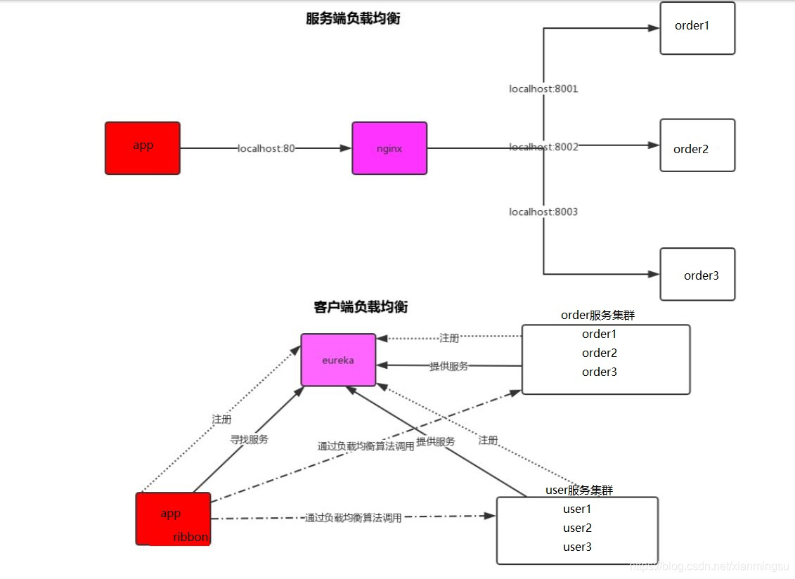
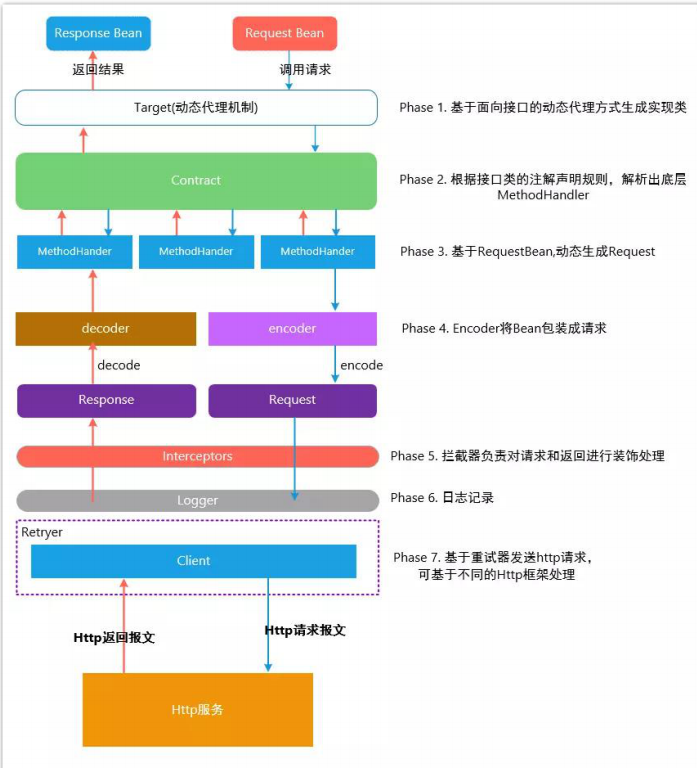

# Boot & Cloud

- [Boot & Cloud](#boot--cloud)
  - [Boot](#boot)
    - [常见的微服务组件及概念](#常见的微服务组件及概念)
      - [架构师需要思考的](#架构师需要思考的)
      - [开发需要思考的](#开发需要思考的)
      - [DevOps需要思考的](#devops需要思考的)
    - [客户端弹性模式](#客户端弹性模式)
    - [Seata](#seata)
      - [分布式事物的最终解决](#分布式事物的最终解决)
    - [Zookeeper](#zookeeper)
  - [Cloud](#cloud)
    - [OpenFeign](#openfeign)
      - [Feign请求头无信息](#feign请求头无信息)
      - [请求到新的域名验证是否登陆](#请求到新的域名验证是否登陆)
    - [Grateway](#grateway)
    - [SpringCache](#springcache)
    - [SpringDataJPA](#springdatajpa)
    - [Swagger2](#swagger2)
    - [ES](#es)
    - [Nacos](#nacos)

## Boot

1. 拥有starter 封装了该环境所拥有的所有依赖
1. 自动配置,约定大于配置
1. 基本上没有xml文件 基于类配置 @Configuration  @SpringBootConfiguration这两差不多

### 常见的微服务组件及概念

1. 服务注册：服务提供方将自己调用地址注册到服务注册中心，让服务调用方能够方便地找到自己。
2. 服务发现：服务调用方从服务注册中心找到自己需要调用的服务的地址。
3. 负载均衡：服务提供方一般以多实例的形式提供服务，负载均衡功能能够让服务调用方连接到合适的服务节点。并且，节点选择的工作对服务调用方来说是透明的。
4. 服务网关：服务网关是服务调用的唯一入口，可以在这个组件是实现用户鉴权、动态路由、灰度发布、A/B 测试、负载限流等功能。
5. 配置中心：将本地化的配置信息（properties, xml, yaml 等）注册到配置中心，实现程序包在开发、测试、生产环境的无差别性，方便程序包的迁移。
6. API 管理：以方便的形式编写及更新 API 文档，并以方便的形式供调用者查看和测试。外部restful，内部rpc
7. 集成框架：微服务组件都以职责单一的程序包对外提供服务，集成框架以配置的形式将所有微服务组件（特别是管理端组件）集成到统一的界面框架下，让用户能够在统一的界面中使用系统。
8. 分布式事务：对于重要的业务，需要通过分布式事务技术（TCC、高可用消息服务、最大努力通知）保证数据的一致性。
9. 调用链：记录完成一个业务逻辑时调用到的微服务，并将这种串行或并行的调用关系展示出来。在系统出错时，可以方便地找到出错点。
10. 支撑平台：系统微服务化后，系统变得更加碎片化，系统的部署、运维、监控等都比单体架构更加复杂，那么，就需要将大部分的工作自动化。现在，可以通过 Docker 等工具来中和这些微服务架构带来的弊端。 例如持续集成、蓝绿发布、健康检查、性能健康等等。严重点，以我们两年的实践经验，可以这么说，如果没有合适的支撑平台或工具，就不要使用微服务架构。

#### 架构师需要思考的

1. 分解业务的问题
   - 描述业务问题，并聆听用来描述问题的名词
   - 注意动词，突出了动作，通常代表问题域的自然轮廓
   - 寻找数据内聚
2. 建立服务粒度
   - 一个太粗粒度和太细粒度的微服务将具有很多的特征
   - 刚开始可以让微服务设计的范围更广泛一些，然后再将其重构到更小的服务
   - 重点关注服务如何相互交互
   - 随着对问题域的理解不断增长，服务的职责将随着时间的推移而改变
   - 糟糕的服务味道
     - 过粗
       - 服务承担过多的职责
       - 该服务正在跨大量表来管理数据(大于3-5表)
       - 测试用例太多
     - 过细
       - 问题域的一部分微服务像兔子一样繁殖
       - 微服务彼此间严重相互依赖
       - 微服务成为简单的CRUD
3. 定义服务接口
   - 拥抱REST的理念
   - 使用URI来传达意图
   - 请求和响应使用JSON
   - 使用HTTP状态码来传达结果
4. 何时不应该使用微服务
   - 建构分布式系统的复杂性(微服务需要高度的运维成熟度)
   - 虚拟服务器/容器散乱
   - 应用程序的类型
   - 数据事务和一致性

#### 开发需要思考的

#### DevOps需要思考的

 1. 微服务应该是独立的和可独立部署的
 2. 微服务应该是可配置的
 3. 微服务实例需要对客户端是透明的
 4. 微服务应该传达他的健康信息
 5. 服务装配 服务引导 服务注册/发现 服务监控
 6. 配置信息原则 分离 抽象 集中 稳定

### 客户端弹性模式

- 客户端负载均衡模式client load balance
- 断路器模式 circuit breaker
- 后备模式 fallback
- 舱壁模式 bulkhead

### Seata

Seata 本身有两种事务AT & TCC ，支持AT & MT模式

1. AT模式主要关注多 DB 访问的数据一致性，当然也包括多服务下的多 DB 数据访问一致性问题 2PC-改进
   - DR DataSource Resource
   - XID：一个全局事务的唯一标识
   - TC：维护全局和分支事务的状态，协调全局事务提交或回滚。
   - TM：定义全局事务的范围、开始全局事务、提交或回滚全局事务。
   - RM：管理分支事务处理的资源，与TC交谈以注册分支事务和报告分支事务的状态，并驱动分支事务提交或回滚。
     - TM是一个分布式事务的发起者和终结者，
     - TC负责维护分布式事务的运行状态，
     - RM则负责本地事务的运行
   - TM 向 TC 申请开启一个全局事务，全局事务创建成功并生成一个全局唯一的 XID
   - XID 在微服务调用链路的上下文中传播。
   - RM 向 TC 注册分支事务，接着执行这个分支事务并提交（重点：RM在第一阶段就已经执行了本地事务的提交/回滚），最后将执行结果汇报给TC
   - TM 根据 TC 中所有的分支事务的执行情况，发起全局提交或回滚决议。
   - TC 调度 XID 下管辖的全部分支事务完成提交或回滚请求。

2. TCC(MT) 模式主要关注业务拆分，在按照业务横向扩展资源时，解决微服务间调用的一致性问题,通过 MT 模式可以把众多非事务性资源纳入全局事务的管理中。

#### 分布式事物的最终解决

- 无侵入性的需要xa协议支持，但是因为该协议会造成资源得不到释放，锁定周期长，而且不能在应用层上进行干预，本身是基于数据库自身的支持
- 理想的事务：性能要好而且要对业务无入侵，像本地事务 一样简单，业务逻辑只关注业务层面的需求，不需要考虑事务机制上的约束。

### Zookeeper

Zookeeper 可以看成一个基于 观察者模式 设计的分布式服务管理框架。
在服务器端可以 存储、管理 数据，并接受 客户端（观察者）的注册，一旦数据变化，将通知这些 观察者 作出相应的动作。
简单的理解：Zookeeper 就是 文件系统 加上 监听通知机制 来工作。

## Cloud

### OpenFeign

```yml
feign:
client:
 config:
  default:
   connectTimeout: 50000
   readTimeout: 50000
```

- 主类上面添加``@EnableFeignClients`` 开启``feign``,类上注解``@FeignClient(value,fallback)``写接口上,被类实现不过一般都是写好接口将接口引入feign中,value是提供者的名称,动态拼接路径，fallback是实现类class,失败调用对应的实现方法
- 远程调用是将对象转化为``json``放在请求体中,接收方不一定要同类型的对象接收,只要对象字段一样,都可以``@RequestBody``接收,最好所有远程调用feign都用``@Post``请求
``feign``远程调用设置的响应时间是1s,可能会导致没有快速响应直接报错不存在,需要设置响应时间

客户端和服务端的负载均衡



- 服务端的负载均衡是一个url先经过一个代理服务器（这里是nginx），然后通过这个代理服务器通过算法（轮询，随机，权重等等）反向代理你的服务，来完成负载均衡。
- 客户端的负载均衡则是一个请求在客户端的时候已经通过eureka获取了要调用服务的集群信息，然后通过具体的负载均衡算法来完成调用具体某个服务。
- 简而言之，服务端负载均衡需要先经过nginx代理服务器才能知道调用服务的集群信息。而客户端负载均衡请求在客户端的时候就已经知道了调用服务的集群信息。



feign自身可以维护服务列表,当他配合nacos时让nacos维护服务列表,定时拉去,如果nacos挂掉,可以维护之前拉取的服务列表缓存

#### Feign请求头无信息

feign动态代理,远程调用是新的请求,没有原始的请求头和信息,需要一个拦截器,在远程调用之前往请求里面加入原始请求头信息,更改源码的配置类,添加拦截器(这是老的每个微服务都这么弄一个,可以在工具类里面弄一个公用的)

``` java
@Configuration
public class GlFeignConfig {
@Bean("requestInterceptor")
public RequestInterceptor requestInterceptor(){
  // Feign在远程调用之前都会先经过这个方法
  return new RequestInterceptor() {
    @Override
    public void apply(RequestTemplate template) {
      //RequestContextHolder spring提供的上下文保持器,就是threadlocal, 拿到刚进来的这个原始请求
      //远程调用的线程就是请求的线程,只是请求不一样了,所以没有原始的请求头
      ServletRequestAttributes attributes = (ServletRequestAttributes) RequestContextHolder.getRequestAttributes();
      // 获取当前的请求的信息,加入到新的feign请求里面
      if(attributes != null){
        System.out.println("feign远程调用之前,先进行RequestInterceptor.apply");
        HttpServletRequest request = attributes.getRequest();
        if(request != null){
          // 同步请求头数据
          String cookie = request.getHeader("Cookie");
          // 给新请求同步Cookie
          template.header("Cookie", cookie);}}}};}}
```

也可以这样 这样的需要在gateway里面放入id信息  

```java
request.mutate().header("userId",userId).build();
@Component
public class FeignInterceptor implements RequestInterceptor {
public void apply(RequestTemplate requestTemplate){
    ServletRequestAttributes requestAttributes = (ServletRequestAttributes) RequestContextHolder.getRequestAttributes();
    if(requestAttributes!=null){
      HttpServletRequest request = requestAttributes.getRequest();
      System.out.println("拦截器的 userTempId是" + request.getHeader("userTempId"));
      requestTemplate.header("userTempId", request.getHeader("userTempId"));
      System.out.println("拦截器的 userId是" + request.getHeader("userId"));
      requestTemplate.header("userId", request.getHeader("userId"));}}}
```

#### 请求到新的域名验证是否登陆

``` java
@Configuration
public class GlMallWebConfig implements WebMvcConfigurer {
  @Override
  public void addInterceptors(InterceptorRegistry registry) {
    registry.addInterceptor(new CartInterceptor()).addPathPatterns("/**");}}
```

拦截器如下

```java
public class CartInterceptor implements HandlerInterceptor {
public static ThreadLocal<UserInfoTo> threadLocal = new ThreadLocal<>();
@Override
public boolean preHandle(HttpServletRequest request, HttpServletResponse response, Object handler) throws Exception {
UserInfoTo userInfoTo = new UserInfoTo();
HttpSession session = request.getSession();
MemberRsepVo user = (MemberRsepVo) session.getAttribute(AuthServerConstant.LOGIN_USER);
  if (user != null){
    // 用户登陆了
    userInfoTo.setUsername(user.getUsername());
    userInfoTo.setUserId(user.getId());}

  Cookie[] cookies = request.getCookies();
  if(cookies != null && cookies.length > 0){
    for (Cookie cookie : cookies) {
    String name = cookie.getName();
    if(name.equals(CartConstant.COOKIE_TEMP_USER_KEY)){
      userInfoTo.setUserKey(cookie.getValue());
      userInfoTo.setTempUser(true);}}}
  // 如果没有临时用户 则分配一个临时用户
  if (StringUtils.isEmpty(userInfoTo.getUserKey())){
    String uuid = UUID.randomUUID().toString().replace("-","");
    userInfoTo.setUserKey("yxgulimall-" + uuid);}
  threadLocal.set(userInfoTo);
  return true;}
  /**
  * 执行完毕之后分配临时用户让浏览器保存
  */
  @Override
  public void postHandle(HttpServletRequest request, HttpServletResponse response, Object handler, ModelAndView modelAndView) throws Exception {
  UserInfoTo userInfoTo = threadLocal.get();
  if(!userInfoTo.isTempUser()){
    Cookie cookie = new Cookie(CartConstant.COOKIE_TEMP_USER_KEY, userInfoTo.getUserKey());
    // 设置这个cookie作用域 过期时间
    cookie.setDomain("gulimall.com");
    cookie.setMaxAge(CartConstant.COOKIE_TEMP_USER_KEY_TIMEOUT);
  response.addCookie(cookie);}}}
```

### Grateway

- 所有微服务的统一入口,配置 唯一id / uri / predicates 注意 Path首大写
- uri: lb://user-provider 协议动态获取,lb负载均衡
  - 这个断言需要放在/api/** 的最下面 不然所有带有host的请求都会被他拦截
  
  ```yml
  id: gulimall_host_route
  uri: lb://gulimall-product
  predicates:
  - Host=**.gulimall.com
  ```

- 过滤器可添加/去除请求路径前缀
- 作用:微服务鉴权、安全控制、请求监控、限流
  - 易于监控。可以在网关收集监控数据并将其推送到外部系统进行分析。
  - 易于认证。可以在网关上进行认证，然后再将请求转发到后端的微服务，而无须在每个微服务中进行认证。
  - 减少了客户端与各个微服务之间的交互次数。
  - 微服务鉴权: 新建一个类 实现 GlobalFilter 实现全局过滤,配置文件配置白名单,访问白名单里必须要登录

  ```java
    for (String filterWhite : filterWhiteList.split(",")) {
    if(path.indexOf(filterWhite) != -1 && StringUtils.isEmpty(userId)){
        ServerHttpResponse response = exchange.getResponse();
        response.setStatusCode(HttpStatus.SEE_OTHER);
        response.getHeaders().set(HttpHeaders.LOCATION,"http://www.gmall.com/login.html?originalUrl="+request.getURI());
        return response.setComplete();}}

  只要网关拦截过一次,就要把header里面的关键属性再次设置一次在header里,不然微服务不能获取到,而且微服务间远程调用也需要再次设置到header到里面 
    // 网关需要再次设置userId给后面的服务使用,后面微服务远程调用也是用拦截器自己添加userId到head里面
    if(!StringUtils.isEmpty(userId)||!StringUtils.isEmpty(userTempId)){
        if(!StringUtils.isEmpty(userId)){//将用户id放入到header中
            request.mutate().header("userId",userId).build();}
        if(!StringUtils.isEmpty(userTempId)){//将用户id放入到header中
            request.mutate().header("userTempId",userTempId).build();}
        //过滤器放开拦截 让下游继续执行(此时exchange里面的header做了修改)
        return chain.filter(exchange.mutate().request(request).build());}

    最后要执行放行,不然所有的请求都不能执行 return chain.filter(exchange);
  ```

- 请求进入网关会碰到三类过滤器：当前路由的过滤器、DefaultFilter、GlobalFilter
- 全局过滤器实现GlobalFilter, Ordered,不需要配置
- 局部过滤器继承AbstractGatewayFilterFactory,要yml配置 - MyParam且MyParamGatewayFilterFactory为固定后缀,只能改前面。除了实现方法还需要一个无参构造，和一个方法

```java
public MyParamGatewayFilterFactory() {
    super(MyParamGatewayFilterFactory.Config.class);}
public static class Config {}
```

- 微服务如果让所有请求过网关 @FeignClient("gulimall-gateway") 路径为api/product/skuinfo/{skuinfo}
- 微服务直接请求另一个微服务 @FeignClient("gulimall-product") 路径为/product/skuinfo/{skuinfo}

远程调用使用拦截器写入参数,直接放到header里面的写法

```java
  /**
    * 用来对发起feign请求的拦截器
    * 在这里我们用它来把一个微服务的(用户id信息)传给另一个微服务
    */
  @Component
  public class FeignInterceptor implements RequestInterceptor {
  public void apply(RequestTemplate requestTemplate){
          ServletRequestAttributes requestAttributes = (ServletRequestAttributes) RequestContextHolder.getRequestAttributes();
          if(requestAttributes!=null){
              HttpServletRequest request = requestAttributes.getRequest();
              requestTemplate.header("userTempId", request.getHeader("userTempId"));
              requestTemplate.header("userId", request.getHeader("userId"));}}}
```

### SpringCache

```yml
spring
    cache:
        type: redis
        redis:
        time-to-live: 360000
        key-prefix: CACHE_ #使用就用这个
        use-key-prefix: true #是否使用前缀,不指定就用注解的名字,如果是false就完全不使用注解
        cache-null-values: true # 是否缓存空值
```

```java
@Cacheable(value = "category", key = "#root.methodName")
// @CacheEvict(value = "category", key = "'getLevel1Categorys'")  // 缓存失效模式
// 删除分区,注意 redis并没有分区,只是spring的标识分区而已,分区名就是缓存前缀 需要在配置文件开启前缀
@CacheEvict(value = {"category"}, allEntries = true) // 失效模式
//  @Caching(evict = { // 同时删除多个缓存
//          @CacheEvict(value = {"category"}, key = "'getLevel1Categorys'"),
//          @CacheEvict(value = {"category"}, key = "'getCatelogJson'")
//  })
@CachePut // 双写模式,需要返回值,当前接口不支持
还有别的注解
```

- 常规数据(读多写少,即时性,一致性要求不高的) 可以使用springcache,写模式只要有过期时间就够了
- 特殊数据 特殊设计

### SpringDataJPA

实现过程

- 定义实体，实体类添加Jpa的注解  @Entity  @Talbe @Cloumn @Id
- 定义接口，接口要继承JpaRepository的接口(注意泛型)
- 配置spring容器，applicationContext.xml 或 SpringApplication.run(T.class,args)

映射(ES)

1. @Document 标记实体类为文档对象，一般有四个属性
   - indexName：对应索引库名称
   - shards：分片数量，默认5
   - replicas：副本数量，默认1
1. @Id 作用在成员变量，标记一个字段作为id主键
1. @Field 作用在成员变量，标记为文档的字段，并指定字段映射属性：
   - type：字段类型，取值是枚举：FieldType
   - index：是否索引，布尔类型，默认是true
   - store：是否存储，布尔类型，默认是false
   - analyzer：分词器名称：ik_max_word
要配置application.yml 里面的elasticsearch
自动注入的模板是ElasticsearchTemplate
CRUD时，Update指定id就是修改，不指定就是插入

```java
Mysql
@Entity
@Table(name = "user")
public class User{
    @Id
    @GeneratedValue(strategy = GenerationType.IDENTITY)
    @Column(name = "id")
    private Long id;
    @Column(name = "username")
    private String username;
}    //此处省略setter和getter方法... ...
UserDao extends JpaRepository<User,Integer> 
继承CRUD方法
支持new Sort()排序
jpa sql语句进行 update/delete 需要@Query 和 @Modifying 而且调用该方法的地方 需要@Transactional 和 @Rollback(false)这两个注解

```

### Swagger2

- 生成测试页面和api接口说明网页(地址是 服务器端口/swagger-ui.html)
- 不同的微服务配置不同的配置文件，不然共用一套配置会导致接口混乱！

```java
@Configuration
@EnableSwagger2
public class Swagger2Config {
@Bean
public Docket adminApiConfig(){
  return new Docket(DocumentationType.SWAGGER_2)
    .groupName("adminApi")//api分组
    .apiInfo(adminApiInfo())//信息，可选
  .select()
  .paths(Predicates.and(PathSelectors.regex("/admin/.*")))
  .build();}

private ApiInfo adminApiInfo(){
  return new ApiInfoBuilder()
  .title("尚融宝后台管理系统-API文档")
  .description("本文档描述了尚融宝后台管理系统接口")
  .version("1.0")
  .contact(new Contact("name", "url", "email"))
  .build();}}

@ApiModelProperty(value = "创建/更新时间", example = "2019-01-01 8:00:00")//用于实体类属性
@Api(tags = "积分等级管理")//接口类注解(controller)
@ApiOperation(value = "根据id删除积分等级", notes = "逻辑删除")//方法注解
@ApiParam(value = "数据id", required = true, example = "1")
@ApiModel(value="IntegralGrade对象", description="积分等级表")
```

### ES

1. 需要换成本地磁盘，测试环境也是我们的正式环境。是否能直接替换成物理机？多少台合适？怎么可以平滑替换？
   - 没有必要换成物理机。因为ES内存最多能用32G。内存多出来的是浪费用不上，有物理机也是隔成VM来用。
   - 原来10台VM是足够的，只需要同等数量替换。有机器替换功能。替换时原理是先申请机器部署。然后点击机器替换。会一台台的将分片赶到新机器上。一台下完自动下线老机器。
2. 我们测试环境有10台服务器，10个分片，4个副本，写/读QPS大概是7：6。究竟几个分片几个索引更合理？
   - 因为每个分片和副本是同步写。写比例大，副本多会对性能有很大影响。分片替换需要重建索引，很难平滑。所以只将副本数减少为一个分片1个。
3. 程序方面有没有可以优化的？
   - 在ES上层增加tair缓存。在进行数据更新操作时是单个数据读取。采用tair有更好的事务性，并减少了对ES的压力。ES只处理复杂查询请求。

```java
es接收的结果是json,需要自己指定类型,不然会没有对应的方法
ParsedLongTerms brandIdAgg = searchResponse.getAggregations().get("brandIdAgg");
ParsedStringTerms brandNameAgg = bucket.getAggregations().get("brandNameAgg");
ParsedNested platformPropertyAgg = searchResponse.getAggregations().get("platformPropertyAgg");
这三种类型可以在response上面打断点看返回结果,debug模式下有类型指示ParsedLongTerms@183134这样的指示


//把得到的商品信息转换为product对象
Product product = JSONObject.parseObject(secondHit.getSourceAsString(), Product.class);也可以转为map.class
//看信息里面是否有高亮信息
if (secondHit.getHighlightFields().get("productName") != null) {
//拿取高亮信息
Text productName = secondHit.getHighlightFields().get("productName").getFragments()[0];
product.setProductName(productName.toString());}
```

### Nacos

1. 服务发现和健康检查
2. 动态配置管理(需要热更新的配置建议放nacos，基本不变的放在微服务本地比较好)
3. 动态DNS服务
4. 服务和元数据管理

配置文件读取顺序：先读取bootstrap.yaml，再读取nacos中的配置，与application.yml合并

作为服务中心和配置中心，需要检查boot，cloud，alibaba版本，在[git上面查看版本](https://github.com/alibaba/spring-cloud-alibaba/wiki/%E7%89%88%E6%9C%AC%E8%AF%B4%E6%98%8E)对照

```yml
#注意@RefreshScope 刷新配置，
#@value & @ConfigurationProperties都可以从配置文件中获取值
bootstrap.properties    文件
spring.application.name=gulimall-coupon # 默认属性的配置文件是 gulimall-coupon.properties
spring.cloud.nacos.config.server-addr=192.168.134.12:8848 
spring.cloud.nacos.config.namespace=a432e624-e3ce-4cc1-9249-66553c8b8ed4 # 命名空间号
spring.cloud.nacos.config.group=dev # 默认属性使用 命名空间中的 dev分组
spring.cloud.nacos.config.extension-configs[0].data-id=datasource.yml # 配置yml属性，作为启动信息
spring.cloud.nacos.config.extension-configs[0].group=coupon
spring.cloud.nacos.config.extension-configs[0].refresh=true
spring.cloud.nacos.config.extension-configs[1].data-id=mybatis.yml
spring.cloud.nacos.config.extension-configs[1].group=coupon
spring.cloud.nacos.config.extension-configs[1].refresh=true
spring.cloud.nacos.config.extension-configs[2].data-id=other.yml
spring.cloud.nacos.config.extension-configs[2].group=coupon
spring.cloud.nacos.config.extension-configs[2].refresh=true
```
